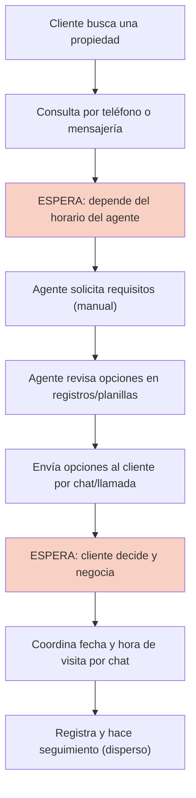

# Laboratorio 1 — HouseBroker Perú · Propuesta Ágil y Levantamiento de Necesidades

| Campo | Detalle |
|---|---|
| **Proyecto** | HouseBroker Perú — Sistema Web Inteligente de Gestión Inmobiliaria |
| **Autor** | Brandy Sinche |
| **Asignatura** | Proyecto Integrador / Ingeniería de Software |
| **Fase** | Sprint 0 y Planificación (Semanas 1–2) |
| **Entregable** | APF 1 (Semanas 5–6) |

> La información de este documento proviene del acta de planificación, el SRS v2.0, el acta de arquitectura y el Product Backlog del repositorio (`docs/`). Los datos que no cuentan todavía con evidencia cuantitativa están marcados como **Por validar**.

---

## 1. Equipo Scrum

El equipo está conformado por 4 integrantes, por lo que algunos roles son compartidos:

| Rol en Scrum | Integrante | Responsabilidad principal |
|---|---|---|
| **Product Owner (simulado)** | Jhon Ordoñez | Priorizar el backlog, definir el valor y validar los criterios de aceptación. |
| **Scrum Master / Lead Engineering** | Brandy Sinche | Facilitar Scrum, coordinar la planificación, supervisar arquitectura, GitHub Flow e integración Backend/IA. |
| **Developer — Backend / API** | Brandy Sinche | Django + Django REST Framework, mocks y servicios de integración. |
| **Developer — Frontend** | Yohan Ñato | React + TypeScript, componentes y conexión con la API. |
| **QA Engineer** | Anderson Villanes | Pruebas unitarias (Jest), rendimiento (WPO) y accesibilidad (WCAG 2.2 AA). |
| **Documentador** | Brandy Sinche | Consolidar evidencias y documentación académica por laboratorio. |

> Nota: dentro del cronograma, Jhon Ordoñez cumple el rol de PO simulado **y** de developer backend; la documentación e integración se centra en las evidencias de cada APF.

---

## 2. Problema empresarial

**Problema actual (negocio):** las actividades de búsqueda de propiedades, cualificación inicial del cliente y coordinación de visitas dependen en gran medida de procesos manuales y de la disponibilidad horaria de los agentes.

**Diferencia problema vs. solución:** el problema es de **operación comercial** (atención fragmentada y dependiente de personas), no de codificación. La solución tecnológica (una plataforma web) solo es el vehículo para resolverlo; si el problema no está bien delimitado, la plataforma automatiza un proceso mal diseñado.

### Dolores principales del negocio

| # | Dolor | Evidencia |
|---|---|---|
| D1 | Consultas fuera del horario del agente quedan sin respuesta oportuna. | Proceso AS-IS (Sección 4) — **Por validar** con entrevistas. |
| D2 | Búsqueda manual de propiedades: el agente debe revisar opciones una por una. | Proceso AS-IS — **Por validar**. |
| D3 | Coordinación manual de visitas (fechas/horas por chat o llamada). | Proceso AS-IS — **Por validar**. |
| D4 | Información comercial distribuida (clientes, conversaciones, citas sin consolidar). | **Por validar**; no existe métrica cuantitativa actual registrada. |

---

## 3. Stakeholders

| Stakeholder | Necesidad | Problema / Dolor | Pregunta de validación |
|---|---|---|---|
| **Cliente (comprador/inquilino)** | Encontrar propiedades adecuadas rápido y coordinar visitas. | Esperar al agente, recibir opciones poco personalizadas, agendar por canales no estructurados. | ¿Cómo decides actualmente qué propiedad te conviene y cuánto demoras en coordinar una visita? |
| **Agente inmobiliario** | Atender más oportunidades con menos tareas manuales. | Búsqueda manual, duplicidad de registros y seguimiento disperso. | ¿Cuánto tiempo dedicas al día a buscar propiedades y coordinar visitas manualmente? |
| **Administración de HouseBroker Perú** | Centralizar la operación y disponer de métricas. | Sin visibilidad global de clientes, citas ni rendimiento de agentes. | ¿Qué indicadores de la operación no puedes medir hoy con confianza? |

---

## 4. Proceso Actual — AS-IS



### Puntos de dolor identificados

| Tipo | Detalle |
|---|---|
| **Esperas** | Respuesta del agente (C) y decisión del cliente (G). |
| **Tareas manuales** | Solicitud de requisitos, búsqueda de opciones y registro de seguimiento. |
| **Duplicidad de información** | El mismo cliente/propiedad aparece en planillas o chats sin un registro único. |
| **Comunicación informal** | Todo el flujo depende de chat o llamada sin trazabilidad estructurada. |
| **Puntos de demora** | Entre la consulta (B) y la entrega de opciones (F) pueden pasar horas o días. |

---

## 5. Análisis de causa raíz — Los 5 Porqués

**Problema central:** la gestión de atención, búsqueda personalizada y coordinación de visitas depende de procesos manuales.

| Nivel | Pregunta | Respuesta |
|---|---|---|
| 1 | ¿Por qué existe dependencia de procesos manuales? | Porque la atención la realiza el agente según su horario y canal personal. |
| 2 | ¿Por qué la atención depende del agente? | Porque no existe un canal automatizado de primera atención ni un catálogo público. |
| 3 | ¿Por qué no existe un catálogo público ni canal automatizado? | Porque la información de propiedades, clientes y agendas no está centralizada en una sola plataforma. |
| 4 | ¿Por qué la información no está centralizada? | Porque nunca se definió un sistema comercial digital único para la operación. |
| 5 | ¿Por qué no se definió un sistema digital? | Porque HouseBroker Perú mantiene un modelo de operación tradicional y no había priorizado digitalizar la atención comercial. |

> Disección: la **causa raíz es la falta de una plataforma digital centralizada y de un primer canal de atención automatizado**. Esa es la base sobre la que se construye todo el MVP.
>
> No se dispone de métricas cuantitativas reales (tiempo de respuesta, % de abandono). Estas se convierten en hipótesis de validación del APF 1. **Evidencia cuantitativa: Por validar.**

---

## 6. Enunciado de oportunidad

- **Para el cliente** que busca comprar o alquilar una propiedad en Lima, la situación de atención dependiente del horario del agente produce demoras y opciones poco personalizadas, lo que hace que la coordinación de visitas sea lenta e insegura. Nuestra plataforma **reduce el tiempo de búsqueda y coordina la visita de forma centralizada**.
- **Para el agente inmobiliario**, la situación de búsqueda y registro manual de opciones produce pérdida de tiempo y seguimiento disperso, lo que afecta su productividad. Nuestra plataforma **automatiza la búsqueda y concentra el seguimiento en una sola agenda**.
- **Para la administración de HouseBroker Perú**, la situación de información distribuida produce falta de trazabilidad y ausencia de métricas de operación, lo que impide decisiones comerciales informadas. Nuestra plataforma **centraliza la operación y habilita indicadores de gestión**.

---

## 7. MVP

### Product Goal

> Lograr que un cliente de HouseBroker Perú **encuentre y coordine la visita de una propiedad adecuada** a través de una plataforma web única, con atención inicial automatizada y seguimiento centralizado, de forma incremental durante las 18 semanas del curso.

### Dentro del alcance (APF 1 → Entrega final)

- Catálogo público de propiedades con detalle (HU-PROP-02).
- Búsqueda con filtros combinados y paginación (HU-PROP-03).
- Registro y edición de propiedades por el agente (HU-PROP-01).
- Autenticación por roles Cliente / Agente / Administrador (HU-SEC-01).
- Agendamiento de visitas (HU-CRM-01).
- Asistente virtual + recomendación de 2–3 propiedades (ECHO de HU-AI-01 / HU-AI-03) con **fallback por reglas** si la IA no está disponible.
- Chat humano con el agente (HU-SEC-03).

### Fuera del alcance (versión 1)

- Pasarela de pagos y cobro de comisiones online.
- Aplicaciones nativas iOS/Android.
- Firma digital y gestión contractual completa.
- IA avanzada como única fuente de recomendación (en el APF 1 se prioriza el ranking por reglas).

### Supuestos

- Se contará con un proveedor de IA con plan gratuito (acceso con límites) y archivo de configuración para cambiarlo.
- Existirán datos de propiedades disponibles con los que probar el catálogo y los filtros.
- El equipo tiene acceso a GitHub, Figma y herramientas de desarrollo.

### Restricciones

- Mercado inicial: **Lima Metropolitana, Perú**.
- Solo web responsive / PWA (sin apps nativas).
- Sin operaciones transaccionales ni contractuales en el MVP.
- **PostgreSQL es la fuente de verdad**: la IA no inventa propiedades, precios ni disponibilidad.

---

## 8. Requerimientos

Catalogo resumido reutilizando el SRS v2.0 y el acta de negocio existentes.

### 8.1 Requerimientos de negocio

| ID | Requerimiento |
|---|---|
| RN-01 | Atención continua (24/7) para captación de leads sin importar el horario comercial. |
| RN-02 | Personalización: recomendar de 2 a 3 propiedades con alto nivel de coincidencia. |
| RN-03 | Eficiencia operativa: agenda centralizada de agentes y programación autónoma de visitas. |
| RN-04 | Control gerencial: métricas de rendimiento, conversaciones y estado de la oferta inmobiliaria. |

### 8.2 Requerimientos de usuario

| Rol | Funcionalidad esperada |
|---|---|
| Cliente | Registro/login, búsqueda con filtros, chatbot, favoritos, agendar visitas y chat con agente. |
| Agente | Gestionar propiedades asignadas, estado de disponibilidad, agenda, chat y observaciones. |
| Administrador | Gestionar usuarios/agentes, asignar leads y propiedades, supervisar citas/chats, auditoría de IA y reportes. |

### 8.3 Requerimientos funcionales (resumen del SRS v2.0)

| Código | Descripción |
|---|---|
| RF-PROP-01..05 | Registro/edición, catálogo interactivo, motor de filtros, control de disponibilidad y favoritos. |
| RF-CRM-01..05 | Agendamiento autónomo, gestión de citas, ficha e historial del cliente, observaciones y dashboard. |
| RF-SEC-01..05 | Autenticación + RBAC, chat en tiempo real, auditoría de chats, estados de conexión y notificaciones. |
| RF-AI-01..05 | Asistente virtual 24/7, motor de recomendación, presentación con Match %, transferencia a agente y auditoría del bot. |

### 8.4 Requerimientos no funcionales

| Código | Categoría | Criterio |
|---|---|---|
| RNF-01 | Usabilidad | Interfaz responsive (mobile-first), agendar o conversar con el bot en menos de 3 clics. |
| RNF-02 | Rendimiento | Búsqueda y catálogo < 2.0 s; respuesta del chatbot < 3.0 s. |
| RNF-03 | Disponibilidad | 99.5 % uptime del portal y asistente. |
| RNF-04 | Seguridad | Contraseñas robustas (Bcrypt/Argon2), HTTPS (TLS 1.3), datos sensibles cifrados. |
| RNF-05 | Escalabilidad | Soportar hasta 100 usuarios concurrentes en chat/búsquedas. |
| RNF-06 | Compatibilidad | Chrome, Edge, Firefox y Safari, escritorio y móvil. |

### 8.5 Reglas de negocio

| Regla | Descripción |
|---|---|
| RB-01 | Una propiedad no se muestra disponible si está vendida, alquilada, suspendida o eliminada. |
| RB-02 | Una cita solo se reserva en un horario disponible del agente. |
| RB-03 | Las recomendaciones solo usan propiedades registradas y activas. |
| RB-04 | Un agente solo consulta conversaciones y citas que le corresponden. |
| RB-05 | Los permisos se validan siempre en el backend; la interfaz solo refleja lo autorizado. |
| RB-06 | La IA no es fuente de verdad de propiedades, precios ni disponibilidad. |

### 8.6 Restricciones

- Delimitación geográfica inicial: Lima Metropolitana.
- Solución web responsive / PWA (sin apps nativas).
- Sin pagos ni contratos electrónicos en el MVP.
- Proveedor de IA intercambiable mediante el patrón Adapter.

---

## 9. Historias de Usuario (Prioritarias para el laboratorio)

Se reutilizan las HU existentes del Product Backlog. Formato de las 3C: **Card** (enunciado), **Conversation** (criterios/notas de conversación) y **Confirmation** (criterios de aceptación).

### HU-PROP-01 — Registrar y editar propiedades

- **Card:** Como *agente inmobiliario*, quiero *registrar y editar inmuebles con sus características*, para *publicarlos en la plataforma con información consistente*.
- **Conversation:** tipo (casa/departamento), modalidad (venta/alquiler), precio, distrito, habitaciones, baños, cochera, metraje, mascotas, fotos y estado.
- **Confirmation:** el formulario valida obligatorios, persiste la propiedad y muestra el mensaje de éxito; sólo agentes/admin pueden registrar (RB-01).

### HU-PROP-02 — Consultar catálogo de propiedades

- **Card:** Como *cliente*, quiero *consultar el catálogo de propiedades disponibles con paginación*, para *explorar las opciones sin depender de un agente*.
- **Conversation:** vista pública, ficha resumida y detalle con galería; paginación `page`/`limit`.
- **Confirmation:** ver criterios Gherkin (Sección 10).

### HU-PROP-03 — Buscar propiedades mediante filtros

- **Card:** Como *cliente*, quiero *filtrar por precio, tipo, distrito, habitaciones, cochera, mascotas y modalidad*, para *encontrar solo las propiedades que me interesan*.
- **Conversation:** los filtros se combinan entre sí y se aplican sobre datos reales (mock en APF 1).
- **Confirmation:** combinación de filtros devuelve resultados correctos y coherentes con el total paginado.

### HU-CRM-01 — Agendar una visita

- **Card:** Como *cliente*, quiero *agendar una visita a una propiedad*, para *coordinarla sin llamadas ni mensajes informales*.
- **Conversation:** selección de propiedad, fecha y turno según disponibilidad del agente; el agente acepta/rechaza/reprograma.
- **Confirmation:** el sistema valida horario disponible y notifica el estado de la cita (RB-02).

### HU-SEC-01 — Registrarse e iniciar sesión

- **Card:** Como *usuario*, quiero *registrarme e iniciar sesión con un rol*, para *acceder solo a las funciones que me corresponden*.
- **Conversation:** roles Cliente / Agente / Administrador; JWT en cookies HttpOnly.
- **Confirmation:** el acceso a recursos no autorizados es denegado por el backend (RB-05).

### HU-SEC-03 — Comunicarse con un agente mediante chat

- **Card:** Como *cliente*, quiero *chatear en tiempo real con un agente*, para *resolver dudas y coordinar la visita en el mismo contexto*.
- **Conversation:** WebSockets, historial persistente y estados de conexión del agente.
- **Confirmation:** los mensajes se guardan antes de confirmar y el historial se conserva al transferir del bot al humano.

### HU-AI-01 — Conversar con el asistente virtual 24/7

- **Card:** Como *cliente*, quiero *conversar con un asistente virtual disponible siempre*, para *recibir atención inicial fuera del horario de oficina*.
- **Conversation:** el bot recopila preferencias y, si la IA no responde, cae al ranking por reglas.
- **Confirmation:** la respuesta se entrega con respaldo (fallback) aunque el proveedor de IA esté caído.

### HU-AI-03 — Recibir recomendaciones personalizadas

- **Card:** Como *cliente*, quiero *recibir 2 a 3 propiedades recomendadas con un % de coincidencia*, para *decidir con menos esfuerzo*.
- **Conversation:** filtros SQL obligatorios + scoring por reglas (70 %) y semántico (30 %); Match % visible con botón "Ver detalles", "Agendar visita" y "Hablar con agente".
- **Confirmation:** solo se recomiendan propiedades reales y disponibles; un ID devuelto por la IA que no sea candidato se descarta (RB-03, RB-06).

---

## 10. Criterios de aceptación — HU prioritaria (Gherkin)

**HU-PROP-02 — Consultar catálogo de propiedades** (la más crítica del APF 1 por su transversalidad).

```gherkin
Funcionalidad: Consultar catálogo con paginación
  Contexto:
    Dado un catálogo con 25 propiedades disponibles registradas en el catálogo
    Y el usuario anónimo en la vista pública del portafolio

  Escenario: Primera página del catálogo
    Cuando el usuario solicita la página 1 con límite de 10 resultados
    Entonces el sistema muestra 10 propiedades
    Y se muestra la paginación con 3 páginas disponibles
    Y se indica el total de propiedades encontradas

  Escenario: Navegar a otra página
    Cuando el usuario selecciona la página 2
    Entonces el sistema muestra las propiedades de la página siguiente
    Y el selector de página activa muestra la página 2

  Escenario: Catálogo vacío
    Dado que no existen propiedades disponibles
    Cuando el usuario consulta el catálogo
    Entonces el sistema muestra un estado vacío con mensaje claro
    Y no se muestra paginación

  Escenario: Página fuera de rango
    Cuando el usuario solicita una página inexistente (p. ej. la 99)
    Entonces el sistema responde con una página vacía o un error controlado
    Y no muestra información inventada o duplicada
```

---

## 11. Product Backlog

Fuente: `docs/scrum/backlog.md`. Tallas: **S / M / L**. Riesgo: Bajo / Medio / Alto.

| ID | HU | Prioridad | Valor | Dependencias | Riesgo | Tamaño |
|---|---|:---:|:---:|---|---|:---:|:---:|
| HU-PROP-01 | Registrar y editar propiedades | Alta | Alto | — | Medio | L |
| HU-PROP-02 | Consultar catálogo de propiedades | Alta | Alto | HU-PROP-01 | Bajo | L |
| HU-PROP-03 | Buscar mediante filtros | Alta | Alto | HU-PROP-02 | Medio | M |
| HU-PROP-04 | Gestionar disponibilidad | Media | Medio | HU-PROP-01 | Bajo | M |
| HU-PROP-05 | Guardar propiedades favoritas | Media | Medio | HU-PROP-02, HU-SEC-01 | Bajo | S |
| HU-CRM-01 | Agendar una visita | Alta | Alto | HU-PROP-02, HU-SEC-01 | Medio | M |
| HU-CRM-02 | Gestionar citas | Media | Medio | HU-CRM-01 | Medio | M |
| HU-CRM-03 | Consultar ficha e historial del cliente | Media | Medio | HU-SEC-01 | Medio | M |
| HU-CRM-04 | Registrar observaciones de atención | Media | Medio | HU-CRM-01, HU-CRM-03 | Bajo | S |
| HU-CRM-05 | Consultar dashboard y reportes | Media | Medio | HU-CRM-02, HU-CRM-04 | Medio | L |
| HU-SEC-01 | Registrarse e iniciar sesión | Alta | Alto | — | Alto | L |
| HU-SEC-02 | Recuperar contraseña | Media | Medio | HU-SEC-01 | Medio | S |
| HU-SEC-03 | Chat con agente en tiempo real | Alta | Alto | HU-SEC-01 | Alto | L |
| HU-SEC-04 | Visualizar estado de conexión | Baja | Bajo | HU-SEC-03 | Bajo | S |
| HU-SEC-05 | Recibir notificaciones | Media | Medio | HU-CRM-01, HU-SEC-03 | Medio | M |
| HU-SEC-06 | Supervisar y auditar conversaciones | Media | Medio | HU-SEC-03 | Medio | M |
| HU-AI-01 | Conversar con asistente virtual 24/7 | Alta | Alto | HU-SEC-01 | Alto | L |
| HU-AI-02 | Guardar preferencias y contexto | Media | Medio | HU-AI-01 | Alto | M |
| HU-AI-03 | Recibir recomendaciones personalizadas | Alta | Alto | HU-AI-02, HU-PROP-03 | Alto | L |
| HU-AI-04 | Solicitar atención de un agente humano | Media | Medio | HU-AI-01, HU-SEC-03 | Alto | M |
| HU-AI-05 | Supervisar el funcionamiento del asistente IA | Media | Medio | HU-AI-01 | Medio | M |

---

## 12. Mini Sprint Planning

Para el siguiente sprint a ejecutar (Semanas 5–6, coincide con el APF 1):

### Sprint Goal

> Verificar con datos simulados que un cliente puede **encontrar la propiedad adecuada mediante el catálogo con paginación y filtros combinados**, y que ese flujo completo (React → API mock → pruebas) queda validado con estándares de accesibilidad y pruebas automatizadas antes de integrar el backend real.

### HU seleccionadas

| HU | Puntos | Sprint (trabajo directo) |
|---|---|---|
| HU-PROP-02 — Consultar catálogo | 13 | SEMANAS 5–6 (APF 1) |
| HU-PROP-03 — Buscar con filtros | 8 | SEMANAS 5–6 (APF 1) |
| **Total** | **21 pts** | |

### Sprint Backlog

| ID | Tarea | Est. (h) |
|---|---|---|
| TASK-ARC-PROP-02 | Contrato API (pag/catálogo) en OpenAPI v1.1 | 6 |
| TASK-ARC-PROP-03 | Contrato API para parámetros de búsqueda | 4 |
| TASK-UI-PROP-02 | Prototipo Figma catálogo y detalle | 10 |
| TASK-UI-PROP-03 | Panel de filtros reactivo en Figma | 6 |
| TASK-FRONT-PROP-02 | Vista de catálogo y detalle en React | 16 |
| TASK-FRONT-PROP-03 | Filtrado dinámico y combinación en React | 12 |
| TASK-MOCK-PROP-02 | Servicio Mock con paginación | 8 |
| TASK-MOCK-PROP-03 | Servicio Mock de búsqueda filtrada | 6 |
| TASK-TEST-PROP-02 | Pruebas de renderizado en Jest | 10 |
| TASK-TEST-PROP-03 | Pruebas de combinación de filtros en Jest | 8 |
| TASK-A11Y-PROP-02 | Etiquetas ARIA y navegación por teclado (WCAG 2.2 AA) | 6 |
| TASK-A11Y-PROP-03 | Accesibilidad en formularios de filtro y sliders | 4 |
| TASK-WPO-PROP-02 | React.lazy + Suspense para imágenes | 6 |
| TASK-WPO-PROP-03 | Debounce en inputs de búsqueda | 4 |

### Definition of Done (DoD)

- Código integrado en `main` mediante Pull Request aprobado.
- Paginación y filtros dinámicos funcionando sobre datos de Mock.
- Pruebas unitarias de ambos componentes pasando en Jest.
- Auditoría WCAG 2.2 AA aprobada en AXE DevTools.

### Riesgo técnico principal y tratamiento

| Riesgo | Acción de tratamiento |
|---|---|
| Dependencia excesiva de los Mocks y desalineación del contrato API con el backend real. | Congelar el contrato OpenAPI v1.1 antes del desarrollo; los Mocks implementan exactamente ese contrato para que el backend real los reemplace sin cambios en React. |
| Combinación de filtros con resultados incorrectos en pruebas. | Cubrir los casos de combinación con tablas de casos en Jest (cada filtro y su combinación). |

---

## 13. Gantt de hitos — Semanas 1 a 18

> Leyenda: `█` período de trabajo · `◆` hito académico · `★` entrega final. Distribución de laboratorios 2–6 **Por validar** según cronograma del curso.

| Actividad / Semana | 1 | 2 | 3 | 4 | 5 | 6 | 7 | 8 | 9 | 10 | 11 | 12 | 13 | 14 | 15 | 16 | 17 | 18 |
|---|:---:|:---:|:---:|:---:|:---:|:---:|:---:|:---:|:---:|:---:|:---:|:---:|:---:|:---:|:---:|:---:|:---:|:---:|
| **Laboratorio 1** (problema + plan ágil) | █ | █ | | | | | | | | | | | | | | | | |
| **Sprint 1** — Incremento: registro/edición de propiedades | | | █ | █ | | | | | | | | | | | | | | |
| **Sprint 2** — Incremento: catálogo + filtros (◉ APF1) | | | | | █ | █ | | | | | | | | | | | | |
| **APF 1** | | | | | ◆ | | | | | | | | | | | | | |
| **Sprint 4** — Incremento: backend + CRM (◉ APF2) | | | | | | | | | █ | █ | | | | | | | | |
| **APF 2** | | | | | | | | | ◆ | | | | | | | | | |
| **Sprint 6** — Incremento: IA + recomendador (◉ APF3) | | | | | | | | | | | | | █ | █ | | | | |
| **APF 3** | | | | | | | | | | | | | ◆ | | | | | |
| **Sprint 7** — Estabilización QA/WPO/A11y | | | | | | | | | | | | | | | █ | █ | | |
| **Laboratorios 2–6** (por validar) | | | | | | | | | | | | | | | | | | █ |
| **ENTREGA FINAL** | | | | | | | | | | | | | | | | | | ★ |

> Coherencia con el acta (`docs/00_Acta_Planificacion_y_Negocio.md`): APF1 ≈ semana 5, APF2 ≈ semana 9, APF3 ≈ semana 13, entrega final ≈ semana 18. El Sprint 3 (semanas 7–8) se reserva para los exámenes parciales con carga reducida.

---

## 14. Trazabilidad

| Problema/Dolor | Requerimiento | HU | Criterio de aceptación (ref.) | Sprint |
|---|---|---|---|---|
| D1 — Atención fuera de horario | RN-01 · RF-AI-01 | HU-AI-01 | Fallback disponible aunque la IA esté caída (Sec. 10/AI) | 6 |
| D2 — Búsqueda manual | RF-PROP-03 | HU-PROP-03 | Filtros combinados coherentes con el total paginado | 2 |
| D3 — Coordinación manual de visitas | RF-CRM-01 | HU-CRM-01 | Validación de horario disponible del agente (RB-02) | 4 |
| D4 — Información distribuida | RN-04 · RF-CRM-05 | HU-CRM-05 | Indicadores y reportes desde datos centralizados | 7 |
| D1+D2 — Demoras en el hallazgo | RF-PROP-02 | HU-PROP-02 | Catálogo paginado por rango y estado (Sec. 10) | 2 |

---

## 15. Pitch (≈ 3 minutos)

> **Problema (30 s).** Comprar o alquilar en HouseBroker Perú hoy depende de timbres al agente, mensajes de ida y vuelta y planillas. El cliente espera respuestas según horario de oficina, recibe opciones poco personalizadas y coordina visitas por chat informal. El agente pierde tiempo buscando inmuebles (una por una) y su seguimiento queda disperso. No hay una visión única de la operación.

> **Oportunidad (45 s).** Todo ese dolor tiene una causa común: no hay un canal digital centralizado ni un primer punto de atención automatizado. Si logramos que un cliente encuentre la propiedad adecuada y coordine su visita en una sola plataforma, ganamos tiempo para el cliente, productividad para el agente y trazabilidad para la administración. Es una oportunidad de captación continua, no una página de avisos.

> **MVP (60 s).** Nuestro MVP es una web con catálogo paginado y filtros combinados (tipo, distrito, precio, habitaciones, modalidad), registro de propiedades para el agente, autenticación por roles, agendamiento de visitas y una atención inicial con asistente que recomienda 2 a 3 propiedades y, si la IA no está disponible, funciona por reglas. Está acotado a Lima, a web responsive, sin pagos ni contratos; lo demostramos con datos simulados en el APF 1 y lo conectamos al backend real (Django + PostgreSQL) en el APF 2.

> **Valor (45 s).** El equipo de 4 integrantes corre Scrum en 18 semanas: el APF 1 valida el catálogo y los filtros; el APF 2 integra el backend real, roles y CRM; el APF 3 incorpora el chat y la IA; y la semana 18 entrega el sistema completo con pruebas y accesibilidad. Dob ciclo corto, mocks tempranos y un contrato API congelado reducen el riesgo de integrar tarde.

> **Cierre (15 s).** En resumen: un catálogo digital, una atención que no duerme y una operación visible. HouseBroker Perú pasa de improvisar a gestionar. Estamos listos para empezar en la semana que viene.

---

## Referencias

- `docs/00_Acta_Planificacion_y_Negocio.md` — acta de planificación ágil y análisis de negocio.
- `docs/01_requerimientos.md` — SRS v2.0 (RF, RNF, roles y alcance).
- `docs/02_Arquitectura.md` — arquitectura (React, Django DRF, PostgreSQL, IA Adapter).
- `docs/scrum/backlog.md` y `docs/scrum/sprint-2/planning.md` — backlog y planificación de sprints.