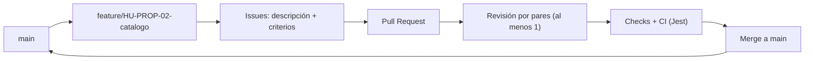
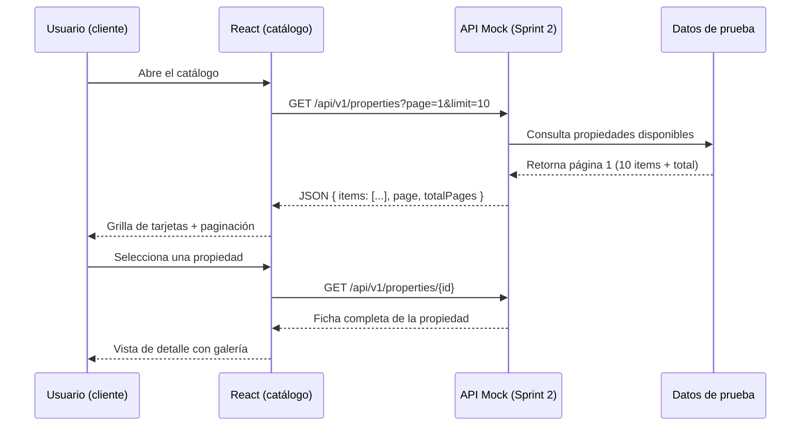
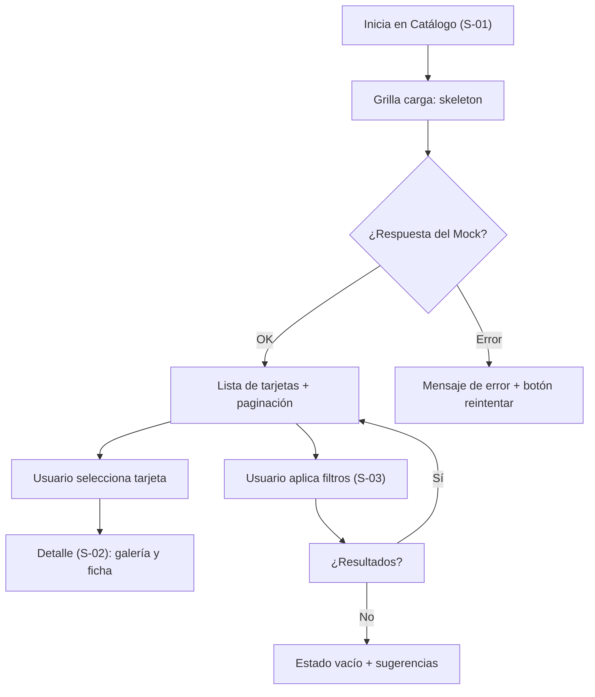

# Laboratorio 2 — Entorno Reproducible, Decisiones Tecnológicas y Prototipo Interactivo

| Campo | Detalle |
|---|---|
| **Proyecto** | HouseBroker Perú — Sistema Web Inteligente de Gestión Inmobiliaria |
| **Autor** | Brandy Sinche |
| **Asignatura** | Proyecto Integrador / Ingeniería de Software |
| **Fase** | Sprints 1–2 (Semanas 3–6) |
| **Entregable** | APF 1 (Semanas 5–6) |

> Base documental: `docs/00_Acta_Planificacion_y_Negocio.md`, `docs/01_requerimientos.md`, `docs/02_Arquitectura.md`, `docs/06_UX_UI_PROP.md`, `docs/scrum/` y el Laboratorio 1.
> Información sin evidencia se marca como **Por validar**.

---

## 1. Línea base del Laboratorio 1

| Elemento | Definición |
|---|---|
| **HU seleccionada** | **HU-PROP-02 — Consultar catálogo de propiedades** (13 pts, Prioridad Alta). Es la historia transversal para el APF 1 porque concentra catálogo, paginación, detalle y es base de los filtros (HU-PROP-03). |
| **Product Goal** | Lograr que un cliente de HouseBroker Perú encuentre y coordine la visita de una propiedad adecuada a través de una plataforma web única, con atención inicial automatizada y seguimiento centralizado, de forma incremental durante las 18 semanas del curso. |
| **Sprint Goal relacionado** | Verificar con datos simulados que un cliente puede **encontrar la propiedad adecuada mediante el catálogo con paginación y filtros combinados**, y que ese flujo completo (React → API mock → pruebas) queda validado con estándares de accesibilidad y pruebas automatizadas antes de integrar el backend real (Sprint 2, Semanas 5–6). |

---

## 2. Matriz de selección tecnológica

Ponderación de criterios (suma = 100 %) acordada por el equipo:

| Criterio | Peso |
|---|---:|
| Facilidad de desarrollo | 25 % |
| Escalabilidad | 20 % |
| Mantenibilidad | 20 % |
| Compatibilidad | 15 % |
| Comunidad / ecosistema | 20 % |

> Puntuación cualitativa **1 a 5** basada en la experiencia del equipo y la documentación del curso. No se usan benchmarks externos; el resultado respalda una decisión ya tomada en el acta del proyecto.

### 2.1 Frontend: React + TypeScript vs. Vue 3

| Criterio | Peso | React | Vue 3 |
|---|---|:---:|:---:|
| Facilidad de desarrollo | 25 % | 4 | 4 |
| Escalabilidad | 20 % | 4 | 3 |
| Mantenibilidad | 20 % | 4 | 4 |
| Compatibilidad | 15 % | 4 | 3 |
| Comunidad / ecosistema | 20 % | 5 | 3 |
| **Total ponderado** | | **4.20** | **3.45** |

### 2.2 Backend: Django REST Framework vs. FastAPI

| Criterio | Peso | Django DRF | FastAPI |
|---|---|:---:|:---:|
| Facilidad de desarrollo | 25 % | 4 | 4 |
| Escalabilidad | 20 % | 4 | 4 |
| Mantenibilidad | 20 % | 4 | 3 |
| Compatibilidad | 15 % | 5 | 3 |
| Comunidad / ecosistema | 20 % | 5 | 3 |
| **Total ponderado** | | **4.35** | **3.45** |

### 2.3 Base de datos: PostgreSQL vs. MySQL

| Criterio | Peso | PostgreSQL | MySQL |
|---|---|:---:|:---:|
| Facilidad de desarrollo | 25 % | 4 | 4 |
| Escalabilidad | 20 % | 5 | 3 |
| Mantenibilidad | 20 % | 4 | 4 |
| Compatibilidad | 15 % | 5 | 3 |
| Comunidad / ecosistema | 20 % | 4 | 5 |
| **Total ponderado** | | **4.35** | **3.85** |

### 2.4 Resultado

| Capa | Ganador | Puntaje |
|---|---|---|
| Frontend | **React + TypeScript** | 4.20 |
| Backend | **Django REST Framework** | 4.35 |
| Base de datos | **PostgreSQL** | 4.35 |

---

## 3. ADR-001 — Decisión tecnológica del frontend, backend y base de datos

| Campo | Detalle |
|---|---|
| **Título** | ADR-001: Stack base de HouseBroker Perú |
| **Fecha** | 7 de septiembre de 2026 |
| **Estado** | Aceptado |

**Contexto**
El equipo debe elegir un stack para un sistema web inmobiliario con roles (Cliente, Agente, Administrador), catálogo con filtros, agendamiento de visitas, chat en tiempo real y un asistente/recomendador basado en IA. El equipo es de 4 integrantes con un ciclo de 18 semanas y entregables en APF 1, 2, 3.

**Decisión**
Adoptar el siguiente stack como oficial del proyecto:

- **Frontend:** React + TypeScript.
- **Backend:** Django + Django REST Framework.
- **Base de datos:** PostgreSQL.
- **Complementos:** Django Channels + Redis para tiempo real y `AIService`/`GeminiAdapter` (patrón Adapter) para la IA. La IA no accede directamente a PostgreSQL.

**Alternativas**
- Frontend: Vue 3 (descartado: menor puntaje ponderado 3.45).
- Backend: FastAPI (descartado: 3.45 vs. 4.35; pierde en mantenibilidad y ecosistema propio de Django para permisos, admin y ORM).
- Base de datos: MySQL (descartado: 3.85 vs. 4.35; PostgreSQL aporta JSONB, mejor manejo de datos geoespaciales y índices para el buscador).

**Consecuencias**
- Positivas: administración y ORM de Django aceleran el CRUD; TypeScript reduce errores en componentes React; el ecosistema Django-PostgreSQL es el más documentado para este tipo de curso.
- Negativas: la curva de WebSockets (Django Channels + Redis) es la parte más compleja; se debe planificar un *spike* técnico antes del APF 3.
- Costo: la integración con IA requiere mantener el desacoplamiento por Adapter para no acoplar el negocio a Gemini.

---

## 4. Entorno de desarrollo

Estado verificado en la máquina de desarrollo el **07/09/2026**. Solo se documenta lo realmente verificado.

### 4.1 Backend (Django)

| Comando | Salida obtenida | Estado |
|---|---|---|
| `git --version` | `git version 2.53.0.windows.1` | ✅ Verificado |
| `node --version` | `v20.20.0` | ✅ Verificado |
| `python --version` | `3.13.13` (entorno virtual del proyecto) | ✅ Verificado |
| `python -m django --version` | `6.1.1` | ✅ Verificado |
| Versión Django REST Framework | `3.18.0` | ✅ Verificado |
| `python manage.py check` | `System check identified no issues (0 silenced).` | ✅ Verificado |

### 4.2 Frontend (React + TypeScript)

| Comando | Salida obtenida | Estado |
|---|---|---|
| `node --version` | `v20.20.0` | ✅ Verificado |
| Instalación de dependencias | Sin errores (React 19.2.x, TypeScript 6.0.x, Vite 8.2.x) | ✅ Verificado |
| `npm run build` | `✓ built` sin errores de TypeScript ni de Vite | ✅ Verificado |

### 4.3 Infraestructura (base de datos)

| Comando | Estado |
|---|---|
| `docker compose version` | ✅ CLI `v5.3.1` verificado |
| `docker ps` | ⚠️ Daemon (Docker Desktop) **apagado** al momento de la verificación |
| Contenedor PostgreSQL 16 (`infra/docker-compose.yml`) | ⏳ Pendiente: levantar Docker Desktop y ejecutar `docker compose up -d db` |
| `psql --version` | ⏳ Pendiente (depende del contenedor) |

### 4.4 Acciones pendientes (cronograma)

| Tarea | Responsable | Criterio de aceptación |
|---|---|---|
| Levantar Docker Desktop y crear la BD PostgreSQL | Jhon Ordoñez | `docker ps` muestra el contenedor `housebroker-db` y `psql -c "select version()"` responde |
| Ejecutar `python manage.py migrate` | Jhon Ordoñez | Migraciones aplicadas sin error en PostgreSQL |
| (Opcional) Documentar instalación estándar para el equipo | Brandy Sinche | Instrucciones con `venv` + `pip` y `npm` replicables por cualquier integrante |

> El entorno es **reproducible**: mientras la base de datos aún no está levantada, el desarrollo de UI avanza con los Mocks sin depender del backend.

---

## 5. Estructura del repositorio

```text
housebroker-peru/
├── backend/                    # Django + DRF + apps por módulo
│   ├── config/                 # settings, urls, asgi, wsgi
│   └── apps/
│       ├── users/
│       ├── properties/
│       ├── appointments/
│       ├── conversations/
│       ├── assistant/
│       ├── notifications/
│       └── reports/
├── frontend/                   # React + TypeScript
│   └── src/
│       ├── api/
│       ├── components/
│       ├── features/           # auth, properties, appointments, assistant, chat, dashboard
│       ├── hooks/
│       ├── pages/
│       ├── routes/
│       ├── store/
│       ├── types/
│       └── utils/
├── docs/                       # Documentación del producto (SRS, arquitectura, UX/UI, scrum)
├── infra/                      # docker-compose.yml, .env.example, scripts
└── laboratorios/               # Evidencias por laboratorio (equivalente a Laboratorios/)
```

> Estado al cierre de este laboratorio: `backend/` (Django 6.1 + DRF), `frontend/` (Vite + React 19 + TS) e `infra/` (docker-compose de PostgreSQL) ya fueron inicializados y verificados (Sección 4). `docs/` y `Laboratorios/` existen desde el inicio del proyecto. La estructura detallada proviene de `docs/02_Arquitectura.md` §13.

---

## 6. GitHub Workflow

Se usa **GitHub Flow**: `main` siempre estable y ramas cortas de vida limitada.



| Elemento | Regla del equipo |
|---|---|
| `main` | Protegida: no se hace commit directo; solo merges vía PR. |
| Ramas `feature` | Convención `feature/<HU-ID>-<descripcion>`, ej. `feature/HU-PROP-02-catalogo`. |
| Issues | Una issue por HU/TASK con descripción, definición de listo y criterios de aceptación. |
| Pull Requests | Título con HU/TASK (ej. `HU-PROP-02: catálogo con paginación`), descripción de cambios, pruebas y captura de evidencia. |
| Revisión por pares | Al menos 1 integrante aprueba antes de merge. |
| GitHub Projects | Backlog por columnas (Backlog / To do / In progress / Review / Done) bajo la jerarquía EPIC → HU → TASK. |

---

## 7. Flujo de usuario de la HU seleccionada

**HU-PROP-02 — Consultar catálogo de propiedades.**



| Acción del usuario | Respuesta del sistema |
|---|---|
| Ingresa al catálogo | Muestra página 1 con tarjetas y paginación. |
| Cambia de página | Solicita la página indicada y refresca la grilla. |
| Selecciona una propiedad | Abre la vista de detalle con galería y ficha técnica. |
| Propiedad no disponible | No aparece en el catálogo (regla RB-01). |
| Página fuera de rango | Respuesta controlada: página vacía con mensaje. |

---

## 8. Inventario de pantallas

| ID | Pantalla | HU | Criterio de aceptación | Estados |
|---|---|---|---|---|
| S-01 | Catálogo de propiedades (grilla) | HU-PROP-02 | Se muestra la página 1 con `items`, total y paginación | Loading · Lista · Vacío · Error |
| S-02 | Detalle de propiedad | HU-PROP-02 | Galería + ficha técnica + Match AI | Loading · Ok · No encontrado |
| S-03 | Panel de filtros | HU-PROP-03 | Filtros combinados con debounce | Abierto · Colapsado · Enviando |
| S-04 | Login / Registro | HU-SEC-01 | Autenticación por rol (JWT) | Loading · Error · Success |
| S-05 | Publicación de nueva propiedad | HU-PROP-01 | Flujo por pasos con validación | Paso 1–4 · Error de validación · Success |
| S-06 | Listado administrativo de propiedades | HU-PROP-01 | Además de registrar, el agente ve su listado con estados | Loading · Lista · Vacío |
| S-07 | Agendar visita | HU-CRM-01 | Fecha/hora según disponibilidad del agente | Success · Conflicto de agenda |
| S-08 | Estado vacío / 404 | — | Mensaje claro y acción de regreso al catálogo | Vacío · 404 |

> Detalles del diseño según `docs/06_UX_UI_PROP.md` (tarjetas premium, filtros avanzados, Match AI, vistas móvil/desktop).

---

## 9. Wireframes

Los wireframes y mockups del módulo se trabajan en Figma. Pantallas que deben existir en el archivo de Figma del equipo:

- Wireframe desktop y mobile de **S-01 Catálogo** (grilla, paginación, barra de filtros).
- Wireframe de **S-02 Detalle** (galería, métricas, botones "Ver detalle" / "Agendar visita").
- Wireframe de **S-03 Panel de filtros** (collapsed/expanded, sliders de precio).
- Wireframes de **S-05 Publicación por pasos** y **S-06 Listado administrativo**.
- Wireframe de **S-08 Estado vacío / error**.

| Pantalla | Desktop | Mobile |
|---|---:|---:|
| Catálogo | ✅ | ✅ |
| Detalle | ✅ | ✅ |
| Filtros | ✅ | ✅ |
| Publicación por pasos | ✅ | ✅ |
| Listado admin | ✅ | ✅ |
| Login / Agendar visita | ✅ | ✅ |

> Archivo de diseño de referencia (módulo de propiedades): <https://www.figma.com/design/E3GqcXxdcDJVc8CBMsbOkM/HOUSE-BROKER-PERÚ-–-UX-UI>. No se pegan capturas propias; la vinculación de cada pantalla con su estado de aprobación queda en Figma (**Por validar** con el equipo de UI).

---

## 10. Componentes UI

Catálogo de componentes identificados para el sistema de diseño en React (sin implementación aún):

| Tipo | Componentes | Estados |
|---|---|---|
| Botones | `Button` (primary / secondary / ghost / danger) | default · hover · **disabled** · loading |
| Inputs | `Input` (texto, número, precio), `PasswordInput`, `SearchInput` | normal · focus · **error** · disabled |
| Formularios | `PropertyForm` (pasos), `LoginForm`, `AppointmentForm`, `FilterForm` | **loading** · error · **success** |
| Tarjetas | `PropertyCard`, `PropertyCardSkeleton` | skeleton · normal · destacada · eliminada |
| Selectores | `Select` (tipo, distrito), `Checkbox`, `RadioGroup`, `RangeSlider` (precio) | normal · disabled · **error** |
| Mensajes | `Toast` / `Alert` (feedback) | **success** · information · **error** |
| Navegación | `Pagination`, `Tabs` (catálogo/detalle), `Stepper` (pasos) | activo · inactivo · **disabled** |
| Overlay | `Modal` (confirmación), `Skeleton` para galería | abierto · cerrado · **loading** |

> Nombres en inglés corresponden a la naming convention de componentes de la arquitectura (`frontend/src/components/`); los estados **loading / error / success / disabled** se manejan de forma transversal por página.

---

## 11. Prototipo (HU-PROP-02)



### Camino exitoso
El cliente ingresa al catálogo, la grilla carga con skeleton y muestra 10 tarjetas con paginación (página 1/3). Selecciona una tarjeta y el sistema abre el detalle con galería, precio, Match AI y botones "Ver detalle" y "Agendar visita".

### Camino alternativo 1 — Filtros sin resultados
El cliente activa filtros avanzados (distrito + rango de precio) que no devuelven propiedades. El sistema muestra el estado vacío (S-08) con el mensaje de resultados no encontrados y sugiere ampliar el rango o limpiar los filtros.

### Camino alternativo 2 — Error de red / página fuera de rango
Si el Mock no responde (o en la fase real el backend falla), el catálogo muestra un mensaje de error controlado con botón "Reintentar" y no oculta el resto de la navegación. Si la página solicitada no existe, se responde con una vista vacía informativa sin romper la paginación.

---

## 12. Prueba de usabilidad — Plantilla de registro

Formato para registrar cada sesión de prueba con un usuario. Se completa una fila por tarea probada.

| Tarea | Usuario | Tiempo empleado | Primer clic (s) | Dudas durante la tarea | Problema observado | Severidad (Alta/Media/Baja) | Mejora aplicada |
|---|---|---|---|---|---|---|---|
| Encontrar y abrir el detalle de un departamento en Miraflores | *(Por validar)* | *(a completar)* | *(a completar)* | *(a completar)* | *(a completar)* | *(a completar)* | *(a completar)* |
| Cambiar a la página 2 del catálogo | *(Por validar)* | | | | | | |
| Aplicar un filtro de precio y limpiarlo | *(Por validar)* | | | | | | |
| Recuperarse desde un estado vacío | *(Por validar)* | | | | | | |

> La plantilla se completa con las sesiones de prueba del prototipo (usuarios de prueba del curso). Cada observación con severidad Alta o Media debe generar una mejora y quedar registrada en GitHub Projects como issue de la HU correspondiente.

---

## Referencias

- `docs/00_Acta_Planificacion_y_Negocio.md` — acta, cronograma y decisiones de negocio.
- `docs/02_Arquitectura.md` — stack, estructura de repositorio y reglas de negocio.
- `docs/06_UX_UI_PROP.md` — diseño UX/UI del módulo de propiedades y prototipo Figma.
- `docs/scrum/backlog.md` y `docs/scrum/sprint-2/planning.md` — backlog y planificación del sprint.
- Evidencias de entorno: comandos ejecutados el 07/09/2026 (Sección 4).