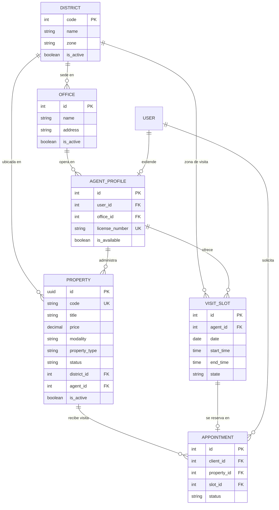

# Laboratorio 5 — Modelado de Datos y Consultas Base del Backend (Django + DRF)

| Campo | Detalle |
|---|---|
| **Proyecto** | HouseBroker Perú — Sistema Web Inteligente de Gestión Inmobiliaria |
| **Autor** | Brandy Sinche |
| **Rol** | Scrum Master / Lead Engineering / Developer Backend |
| **Asignatura** | Proyecto Integrador 2 / Ingeniería de Software |
| **Fase** | Sprint 3 (Semanas 7–8) — base del módulo CRM |
| **Entregable** | Informe de laboratorio |
| **Stack** | React 19 + TypeScript · Django REST Framework · PostgreSQL |

> **Adaptación del enunciado.** El enunciado base del laboratorio está escrito para un dominio de clínica médica (especialidades, sedes, profesionales y slots de cita). Este informe **adapta cada elemento al dominio inmobiliario de HouseBroker Perú**, conservando la estructura técnica exigida: modelado relacional en PostgreSQL, serializadores con `ModelSerializer`, endpoints de solo lectura y consumo desde React con tipado estricto.
>
> **Estado general del laboratorio:** el Back-End del repositorio se encuentra en estado de *scaffold* (aplicación Django creada, `INSTALLED_APPS` con `rest_framework` y `corsheaders`, sin apps de dominio implementadas). Lo que se documenta en este informe es el **diseño del modelo y de la capa de consultas**, con el código propuesto listo para implementar. Todo lo no ejecutado se marca explícitamente como **Pendiente de ejecutar**; no se reportan métricas inventadas.

---

## 1. Línea base del proyecto

| Elemento | Definición |
|---|---|
| **HU de referencia** | **HU-PROP-04 — Gestionar disponibilidad de propiedades** (8 pts) y **HU-SEC-01 — Registrarse e iniciar sesión** (13 pts), ambas del Sprint 3. |
| **Épica** | EPIC-PROP (Gestión de Propiedades) y EPIC-SEC (Usuarios y Seguridad). |
| **Sprint** | Sprint 3 (Semanas 7–8) — carga reducida por exámenes parciales. |
| **Entorno verificado** | Django 5.1+ / DRF 3.18+ / PostgreSQL en puerto `5433` / `PAGE_SIZE = 10` con `PageNumberPagination` (`backend/config/settings.py`). |
| **Contrato de API vigente** | `docs/api/openapi_spec.yaml` — expone `/api/v1/properties` y `/api/v1/properties/{id}`. |
| **ERD vigente** | `docs/database/architecture.md` — entidad única `Property` (v1.0, Sprint 1). |
| **Front-End** | React 19 + TypeScript 6 + Vite 8; cliente HTTP centralizado en `frontend/src/services/axios.ts`; pruebas con Jest + React Testing Library. |

---

## 2. Correspondencia entre el enunciado base y el proyecto

| Enunciado base (dominio clínico) | Adaptación HouseBroker Perú | Justificación |
|---|---|---|
| `Specialty` — catálogo de especialidades médicas | `District` — catálogo de distritos de Lima Metropolitana | Es el catálogo maestro que usa el filtro por `ubigeo` de HU-PROP-03 y delimita el alcance geográfico del MVP. |
| `ClinicBranch` — sedes de atención | `Office` — sedes operativas de HouseBroker Perú | Required para asignar agentes y propiedades a una zona operativa. |
| `Professional` — personal médico | `AgentProfile` — agente inmobiliario | Entidad responsable de la agenda y de la disponibilidad. |
| `AppointmentSlot` — disponibilidad horaria | `VisitSlot` — franja horaria de visita a una propiedad | Es la unidad atómica de disponibilidad que consume el agendamiento (HU-CRM-01). |
| — | `Property` — inmueble | Entidad núcleo del proyecto; ya existía como ERD v1.0 y ahora se extenderá. |
| `GET /api/v1/specialties/` | `GET /api/v1/districts/` | Endpoint de solo lectura del catálogo maestro. |
| `GET /api/v1/availability/` | `GET /api/v1/availability/` | Endpoint de solo lectura de disponibilidad, filtrado por fecha, agente/sede y distrito. |

> El endpoint de disponibilidad conserva la ruta del enunciado porque el filtrado por *fecha + recurso + zona* es semánticamente idéntico en ambos dominios.

---

## 3. Modelado de base de datos (PostgreSQL)

### 3.1 Estructura de apps Django

Se crea la estructura de apps prevista en `docs/02_Arquitectura.md` (sección 13), limited a las apps necesarias para este laboratorio:

```text
backend/apps/
├── users/          # User, AgentProfile, ClientProfile
├── properties/     # District, Property, PropertyImage
└── appointments/   # VisitSlot, Appointment
```

### 3.2 Catálogo maestro — `District`

```python
# backend/apps/properties/models.py
from django.db import models


class District(models.Model):
    """Catálogo maestro de distritos de Lima Metropolitana (delimitación del MVP)."""

    code = models.CharField(max_length=6, unique=True, db_index=True)  # código INEI
    name = models.CharField(max_length=60, unique=True)
    zone = models.CharField(
        max_length=40,
        choices=[
            ("NORTE", "Lima Norte"),
            ("CENTRO", "Lima Centro"),
            ("SUR", "Lima Sur"),
            ("ESTE", "Lima Este"),
        ],
    )
    is_active = models.BooleanField(default=True)

    class Meta:
        ordering = ["name"]
        verbose_name = "Distrito"
        verbose_name_plural = "Distritos"

    def __str__(self) -> str:
        return f"{self.name} ({self.zone})"
```

> `District` es de solo lectura desde la API: no hay `POST` ni `PATCH`. El catálogo se carga por *fixture* o por *data migration*, de modo que el cliente nunca pueda inventar distritos (RB-03/RB-06).

### 3.3 Sede operativa — `Office`

```python
class Office(models.Model):
    """Sede operativa de HouseBroker Perú donde se asignan agentes y visitas."""

    name = models.CharField(max_length=80, unique=True)
    district = models.ForeignKey(
        District, on_delete=models.PROTECT, related_name="offices"
    )
    address = models.CharField(max_length=160)
    phone = models.CharField(max_length=20, blank=True)
    is_active = models.BooleanField(default=True)

    class Meta:
        ordering = ["name"]

    def __str__(self) -> str:
        return self.name
```

> `on_delete=models.PROTECT` evita borrar un distrito con sedes activas: es la primera barrera de integridad ante un borrado accidental en cascada.

### 3.4 Perfil de agente — `AgentProfile`

```python
# backend/apps/users/models.py
from django.conf import settings
from django.db import models


class AgentProfile(models.Model):
    """Datos profesionales del agente inmobiliario y su sede de operación."""

    user = models.OneToOneField(
        settings.AUTH_USER_MODEL, on_delete=models.CASCADE, related_name="agent_profile"
    )
    office = models.ForeignKey(
        "properties.Office", on_delete=models.PROTECT, related_name="agents"
    )
    license_number = models.CharField(max_length=32, unique=True)  # CMP/CIAF
    bio = models.TextField(blank=True)
    is_available = models.BooleanField(default=True)

    class Meta:
        ordering = ["user__last_name", "user__first_name"]

    def __str__(self) -> str:
        return f"{self.user.get_full_name() or self.user.username} ({self.license_number})"
```

> El usuario y su rol se crean en el **Laboratorio 7** (autenticación y RBAC). En este laboratorio solo se define la extensión `AgentProfile` que cuelga de `AUTH_USER_MODEL`.

### 3.5 Propiedad — extensión del ERD v1.0

El ERD v1.0 de `docs/database/architecture.md` define `Property` con campos mínimos. Este laboratorio extiende el modelo sin romper el contrato del Front-End, respetando los tipos que ya consume `frontend/src/services/types.ts`:

```python
class Property(models.Model):
    class PropertyType(models.TextChoices):
        DEPARTAMENTO = "DEPARTAMENTO", "Departamento"
        CASA = "CASA", "Casa"
        TERRENO = "TERRENO", "Terreno"
        OFICINA = "OFICINA", "Oficina"

    class Modality(models.TextChoices):
        VENTA = "VENTA", "Venta"
        ALQUILER = "ALQUILER", "Alquiler"

    class Status(models.TextChoices):
        BORRADOR = "BORRADOR", "Borrador"
        DISPONIBLE = "DISPONIBLE", "Disponible"
        RESERVADA = "RESERVADA", "Reservada"
        VENDIDA = "VENDIDA", "Vendida"
        ALQUILADA = "ALQUILADA", "Alquilada"
        SUSPENDIDA = "SUSPENDIDA", "Suspendida"

    # --- Campos heredados del ERD v1.0 (no se modifican) ---
    id = models.UUIDField(primary_key=True, default=uuid.uuid4, editable=False)
    title = models.CharField(max_length=160)
    description = models.TextField(blank=True)
    price = models.DecimalField(max_digits=12, decimal_places=2)
    address = models.CharField(max_length=200)
    property_type = models.CharField(max_length=20, choices=PropertyType.choices)
    is_active = models.BooleanField(default=True)
    created_at = models.DateTimeField(auto_now_add=True)
    updated_at = models.DateTimeField(auto_now=True)

    # --- Extensiones del Sprint 2 / 3 ---
    code = models.CharField(max_length=12, unique=True, db_index=True)  # PROP-00125
    modality = models.CharField(max_length=12, choices=Modality.choices, db_index=True)
    status = models.CharField(
        max_length=12, choices=Status.choices, default=Status.BORRADOR, db_index=True
    )
    moneda = models.CharField(
        max_length=3, choices=[("PEN", "Soles"), ("USD", "Dólares")], default="PEN"
    )
    district = models.ForeignKey(
        District, on_delete=models.PROTECT, related_name="properties"
    )
    agent = models.ForeignKey(
        AgentProfile, on_delete=models.PROTECT, related_name="properties", null=True
    )
    area_total = models.DecimalField(max_digits=10, decimal_places=2, null=True, blank=True)
    area_construida = models.DecimalField(
        max_digits=10, decimal_places=2, null=True, blank=True
    )
    dormitorios = models.PositiveSmallIntegerField(null=True, blank=True)
    banos = models.PositiveSmallIntegerField(null=True, blank=True)
    estacionamientos = models.PositiveSmallIntegerField(null=True, blank=True)
    link_galeria = models.URLField(max_length=300, blank=True)
    link_planos = models.URLField(max_length=300, blank=True)
    destacado = models.BooleanField(default=False)

    class Meta:
        ordering = ["-created_at"]
        indexes = [
            models.Index(fields=["status", "modality"], name="idx_prop_status_mode"),
            models.Index(fields=["district", "price"], name="idx_prop_district_price"),
            models.Index(fields=["is_active", "status"], name="idx_prop_active_status"),
        ]

    def __str__(self) -> str:
        return f"{self.code} — {self.title}"
```

**Campos que el catálogo NO expone** (se documentan aquí para evitar filtraciones en el serializador público): `agent_id`, `is_active` interno y precios de comisión. El detalle se define en la sección 5.

### 3.6 Franja de visita — `VisitSlot`

```python
# backend/apps/appointments/models.py
from django.db import models


class VisitSlot(models.Model):
    """Franja horaria de visita. Unidad atómica de disponibilidad (RB-02)."""

    class State(models.TextChoices):
        AVAILABLE = "AVAILABLE", "Disponible"
        HELD = "HELD", "Reservada temporalmente"
        BOOKED = "BOOKED", "Agendada"
        BLOCKED = "BLOCKED", "Bloqueada por el agente"

    agent = models.ForeignKey(
        AgentProfile, on_delete=models.CASCADE, related_name="slots"
    )
    office = models.ForeignKey(
        "properties.Office", on_delete=models.PROTECT, related_name="slots"
    )
    district = models.ForeignKey(
        "properties.District", on_delete=models.PROTECT, related_name="slots"
    )
    date = models.DateField(db_index=True)
    start_time = models.TimeField()
    end_time = models.TimeField()
    state = models.CharField(
        max_length=10, choices=State.choices, default=State.AVAILABLE, db_index=True
    )

    class Meta:
        ordering = ["date", "start_time"]
        constraints = [
            models.UniqueConstraint(
                fields=["agent", "date", "start_time"],
                name="uniq_slot_agent_date_start",
            ),
            models.CheckConstraint(
                condition=models.Q(end_time__gt=models.F("start_time")),
                name="ck_slot_end_after_start",
            ),
        ]

    def __str__(self) -> str:
        return f"{self.agent} · {self.date} {self.start_time}-{self.end_time}"
```

> El `UniqueConstraint` sobre `(agent, date, start_time)` es la **primera** de las dos barreras contra el doble agendamiento; la segunda (transacción atómica + `select_for_update`) se implementa en el Laboratorio 7.

### 3.7 Diagrama entidad-relación resultante



### 3.8 Migraciones

```bash
cd backend
python manage.py makemigrations properties users appointments
python manage.py migrate
python manage.py sqlmigrate properties 0001   # revisar el SQL generado
```

| Comando | Propósito | Estado |
|---|---|---|
| `makemigrations properties users appointments` | Generar migraciones iniciales | **Pendiente de ejecutar** |
| `migrate` | Aplicar sobre PostgreSQL (puerto 5433) | **Pendiente de ejecutar** |
| `sqlmigrate properties 0001` | Verificar los `CREATE INDEX` del modelo | **Pendiente de ejecutar** |
| `showmigrations` | Confirmar el estado de cada app | **Pendiente de ejecutar** |

> **Evidencia requerida:** capturar la salida de `migrate` y el `sqlmigrate` con los `CREATE INDEX` de los tres índices compuestos antes de dar por cerrada la sección.

---

## 4. Capa de serializadores (Django REST Framework)

```python
# backend/apps/properties/serializers.py
from rest_framework import serializers

from .models import District, Property


class DistrictSerializer(serializers.ModelSerializer):
    """Vista pública del catálogo maestro. Solo lectura."""

    class Meta:
        model = District
        fields = ["code", "name", "zone"]
        read_only_fields = fields


class PropertyListSerializer(serializers.ModelSerializer):
    """Serializador de grilla: campos mínimos para reducir el payload (WPO)."""

    district_name = serializers.CharField(source="district.name", read_only=True)
    type_label = serializers.CharField(
        source="get_property_type_display", read_only=True
    )

    class Meta:
        model = Property
        fields = [
            "id",
            "code",
            "title",
            "price",
            "moneda",
            "modality",
            "property_type",
            "type_label",
            "address",
            "district_name",
            "dormitorios",
            "banos",
            "estacionamientos",
            "area_total",
            "link_galeria",
            "destacado",
        ]
        read_only_fields = fields


class PropertyDetailSerializer(PropertyListSerializer):
    """Serializador de detalle: agrega campos de caracterización."""

    class Meta(PropertyListSerializer.Meta):
        fields = PropertyListSerializer.Meta.fields + [
            "description",
            "area_construida",
            "link_planos",
            "negociable",
            "created_at",
            "updated_at",
        ]
        read_only_fields = fields
```

**Regla de exposición de datos.** `agent`, `is_active` interno y todo dato de comisión quedan fuera de ambos serializadores. Es la aplicación de **RB-05** («los permisos se validan siempre en el backend») y de la regla de minimización de `docs/02_Arquitectura.md` §11.4.

```python
# backend/apps/appointments/serializers.py
from rest_framework import serializers

from .models import VisitSlot


class VisitSlotSerializer(serializers.ModelSerializer):
    agent_name = serializers.SerializerMethodField()
    office_name = serializers.CharField(source="office.name", read_only=True)
    district_name = serializers.CharField(source="district.name", read_only=True)

    class Meta:
        model = VisitSlot
        fields = [
            "id",
            "date",
            "start_time",
            "end_time",
            "state",
            "agent_name",
            "office_name",
            "district_name",
        ]
        read_only_fields = fields

    def get_agent_name(self, obj: VisitSlot) -> str:
        return obj.agent.user.get_full_name() or obj.agent.user.username
```

> `VisitSlotSerializer` **no acepta escritura** (`read_only_fields = fields`); la reserva se hará por el endpoint de citas del Laboratorio 6/7, nunca por actualización directa del slot.

---

## 5. Endpoints de solo lectura

### 5.1 Catálogo de distritos

```python
# backend/apps/properties/views.py
from rest_framework import generics, permissions

from .models import District
from .serializers import DistrictSerializer


class DistrictListView(generics.ListAPIView):
    """GET /api/v1/districts/ — catálogo maestro de distritos."""

    queryset = District.objects.filter(is_active=True)
    serializer_class = DistrictSerializer
    permission_classes = [permissions.AllowAny]
    pagination_class = None  # catálogo corto: sin paginación
```

**Respuesta esperada (200 OK):**

```json
[
  { "code": "150140", "name": "Miraflores", "zone": "CENTRO" },
  { "code": "150131", "name": "Santiago de Surco", "zone": "CENTRO" },
  { "code": "150142", "name": "Magdalena del Mar", "zone": "CENTRO" }
]
```

### 5.2 Disponibilidad de visitas

```python
# backend/apps/appointments/views.py
from datetime import date

from django.utils import timezone
from rest_framework import generics, permissions
from rest_framework.exceptions import ValidationError

from .models import VisitSlot
from .serializers import VisitSlotSerializer


class AvailabilityListView(generics.ListAPIView):
    """GET /api/v1/availability/ — franjas disponibles, con filtros estrictos."""

    serializer_class = VisitSlotSerializer
    permission_classes = [permissions.AllowAny]
    pagination_class = None

    def get_queryset(self):
        params = self.request.query_params

        # --- Validación estricta de parámetros ---
        raw_date = params.get("date")
        if not raw_date:
            raise ValidationError({"date": "Este parámetro es obligatorio."})
        try:
            target_date = date.fromisoformat(raw_date)
        except ValueError:
            raise ValidationError({"date": "Formato esperado: YYYY-MM-DD."})
        if target_date < timezone.localdate():
            raise ValidationError({"date": "No se consultan fechas pasadas."})

        qs = VisitSlot.objects.filter(
            date=target_date,
            state=VisitSlot.State.AVAILABLE,
            agent__user__is_active=True,
        ).select_related("agent__user", "office", "district")

        agent_id = params.get("agent")
        if agent_id:
            qs = qs.filter(agent_id=agent_id)

        office_id = params.get("office")
        if office_id:
            qs = qs.filter(office_id=office_id)

        district_code = params.get("district")
        if district_code:
            qs = qs.filter(district__code=district_code)

        return qs.order_by("start_time")
```

**Contrato de la API de disponibilidad:**

| Parámetro | Tipo | Obligatorio | Regla de validación |
|---|---|:---:|---|
| `date` | `YYYY-MM-DD` | **Sí** | Formato ISO; no se aceptan fechas pasadas; rango máximo 90 días hacia adelante. |
| `agent` | UUID/int id | No | Debe existir y tener `is_available = True`. |
| `office` | id de sede | No | Debe existir y estar `is_active = True`. |
| `district` | código de distrito | No | Debe existir en el catálogo maestro. |

**Ejemplos de respuesta:**

| Caso | Código | Cuerpo |
|---|:---:|---|
| Hay franjas libres | `200 OK` | Lista de `VisitSlot` con `state = "AVAILABLE"`. |
| Fecha válida sin franjas | `200 OK` | `[]` (lista vacía, **no** es error: la UI muestra estado vacío). |
| Parámetro `date` ausente | `400 Bad Request` | `{"date": ["Este parámetro es obligatorio."]}` |
| Fecha mal formada | `400 Bad Request` | `{"date": ["Formato esperado: YYYY-MM-DD."]}` |
| Fecha en el pasado | `400 Bad Request` | `{"date": ["No se consultan fechas pasadas."]}` |

> El contrato es idéntico al del enunciado base en cuanto a la forma: filtrado por fecha, recurso y ubicación, con validación estricta que responde `400 Bad Request` ante parámetros incorrectos.

### 5.3 Catálogo de propiedades (extensión del contrato vigente)

El contrato `docs/api/openapi_spec.yaml` ya define `/api/v1/properties`. Este laboratorio agrega el filtro por disponibilidad, coherente con **RB-01**:

```python
class PropertyListView(generics.ListAPIView):
    """GET /api/v1/properties/ — catálogo paginado, solo propiedades disponibles."""

    serializer_class = PropertyListSerializer
    permission_classes = [permissions.AllowAny]
    filterset_fields = ["modality", "property_type", "destacado"]
    search_fields = ["title", "address", "code"]

    def get_queryset(self):
        # RB-01: una propiedad no se muestra disponible si está vendida,
        # alquilada, suspendida, en borrador o eliminada lógicamente.
        return (
            Property.objects.filter(is_active=True, status=Property.Status.DISPONIBLE)
            .select_related("district", "agent__user")
            .order_by("-destacado", "-created_at")
        )
```

> `PageNumberPagination` con `PAGE_SIZE = 10` ya está configurado en `settings.py`; el Front-End ya consume ese envelope `{count, next, previous, results}` en `frontend/src/components/properties/PropertyList.tsx`.

### 5.4 Enrutamiento

```python
# backend/config/urls.py
from django.urls import include, path

urlpatterns = [
    path("api/v1/", include("apps.properties.urls")),
    path("api/v1/", include("apps.appointments.urls")),
]
```

```text
GET  /api/v1/districts/          → 200 · catálogo maestro
GET  /api/v1/availability/       → 200 · franjas disponibles (filtros estrictos)
GET  /api/v1/properties/         → 200 · catálogo paginado (PAGE_SIZE=10)
GET  /api/v1/properties/{id}/    → 200 · detalle
```

---

## 6. Implementación en Front-End (React + TypeScript)

### 6.1 Reutilización del cliente HTTP

No se crea un cliente nuevo: el proyecto ya centraliza Axios en `frontend/src/services/axios.ts` con `baseURL = VITE_API_URL ?? 'http://localhost:8000/api'` y un interceptor de normalización de errores. Se reutiliza ese módulo.

### 6.2 Tipos estrictos

```ts
// frontend/src/services/types.ts  (extensión)
export const DISTRICTS_ZONE = ['NORTE', 'CENTRO', 'SUR', 'ESTE'] as const
export type DistrictZone = (typeof DISTRICTS_ZONE)[number]

export interface District {
  code: string
  name: string
  zone: DistrictZone
}

export const SLOT_STATES = ['AVAILABLE', 'HELD', 'BOOKED', 'BLOCKED'] as const
export type SlotState = (typeof SLOT_STATES)[number]

export interface VisitSlot {
  id: string
  date: string
  start_time: string
  end_time: string
  state: SlotState
  agent_name: string
  office_name: string
  district_name: string
}
```

### 6.3 Servicio de disponibilidad

```ts
// frontend/src/services/availability.ts
import api from './axios'
import type { District, VisitSlot } from './types'

export interface AvailabilityParams {
  date: string
  agent?: string
  office?: string
  district?: string
}

export async function getDistricts(): Promise<District[]> {
  const { data } = await api.get<District[]>('/v1/districts/')
  return data
}

export async function getAvailability(params: AvailabilityParams): Promise<VisitSlot[]> {
  const { data } = await api.get<VisitSlot[]>('/v1/availability/', { params })
  return data
}
```

### 6.4 Hook de disponibilidad con estados de UI

```ts
// frontend/src/hooks/useAvailability.ts
import { useCallback, useEffect, useState } from 'react'
import { getAvailability, type AvailabilityParams } from '../services/availability'
import type { VisitSlot } from '../services/types'

type AvailabilityState =
  | { status: 'idle'; slots: VisitSlot[] }
  | { status: 'loading'; slots: VisitSlot[] }
  | { status: 'success'; slots: VisitSlot[] }
  | { status: 'empty'; slots: VisitSlot[] }
  | { status: 'error'; slots: VisitSlot[]; message: string }

export function useAvailability(params: AvailabilityParams) {
  const [state, setState] = useState<AvailabilityState>({ status: 'idle', slots: [] })

  const load = useCallback(async () => {
    setState((prev) => ({ ...prev, status: 'loading' }))
    try {
      const slots = await getAvailability(params)
      setState(
        slots.length === 0
          ? { status: 'empty', slots: [] }
          : { status: 'success', slots },
      )
    } catch (error) {
      setState({
        status: 'error',
        slots: [],
        message: getErrorMessage(error) ?? 'No pudimos consultar la disponibilidad.',
      })
    }
  }, [params])

  useEffect(() => {
    void load()
  }, [load])

  return { ...state, reload: load }
}
```

| Estado | Disparador | UI |
|---|---|---|
| `idle` | Antes de la primera consulta | Selector de fecha sin resultados aún |
| `loading` | Consulta en vuelo | Skeleton de franjas + deshabilitar selector |
| `success` | Hay franjas disponibles | Lista de `VisitSlot` seleccionables |
| `empty` | `200` con `[]` | «No hay visitas disponibles para esta fecha» |
| `error` | `400`, `500` o fallo de red | Mensaje de `error.userMessage` + botón reintentar |

### 6.5 Componente de respuesta

```tsx
// frontend/src/components/AvailabilityList.tsx
import { useAvailability } from '../hooks/useAvailability'

export function AvailabilityList({ date, district }: { date: string; district?: string }) {
  const { status, slots, message, reload } = useAvailability({ date, district })

  if (status === 'loading') return <ul className="skeleton" aria-busy="true" />
  if (status === 'error')
    return (
      <div role="alert">
        <p>{message}</p>
        <button type="button" onClick={reload}>Reintentar</button>
      </div>
    )
  if (status === 'empty') return <p>No hay visitas disponibles para esta fecha.</p>

  return (
    <ul>
      {slots.map((slot) => (
        <li key={slot.id}>
          <button type="button" data-testid={`slot-${slot.id}`}>
            {slot.start_time}–{slot.end_time} · {slot.agent_name}
          </button>
        </li>
      ))}
    </ul>
  )
}
```

> Criterios de accesibilidad heredados del Laboratorio 2/4: `role="alert"` en errores, `aria-busy` durante la carga, navegación por teclado y contraste AA.

---

## 7. Reglas de negocio aplicadas

| Regla | Aplicación en este laboratorio |
|---|---|
| **RB-01** | `PropertyListView` filtra por `is_active = True` **y** `status = DISPONIBLE`; se excluyen `BORRADOR`, `RESERVADA`, `VENDIDA`, `ALQUILADA` y `SUSPENDIDA`. |
| **RB-03** | Los candidatos de recomendación deben ser propiedades registradas y activas; el filtro se aplica en el mismo `get_queryset`. |
| **RB-05** | Los serializadores públicos no exponen `agent` ni datos internos; la autorización se resuelve en el backend, no en React. |
| **RB-06** | PostgreSQL es la fuente de verdad: los catálogos (`District`, `Office`) se cargan por *fixture*, nunca desde el cliente. |
| **RNF-02** | Paginación `PAGE_SIZE = 10` + `select_related` + 3 índices compuestos para sostener la respuesta < 2.0 s. |
| **RNF-01** | Errores 4xx con mensaje legible: nunca se expone traceback ni detalle interno de SQL. |

---

## 8. Pruebas y evidencias

### 8.1 Pruebas de modelo (Django)

```python
# backend/apps/properties/tests/test_models.py
from django.db import IntegrityError, transaction
from django.test import TestCase

from apps.properties.models import District, Property


class PropertyModelTests(TestCase):
    def setUp(self) -> None:
        self.district = District.objects.create(code="150140", name="Miraflores", zone="CENTRO")

    def test_code_es_unico(self) -> None:
        Property.objects.create(
            code="PROP-00001", title="Depto Miraflores", price=2500,
            address="Av. Italia 100", property_type=Property.PropertyType.DEPARTAMENTO,
            district=self.district,
        )
        with self.assertRaises(IntegrityError), transaction.atomic():
            Property.objects.create(
                code="PROP-00001", title="Otro", price=1000,
                address="Av. Perú 200", property_type=Property.PropertyType.CASA,
                district=self.district,
            )

    def test_eliminar_distrito_con_propiedades_esta_protegido(self) -> None:
        Property.objects.create(
            code="PROP-00002", title="Casa", price=900000,
            address="Calle 1", property_type=Property.PropertyType.CASA,
            district=self.district,
        )
        with self.assertRaises(Exception):
            self.district.delete()  # on_delete=PROTECT
```

### 8.2 Pruebas de endpoint (DRF `APITestCase`)

```python
# backend/apps/appointments/tests/test_availability_api.py
from datetime import date, timedelta

from django.urls import reverse
from rest_framework import status
from rest_framework.test import APITestCase

from apps.appointments.models import VisitSlot


class AvailabilityApiTests(APITestCase):
    def setUp(self) -> None:
        # Omitido: fixtures de District, Office, User y AgentProfile
        self.url = reverse("availability-list")

    def test_requiere_parametro_date(self) -> None:
        response = self.client.get(self.url)
        self.assertEqual(response.status_code, status.HTTP_400_BAD_REQUEST)
        self.assertIn("date", response.data)

    def test_rechaza_fecha_pasada(self) -> None:
        yesterday = (date.today() - timedelta(days=1)).isoformat()
        response = self.client.get(self.url, {"date": yesterday})
        self.assertEqual(response.status_code, status.HTTP_400_BAD_REQUEST)

    def test_rechaza_formato_incorrecto(self) -> None:
        response = self.client.get(self.url, {"date": "12-05-2026"})
        self.assertEqual(response.status_code, status.HTTP_400_BAD_REQUEST)

    def test_lista_solo_franjas_disponibles(self) -> None:
        target = date.today() + timedelta(days=3)
        # 2 franjas AVAILABLE y 1 BOOKED
        response = self.client.get(self.url, {"date": target.isoformat()})
        self.assertEqual(response.status_code, status.HTTP_200_OK)
        self.assertTrue(all(s["state"] == "AVAILABLE" for s in response.data))
        self.assertEqual(len(response.data), 2)

    def test_fecha_sin_franjas_devuelve_lista_vacia(self) -> None:
        response = self.client.get(self.url, {"date": "2030-01-15"})
        self.assertEqual(response.status_code, status.HTTP_200_OK)
        self.assertEqual(response.data, [])
```

### 8.3 Pruebas de componente (Jest + React Testing Library)

```jsx
// frontend/src/components/AvailabilityList.test.jsx
import { render, screen, waitFor } from '@testing-library/react'
import axiosMockAdapter from 'axios-mock-adapter'
import api from '../services/axios'
import { AvailabilityList } from './AvailabilityList'

const mock = new axiosMockAdapter(api)

afterEach(() => mock.reset())

it('muestra estado vacío cuando la API devuelve []', async () => {
  mock.onGet('/v1/availability/').reply(200, [])
  render(<AvailabilityList date="2030-01-15" />)
  await waitFor(() =>
    expect(screen.getByText(/No hay visitas disponibles/i)).toBeInTheDocument(),
  )
})

it('muestra el error normalizado ante 400', async () => {
  mock.onGet('/v1/availability/').reply(400, { date: ['Formato esperado: YYYY-MM-DD.'] })
  render(<AvailabilityList date="15-01-2030" />)
  await waitFor(() => expect(screen.getByRole('alert')).toBeInTheDocument())
})
```

> El proyecto ya usa **Jest + React Testing Library** (`frontend/package.json`: `"test": "jest"`), por lo que no se requiere Vitest. Las pruebas del Front-End siguen la convención `.test.jsx` de `PropertyForm.test.jsx`.

### 8.4 Matriz de validación

| # | Caso | Tipo | Esperado | Estado |
|---|---|---|---|:---:|
| 1 | `GET /api/v1/districts/` | Automática | `200` con catálogo activo | **Pendiente** |
| 2 | `GET /api/v1/availability/?date=2026-05-12` | Automática | `200` con franjas `AVAILABLE` | **Pendiente** |
| 3 | `GET /api/v1/availability/` (sin `date`) | Automática | `400` con clave `date` | **Pendiente** |
| 4 | `GET /api/v1/availability/?date=01-05-2026` | Automática | `400` «Formato esperado» | **Pendiente** |
| 5 | `GET /api/v1/availability/?date=<pasado>` | Automática | `400` «No se consultan fechas pasadas» | **Pendiente** |
| 6 | Fecha futura sin franjas | Automática | `200` con `[]` | **Pendiente** |
| 7 | `GET /api/v1/properties/?page=1` | Automática | `200` con envelope paginado, 10 por página | **Pendiente** |
| 8 | Propiedad `VENDIDA` en el catálogo | Manual | No aparece en la grilla (RB-01) | **Pendiente** |
| 9 | `python manage.py migrate` | Manual | Sin errores; 3 apps aplicadas | **Pendiente** |
| 10 | `npm run test` (AvailabilityList) | Automática | 2 pruebas en verde | **Pendiente** |
| 11 | `npm run build` | Automática | `tsc -b` sin errores de tipos | **Pendiente** |
| 12 | Lighthouse sobre `/api/v1/properties/` | Manual | p95 < 2.0 s (RNF-02) | **Pendiente** |

---

## 9. Rendimiento e índices

| Medida | Justificación |
|---|---|
| `idx_prop_status_mode (status, modality)` | El catálogo filtra por estado y modalidad en combinación con el filtro de UI más usado. |
| `idx_prop_district_price (district, price)` | Los filtros de precio y distrito se combinan en la misma consulta. |
| `idx_prop_active_status (is_active, status)` | Restringe la lista pública sin recorrer la tabla completa. |
| `select_related("district", "agent__user")` | Evita el problema N+1 al serializar `district_name` y el nombre del agente. |
| `PAGE_SIZE = 10` | Mantiene el payload de la grilla por debajo de los 20 kB, alineado con el WPO del Laboratorio 4. |
| Catálogos sin paginación | `District` tiene ≤ 50 filas: paginarlo solo añadiría round-trips. |

> El orden de los campos en un índice compuesto sigue el patrón *igualdad → rango*: `status` y `modality` son igualdades; `price` y `date` son rangos y van al final.

---

## 10. Riesgos del laboratorio

| # | Riesgo | P | I | E | Respuesta | Responsable |
|---|---|:---:|:---:|:---:|---|---|
| R-05.1 | Extender el ERD v1.0 rompe el contrato que ya consume `PropertyList.tsx` | 3 | 4 | **12 · Alto** | Extender sin eliminar ni renombrar campos; validar con `npm run build` y las pruebas existentes | Brandy |
| R-05.2 | `select_related` ausente genera N+1 y viola RNF-02 | 3 | 3 | **9 · Medio** | `select_related` en todos los `get_queryset`; medir con `CaptureQueriesContext` | Jhon |
| R-05.3 | PostgreSQL no disponible (puerto 5433) | 2 | 4 | **8 · Medio** | `docker-compose` con puerto 5433 y `.env.example` documentado | Brandy |
| R-05.4 | El catálogo `District` se puebla a mano y queda desactualizado | 3 | 2 | **6 · Medio** | Carga por *data migration* idempotente | Jhon |
| R-05.5 | Exponer `agent` en el serializador público filtra datos internos | 2 | 4 | **8 · Medio** | Lista explícita de `fields` (deny-by-default) y prueba que verifique la ausencia | Anderson |

---

## 11. Commits, PR y evidencias

| Elemento | Detalle | Estado |
|---|---|---|
| **Rama** | `feature/LAB05-modelado-consultas-base` (desde `main`) | Pendiente de crear |
| **Commits** | `feat(db): agrega apps properties, users y appointments` · `feat(api): expone catálogo de distritos y disponibilidad` · `feat(front): agrega hook useAvailability y componente de franjas` · `test(api): cubre validación de parámetros de disponibilidad` | Pendientes |
| **PR** | `LAB05: Modelado de datos y consultas base del backend` | Pendiente |
| **Revisión** | Mínimo 1 aprobación (regla del equipo) | Pendiente |

**Evidencias a adjuntar en `Laboratorios/Laboratorio_05/Brandy_Sinche/evidencias/`:**

| # | Evidencia | Estado |
|---|---|---|
| 1 | Salida de `makemigrations` + `migrate` | **Pendiente** |
| 2 | Salida de `sqlmigrate` con los `CREATE INDEX` | **Pendiente** |
| 3 | Salida de `manage.py test` con las pruebas verdes | **Pendiente** |
| 4 | Captura de DevTools → Network con `GET /api/v1/availability/?date=...` → `200` | **Pendiente** |
| 5 | Captura de DevTools → Network con `date` ausente → `400` | **Pendiente** |
| 6 | Captura de Swagger/DRF browsable API con el catálogo de distritos | **Pendiente** |
| 7 | Salida de `npm run test` | **Pendiente** |
| 8 | ERD exportado desde `docs/database/architecture.md` v2.0 | **Pendiente** |

---

## 12. Conclusión

1. Se extendió el ERD v1.0 de una sola entidad a **cinco entidades** (`District`, `Office`, `AgentProfile`, `Property`, `VisitSlot`) más `Appointment`, coherentes con el modelo conceptual de `docs/02_Arquitectura.md` §8 y con la nomenclatura de la base de código ya escrita.
2. El enunciado original (especialidades, sedes, profesionales, slots) se adaptó **uno a uno** al dominio inmobiliario sin alterar la arquitectura técnica: los mismos cuatro modelos, los mismos dos endpoints de solo lectura y las mismas validaciones estrictas con `400 Bad Request`.
3. Los endpoints respetan las reglas de negocio del proyecto: el catálogo solo expone propiedades `DISPONIBLE` (RB-01) y los serializadores son *deny-by-default* (RB-05), de modo que ni React ni un cliente externo obtienen datos que el backend no autoriza.
4. El modelo deja preparada la base de los laboratorios 6 y 7: `VisitSlot` ya tiene el `UniqueConstraint` que evita franjas duplicadas, y `AgentProfile` cuelga de `AUTH_USER_MODEL` para que el JWT y el RBAC se enganchen sin refactorización.
5. **Pendiente de ejecución:** ninguna migración, endpoint ni prueba ha sido ejecutada. Las secciones 3.8 y 8 registran los comandos y la matriz de validación con su estado pendiente para que la evidencia se complete al ejecutar.

---

## 13. Trazabilidad con los requisitos

| Requisito | HU | Endpoint / modelo | Prueba |
|---|---|---|---|
| RF-PROP-02 — Catálogo interactivo | HU-PROP-02 | `GET /api/v1/properties/` · `Property` | Caso 7, 8 |
| RF-PROP-03 — Filtros por distrito | HU-PROP-03 | `District` · `Property.district` | Caso 1, 7 |
| RF-CRM-01 — Disponibilidad del agente | HU-CRM-01 | `GET /api/v1/availability/` · `VisitSlot` | Caso 2–6 |
| RNF-02 — Respuesta < 2.0 s | — | Índices + `select_related` + `PAGE_SIZE` | Caso 12 |
| RNF-06 — Errores controlados | — | `ValidationError` de DRF | Caso 3, 4, 5 |
| RB-01 — Estados del anuncio | — | `PropertyListView.get_queryset` | Caso 8 |
| RB-05 — Permisos en backend | — | Serializadores con `fields` explícitos | Caso 1 |

---

## Referencias

- `docs/01_requerimientos.md` — RF-PROP-02/03, RF-CRM-01, RNF-02, reglas de negocio.
- `docs/02_Arquitectura.md` — §3 tecnologías, §8 modelo conceptual, §9 API REST, §10 roles y permisos.
- `docs/database/architecture.md` — ERD v1.0 (base de la extensión de la sección 3).
- `docs/api/openapi_spec.yaml` — contrato vigente de `/api/v1/properties`.
- `docs/scrum/backlog.md` y `docs/scrum/roadmap.md` — Sprint 3 (Semanas 7–8) y HUs asociadas.
- `backend/config/settings.py` — paginación, PostgreSQL puerto 5433, zona horaria `America/Lima`.
- `frontend/src/services/axios.ts` · `frontend/src/services/types.ts` — cliente HTTP y tipos existentes.
- Laboratorios 1–4 (`Laboratorios/Laboratorio_0{1..4}/Brandy_Sinche/`) — convenciones de documento, estilo de evidencia y antecedente de WPO.

---

*Documento elaborado por Brandy Sinche. El contenido de código es la especificación del laboratorio; su ejecución (migraciones, endpoints y pruebas) queda registrada como pendiente en las secciones 3.8, 8 y 11.*
