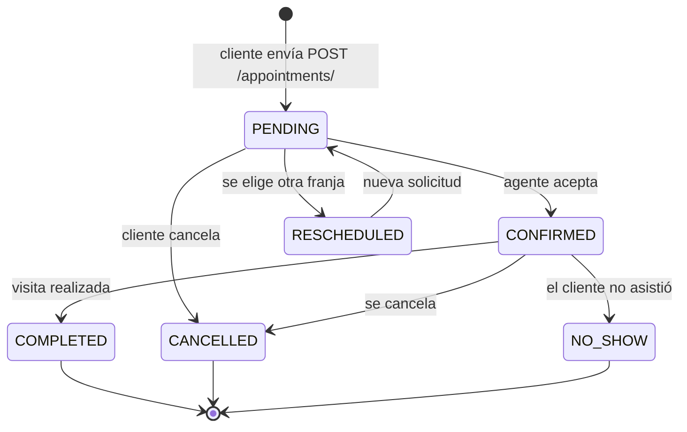

# Laboratorio 6 — Flujo de Negocio de Agendamiento de Visita y Formularios Interactivos

| Campo | Detalle |
|---|---|
| **Proyecto** | HouseBroker Perú — Sistema Web Inteligente de Gestión Inmobiliaria |
| **Autor** | Brandy Sinche |
| **Rol** | Scrum Master / Lead Engineering / Developer Backend |
| **Asignatura** | Proyecto Integrador 2 / Ingeniería de Software |
| **Fase** | Sprint 4 (Semanas 9–10) — APF 2 |
| **Entregable** | Informe de laboratorio |
| **Stack** | React 19 + TypeScript · Django REST Framework · PostgreSQL |

> **Adaptación del enunciado.** El enunciado base describe la ampliación del flujo de negocio con **formularios interactivos para la selección de turnos**, validadores personalizados en el serializador, manejo centralizado de excepciones y estados de interfaz (`idle`, `loading`, `success`, `error`). En HouseBroker Perú el «turno» es una **visita a una propiedad**, y el proceso de «pre-reserva» es la **solicitud de agendamiento** que el cliente envía al agente (HU-CRM-01). Se conserva la estructura del laboratorio y se traduce el dominio.
>
> **Estado general del laboratorio:** el diseño de abajo es la **especificación del incremento**, apoyada en el modelo de datos del Laboratorio 5. El código es propuesto y **no se ha ejecutado**; la sección 9 registra la matriz de pruebas con estado **Pendiente** y la sección 10, las evidencias a capturar. No se reportan resultados que no se hayan medido.

---

## 1. Línea base

| Elemento | Definición |
|---|---|
| **HU de referencia** | **HU-CRM-01 — Agendar una visita** (13 pts, Prioridad Alta) y **HU-CRM-02 — Gestionar citas** (5 pts). |
| **Épica** | EPIC-CRM (Gestión de Citas y contacto comercial). |
| **Sprint** | Sprint 4 (Semanas 9–10) → **APF 2**. |
| **Dependencias** | HU-PROP-02 (catálogo), HU-PROP-03 (filtros), HU-SEC-01 (autenticación), y el modelo del **Laboratorio 5** (`VisitSlot`, `Appointment`). |
| **Sprint Goal** | Entregar el módulo CRM inicial con agendamiento de visitas, calendario del agente y favoritos, conectado ya al backend real de Django + PostgreSQL. |
| **Base técnica real** | `VisitSlot` con `UniqueConstraint(agent, date, start_time)` (Lab 5); `Appointment` con máquina de estados; Axios centralizado en `frontend/src/services/axios.ts`; Jest + React Testing Library. |

---

## 2. Correspondencia entre el enunciado base y el proyecto

| Enunciado base (dominio clínico) | Adaptación HouseBroker Perú | Razón |
|---|---|---|
| Selección de **turno** para agendar una **cita** | Selección de **franja de visita** (`VisitSlot`) para agendar una **visita** a una propiedad | Es la misma mecánica: elegir un recurso y un horario libre, y enviar una solicitud. |
| Validadores personalizados en el serializador | Validadores de **coherencia de la visita**: propiedad disponible, franja libre, anticipación mínima y coherencia entre agente y zona | Los validadores son la barrera de negocio antes de persistir (sección 3). |
| Manejo centralizado de excepciones y respuestas estandarizadas | `custom_exception_handler` con envelope único `{code, message, fields}` | El Front-End ya normaliza errores en `services/errors.ts`; se le da un contrato estable. |
| Formularios controlados en React | Stepper de **pre-reserva**: `PropertyStep` → `DateStep` → `SlotStep` → `ConfirmStep` | Sigue el patrón de stepper ya usado en `PropertyForm.tsx` (consistencia visual). |
| Estados `idle / loading / success / error` | Los mismos cuatro, más `empty` para «no hay franjas» | Coherencia con `PropertyList.tsx`, que ya implementa `idle/loading/success/empty/error`. |
| Pruebas de componentes con librería estándar | **Jest + React Testing Library** (ya configurado en el proyecto) | No se introduce un framework nuevo. |
| Trazas de red y escenarios de error en la UI | Capturas de DevTools → Network sobre `POST /api/v1/appointments/` | Es la evidencia pedida por el enunciado (sección 10). |

---

## 3. Refinamiento en el Back-End (Django)

### 3.1 Modelo `Appointment` (extensión del Lab 5)

```python
# backend/apps/appointments/models.py
from django.conf import settings
from django.db import models


class Appointment(models.Model):
    """Solicitud de visita a una propiedad (HU-CRM-01)."""

    class Status(models.TextChoices):
        PENDING = "PENDING", "Pendiente"
        CONFIRMED = "CONFIRMED", "Confirmada"
        COMPLETED = "COMPLETED", "Completada"
        CANCELLED = "CANCELLED", "Cancelada"
        NO_SHOW = "NO_SHOW", "No asistió"
        RESCHEDULED = "RESCHEDULED", "Reprogramada"

    client = models.ForeignKey(
        settings.AUTH_USER_MODEL,
        on_delete=models.PROTECT,
        related_name="appointments",
        limit_choices_to={"role": "CLIENTE"},
    )
    agent = models.ForeignKey(
        AgentProfile, on_delete=models.PROTECT, related_name="appointments"
    )
    property = models.ForeignKey(
        "properties.Property", on_delete=models.PROTECT, related_name="appointments"
    )
    slot = models.OneToOneField(
        VisitSlot, on_delete=models.PROTECT, related_name="appointment"
    )

    # --- Datos de contacto registrados en el momento de la solicitud ---
    full_name = models.CharField(max_length=120)
    phone = models.CharField(max_length=20)
    notes = models.TextField(blank=True)
    preferred_contact = models.CharField(
        max_length=12,
        choices=[("WHATSAPP", "WhatsApp"), ("PHONE", "Teléfono"), ("EMAIL", "Correo")],
        default="WHATSAPP",
    )

    status = models.CharField(
        max_length=12, choices=Status.choices, default=Status.PENDING, db_index=True
    )
    client_note = models.TextField(blank=True)   # nota interna del agente
    created_at = models.DateTimeField(auto_now_add=True)
    updated_at = models.DateTimeField(auto_now=True)

    class Meta:
        ordering = ["-created_at"]
        indexes = [
            # Índice compuesto para el calendario del agente: estado + fecha de la franja.
            # Django no indexa campos de relaciones, por eso se indexa la FK `slot_id`
            # y la fecha se resuelve en la consulta mediante `slot__date`.
            models.Index(fields=["agent", "status", "slot"], name="idx_appt_agent_status"),
            models.Index(fields=["client", "-created_at"], name="idx_appt_client_recent"),
        ]

    def __str__(self) -> str:
        return f"{self.property.code} · {self.slot.date} {self.slot.start_time} · {self.status}"
```

> `OneToOneField` sobre `slot` es la **segunda barrera** contra el doble agendamiento: una franja que ya tiene cita no puede reutilizarse aunque se pase por alto la validación del serializador. El bloqueo pesimístico (`select_for_update`) se añade en el Laboratorio 7 para cerrar la condición de carrera.
>
> `limit_choices_to` no es una defensa de seguridad —solo restringe el selector del admin—; la autorización real se aplica en la vista y en los permisos (sección 3.5 y Laboratorio 7).

### 3.2 Validadores personalizados

Los validadores son la **integridad de datos de entrada previa a la reserva** que pide el enunciado. Se implementan como validadores de campo + validador de objeto en el serializador:

```python
# backend/apps/appointments/validators.py
from datetime import date, timedelta

from django.core.exceptions import ValidationError
from django.utils import timezone


def validate_future_date(value: date) -> None:
    """Una visita no puede agendarse para hoy ni para una fecha pasada."""
    if value < timezone.localdate():
        raise ValidationError("La fecha de la visita no puede ser anterior a hoy.")


def validate_minimum_anticipation(value: date) -> None:
    """Regla operativa: se requiere al menos 24 h de anticipación."""
    if value < timezone.localdate() + timedelta(days=1):
        raise ValidationError("La visita requiere al menos 24 horas de anticipación.")


def validate_slot_is_available(slot) -> None:
    """La franja debe seguir libre (RB-02)."""
    if slot.state != slot.State.AVAILABLE:
        raise ValidationError("El horario seleccionado ya no está disponible.")


def validate_property_is_listed(prop) -> None:
    """Solo se agenda visita sobre propiedades disponibles (RB-01)."""
    if not prop.is_active or prop.status != prop.Status.DISPONIBLE:
        raise ValidationError("La propiedad ya no se encuentra disponible para visitas.")
```

### 3.3 Serializador de creación de cita

```python
# backend/apps/appointments/serializers.py
from rest_framework import serializers

from .models import Appointment
from .validators import (
    validate_future_date,
    validate_minimum_anticipation,
    validate_property_is_listed,
    validate_slot_is_available,
)


class AppointmentCreateSerializer(serializers.ModelSerializer):
    """Entrada del cliente para solicitar una visita. Aplica RB-01 y RB-02."""

    property_id = serializers.UUIDField(write_only=True)
    slot_id = serializers.IntegerField(write_only=True)
    # El cliente NUNCA envía su propio id: se toma de request.user (ver Lab 7).
    # anti-IDOR: este campo no existe a propósito.

    class Meta:
        model = Appointment
        fields = [
            "property_id",
            "slot_id",
            "full_name",
            "phone",
            "notes",
            "preferred_contact",
        ]
        extra_kwargs = {
            "full_name": {"max_length": 120},
            "notes": {"max_length": 1000},
        }

    # --- Validaciones de campo ---
    def validate_phone(self, value: str) -> str:
        digits = value.replace(" ", "").replace("-", "")
        if not (9 <= len(digits) <= 15 and digits.isdigit()):
            raise serializers.ValidationError("Ingresa un número de teléfono válido.")
        return value

    # --- Validación de objeto (coherencia de la solicitud) ---
    def validate(self, attrs: dict) -> dict:
        prop = self._resolve_property(attrs["property_id"])
        slot = self._resolve_slot(attrs["slot_id"])
        validate_property_is_listed(prop)
        validate_slot_is_available(slot)
        validate_minimum_anticipation(slot.date)

        if slot.district_id != prop.district_id:
            raise serializers.ValidationError(
                {"slot_id": "El horario seleccionado pertenece a otra zona."}
            )
        if slot.agent_id != prop.agent_id:
            raise serializers.ValidationError(
                {"slot_id": "El agente de la franja no es el responsable de la propiedad."}
            )
        if slot.end_time <= slot.start_time:
            raise serializers.ValidationError({"slot_id": "Franja horaria inválida."})

        attrs["property"] = prop
        attrs["slot"] = slot
        return attrs

    def create(self, validated_data: dict) -> Appointment:
        return Appointment.objects.create(
            client=self.context["request"].user,  # ← siempre del token, nunca del body
            agent=validated_data["slot"].agent,
            property=validated_data["property"],
            slot=validated_data["slot"],
            **{k: v for k, v in validated_data.items() if k not in ("property", "slot")},
        )

    @staticmethod
    def _resolve_property(property_id):
        from apps.properties.models import Property

        try:
            return Property.objects.get(pk=property_id)
        except Property.DoesNotExist:
            raise serializers.ValidationError(
                {"property_id": "La propiedad indicada no existe."}
            )
```

**Contrato de validación (mapeado campo → mensaje):**

| Campo | Regla | Mensaje al cliente | HTTP |
|---|---|---|:---:|
| `phone` | 9–15 dígitos, solo numérico | «Ingresa un número de teléfono válido.» | `400` |
| `property_id` | Debe existir | «La propiedad indicada no existe.» | `400` |
| `property_id` | Debe estar `DISPONIBLE` | «La propiedad ya no se encuentra disponible para visitas.» | `400` |
| `slot_id` | Debe existir y estar `AVAILABLE` | «El horario seleccionado ya no está disponible.» | `400` |
| `slot_id` | Mismo distrito que la propiedad | «El horario seleccionado pertenece a otra zona.» | `400` |
| `slot_id` | Mismo agente responsable | «El agente de la franja no es el responsable de la propiedad.» | `400` |
| `slot_id` | ≥ 24 h de anticipación | «La visita requiere al menos 24 horas de anticipación.» | `400` |
| `notes` | Máx. 1000 caracteres | «Este campo admite 1000 caracteres como máximo.» | `400` |

### 3.4 Manejo centralizado de excepciones

Hoy DRF devuelve `{"detail": "..."}` o errores por campo. El proyecto necesita un **envelope único** para que React no tenga que interpretar cinco formatos distintos. Ya existe `frontend/src/services/errors.ts` que normaliza `detail` / `message` / errores por campo; se le entrega una forma estable:

```python
# backend/apps/common/exception_handler.py
from rest_framework.views import exception_handler as drf_exception_handler
from rest_framework.response import Response


def api_exception_handler(exc, context):
    """Envelope único de errores: {code, message, fields}."""
    response = drf_exception_handler(exc, context)
    if response is None:
        return None  # excepción no controlada: la registra el servidor, no se expone

    code_map = {400: "VALIDATION_ERROR", 401: "UNAUTHENTICATED", 403: "PERMISSION_DENIED",
                404: "NOT_FOUND", 409: "CONFLICT", 429: "THROTTLED", 500: "INTERNAL_ERROR"}
    status = response.status_code

    fields = None
    detail = response.data
    if isinstance(detail, dict) and "detail" in detail:
        message = str(detail["detail"])
        rest = {k: v for k, v in detail.items() if k != "detail"}
        fields = rest or None
    elif isinstance(detail, dict):
        message = "Revisa los datos enviados."
        fields = detail
    else:
        message = str(detail)

    return Response(
        {
            "code": code_map.get(status, "ERROR"),
            "message": message,
            "fields": fields,
        },
        status=status,
        headers=response.headers,
    )
```

```python
# backend/config/settings.py
REST_FRAMEWORK = {
    "DEFAULT_PAGINATION_CLASS": "rest_framework.pagination.PageNumberPagination",
    "PAGE_SIZE": 10,
    "EXCEPTION_HANDLER": "apps.common.exception_handler.api_exception_handler",
}
```

**Respuesta de error estandarizada:**

```json
{
  "code": "VALIDATION_ERROR",
  "message": "Revisa los datos enviados.",
  "fields": {
    "slot_id": ["El horario seleccionado ya no está disponible."],
    "phone": ["Ingresa un número de teléfono válido."]
  }
}
```

| Código | Significado para la UI | Acción en React |
|---|---|---|
| `VALIDATION_ERROR` | Dato inválido del formulario | Pintar el error bajo el campo (`fields` ya viene por clave) |
| `UNAUTHENTICATED` | Sesión ausente o vencida | Interceptor: limpiar sesión y redirigir al login (Lab 7) |
| `PERMISSION_DENIED` | Rol sin permiso | Mostrar «no autorizado» y ocultar la acción |
| `CONFLICT` | La franja se ocupa mientras se enviaba | «Ese horario acaba de ocuparse», ofrecer otra franja |
| `THROTTLED` | Demasiadas peticiones | «Espera un momento antes de reintentar» |
| `INTERNAL_ERROR` | Error del servidor | Mensaje genérico + registrar traza; **nunca** mostrar el detalle interno |

> `data=None` con `code` y `message` es deliberado: el Front-End no necesita parsear HTML ni traceback, y RNF-01 («sin errores 404 internos») se cumple por construcción.

### 3.5 Vistas del flujo de cita

```python
# backend/apps/appointments/views.py
from rest_framework import generics, permissions, status
from rest_framework.response import Response

from .models import Appointment
from .serializers import AppointmentCreateSerializer, AppointmentSerializer


class AppointmentCreateView(generics.CreateAPIView):
    """POST /api/v1/appointments/ — el cliente solicita una visita."""

    queryset = Appointment.objects.all()
    serializer_class = AppointmentCreateSerializer
    permission_classes = [permissions.IsAuthenticated]

    def create(self, request, *args, **kwargs):
        serializer = self.get_serializer(data=request.data)
        serializer.is_valid(raise_exception=True)
        appointment = serializer.save()
        # La franja queda retenida para que nadie más la tome mientras el agente responde.
        appointment.slot.update(state="HELD")
        return Response(
            AppointmentSerializer(appointment).data, status=status.HTTP_201_CREATED
        )


class AppointmentListView(generics.ListAPIView):
    """GET /api/v1/appointments/ — solo las citas del usuario autenticado (RB-04)."""

    serializer_class = AppointmentSerializer
    permission_classes = [permissions.IsAuthenticated]

    def get_queryset(self):
        user = self.request.user
        if user.role == "ADMINISTRADOR":
            return Appointment.objects.select_related("property", "slot", "agent__user")
        if user.role == "AGENTE":
            return Appointment.objects.filter(agent__user=user)
        return Appointment.objects.filter(client=user)  # ← IDOR mitigado por defecto
```

**El detalle crítico:** `AppointmentListView` filtra por `request.user` en el servidor. Un cliente que manipule el `id` de la URL no puede leer la cita de otro porque la consulta nunca acepta un identificador de usuario desde el cliente (Laboratorio 7 lo formaliza como escenario S06).

---

## 4. Máquina de estados de la cita



| Estado | Quién puede entrar | Efecto sobre `VisitSlot` |
|---|---|---|
| `PENDING` | Cliente (`POST`) | `VisitSlot.state = HELD` |
| `CONFIRMED` | Agente asignado | El slot sigue `HELD` |
| `COMPLETED` | Agente | El slot pasa a `BOOKED` |
| `CANCELLED` | Cliente o agente | El slot vuelve a `AVAILABLE` (liberación) |
| `RESCHEDULED` | Cliente o agente | El slot antiguo vuelve a `AVAILABLE`; el nuevo queda `HELD` |
| `NO_SHOW` | Agente | El slot queda `BOOKED` (franja consumida) |

> La liberación del slot en `CANCELLED` es la que hace que el inventario de disponibilidad no se agote: es la misma gestión de estados que el enunciado pide para la UI, extendida al dominio.

---

## 5. Implementación en Front-End (React + TypeScript)

### 5.1 Stepper de pre-reserva

Se sigue el patrón de stepper ya implementado en `frontend/src/components/properties/PropertyForm.tsx` (4 pasos, validación por paso) para que la UI sea homogénea.

```text
PropertyStep  →  DateStep  →  SlotStep  →  ConfirmStep
 ¿Qué casa?      ¿Qué día?    ¿Qué hora?    ¿Confirmas?
```

| Paso | Contenido | Fuente de datos | Validación antes de avanzar |
|---|---|---|---|
| 1. Propiedad | Tarjeta con la propiedad elegida | Catálogo (`/v1/properties/`) | La propiedad debe seguir `DISPONIBLE` |
| 2. Fecha | Selector de fecha (mín. mañana) | `VisitSlot` del Lab 5 | ≥ 24 h de anticipación |
| 3. Franja | Botones con hora, agente y zona | `GET /v1/availability/?date=&district=&agent=` | La franja sigue `AVAILABLE` |
| 4. Confirmación | Resumen + nombre, teléfono, nota, canal | Local | Nombre y teléfono válidos |

### 5.2 Tipos del formulario

```ts
// frontend/src/features/appointments/types.ts
export const CONTACT_CHANNELS = ['WHATSAPP', 'PHONE', 'EMAIL'] as const
export type ContactChannel = (typeof CONTACT_CHANNELS)[number]

export interface AppointmentFormData {
  property: { id: string; code: string; title: string; address: string } | null
  date: string | null
  slot: VisitSlot | null
  contact: {
    full_name: string
    phone: string
    notes: string
    preferred_contact: ContactChannel
  }
}

/** Errores por campo, con la misma clave que devuelve el backend. */
export type AppointmentFieldErrors = Partial<
  Record<'full_name' | 'phone' | 'notes' | 'property_id' | 'slot_id', string[]>
>
```

### 5.3 Hook del formulario controlado

```ts
// frontend/src/features/appointments/useAppointmentForm.ts
import { useCallback, useState } from 'react'
import type { AppointmentFieldErrors, AppointmentFormData } from './types'
import { getErrorMessage } from '../../services/errors'
import api from '../../services/axios'

type FormStatus = 'idle' | 'submitting' | 'success' | 'error'

const EMPTY: AppointmentFormData = {
  property: null,
  date: null,
  slot: null,
  contact: { full_name: '', phone: '', notes: '', preferred_contact: 'WHATSAPP' },
}

export function useAppointmentForm(onSuccess?: () => void) {
  const [data, setData] = useState<AppointmentFormData>(EMPTY)
  const [status, setStatus] = useState<FormStatus>('idle')
  const [message, setMessage] = useState<string | null>(null)
  const [fieldErrors, setFieldErrors] = useState<AppointmentFieldErrors>({})

  const setStep = useCallback(<K extends keyof AppointmentFormData>(
    key: K,
    value: AppointmentFormData[K],
  ) => setData((prev) => ({ ...prev, [key]: value })), [])

  const setContact = useCallback(
    (patch: Partial<AppointmentFormData['contact']>) =>
      setData((prev) => ({ ...prev, contact: { ...prev.contact, ...patch } })),
    [],
  )

  const submit = useCallback(async () => {
    if (!data.property || !data.slot) {
      setStatus('error')
      setMessage('Completa la selección de propiedad, fecha y horario.')
      return
    }
    setStatus('submitting')
    setFieldErrors({})
    setMessage(null)
    try {
      await api.post('/v1/appointments/', {
        property_id: data.property.id,
        slot_id: data.slot.id,
        ...data.contact,
      })
      setStatus('success')
      setMessage('Solicitud enviada. El agente confirmará tu visita.')
      onSuccess?.()
    } catch (error) {
      const err = error as { status?: number; data?: { fields?: AppointmentFieldErrors; message?: string } }
      setStatus('error')
      // El backend ya responde con {code, message, fields}: no se parsea HTML ni traceback.
      setFieldErrors(err.data?.fields ?? {})
      setMessage(
        err.status === 409
          ? 'Ese horario acaba de ocuparse. Elige otra franja.'
          : (err.data?.message ?? getErrorMessage(error) ?? 'No pudimos registrar tu solicitud.'),
      )
    }
  }, [data, onSuccess])

  const reset = useCallback(() => {
    setData(EMPTY)
    setStatus('idle')
    setFieldErrors({})
    setMessage(null)
  }, [])

  return { data, setStep, setContact, submit, reset, status, message, fieldErrors }
}
```

### 5.4 Componente de página

```tsx
// frontend/src/features/appointments/AppointmentWizard.tsx
import { useAppointmentForm } from './useAppointmentForm'

export function AppointmentWizard({ onSuccess }: { onSuccess?: () => void }) {
  const { data, setContact, submit, reset, status, message, fieldErrors } =
    useAppointmentForm(onSuccess)

  return (
    <form
      noValidate
      onSubmit={(e) => {
        e.preventDefault()
        void submit()
      }}
      aria-busy={status === 'submitting'}
    >
      {/* Paso 4: confirmación */}
      <label htmlFor="full_name">Nombre completo</label>
      <input
        id="full_name"
        name="full_name"
        value={data.contact.full_name}
        onChange={(e) => setContact({ full_name: e.target.value })}
        aria-invalid={Boolean(fieldErrors.full_name)}
        aria-describedby={fieldErrors.full_name ? 'err-full_name' : undefined}
        required
      />
      {fieldErrors.full_name && (
        <p id="err-full_name" role="alert">
          {fieldErrors.full_name[0]}
        </p>
      )}

      <label htmlFor="phone">Teléfono</label>
      <input
        id="phone"
        name="phone"
        type="tel"
        inputMode="tel"
        value={data.contact.phone}
        onChange={(e) => setContact({ phone: e.target.value })}
        aria-invalid={Boolean(fieldErrors.phone)}
        aria-describedby={fieldErrors.phone ? 'err-phone' : undefined}
        required
      />
      {fieldErrors.phone && (
        <p id="err-phone" role="alert">
          {fieldErrors.phone[0]}
        </p>
      )}

      <button type="submit" disabled={status === 'submitting'}>
        {status === 'submitting' ? 'Enviando…' : 'Solicitar visita'}
      </button>

      {status === 'success' && (
        <div role="status">
          <p>{message}</p>
          <button type="button" onClick={reset}>Agendar otra visita</button>
        </div>
      )}

      {status === 'error' && (
        <div role="alert">
          <p>{message}</p>
        </div>
      )}
    </form>
  )
}
```

### 5.5 Estados de la interfaz

| Estado | Disparador | Qué ve el usuario | Qué hace el formulario |
|---|---|---|---|
| `idle` | Antes de enviar | Formulario habilitado | Permite editar los 4 pasos |
| `submitting` (→ `loading`) | `POST` en vuelo | Botón «Enviando…», `aria-busy="true"` | Campos deshabilitados, sin doble envío |
| `success` | `201 Created` | Confirmación + «Agendar otra visita» | `reset()` y vuelve a `idle` |
| `error` | `400`, `409`, `500` o red caída | Mensaje + errores bajo cada campo | Permite reintentar sin recargar |
| `empty` (dentro del paso 3) | `GET /availability` devuelve `[]` | «No hay visitas disponibles para esta fecha» | Bloquea el avance al paso 4 |

> El estado `empty` no es un error: es información útil que evita que el cliente llegue al final y descubra que no hay horario. Es la diferencia entre un formulario usable y uno frustrante.

### 5.6 Accesibilidad (criterio del proyecto, WCAG 2.2 AA)

| Requisito | Implementación |
|---|---|
| Etiquetas asociadas | `<label htmlFor>` en cada control del formulario |
| Error identificable | `aria-invalid="true"` + `aria-describedby` apuntando al mensaje |
| Error anunciado | `role="alert"` en el mensaje de error y en el de éxito `role="status"` |
| Foco visible | Anillo de foco visible en todos los pasos del stepper |
| Navegación por teclado | `Tab` / `Enter` / `Espacio` recorren los pasos; el `Enter` no envía antes del último paso |
| Zoom 200 % | Stepper apilado en < 768 px sin desplazamiento horizontal |
| Contraste | Textos de error ≥ 4.5:1 (AA) |

---

## 6. Integración con el flujo ya existente

```ts
// frontend/src/services/appointments.ts
import api from './axios'
import type { AppointmentFormData } from '../features/appointments/types'

export interface Appointment {
  id: string
  property: { id: string; code: string; title: string }
  slot: VisitSlot
  agent_name: string
  status: 'PENDING' | 'CONFIRMED' | 'COMPLETED' | 'CANCELLED' | 'NO_SHOW' | 'RESCHEDULED'
  created_at: string
}

export async function createAppointment(
  data: AppointmentFormData & { property_id: string; slot_id: number },
): Promise<Appointment> {
  const { data: body } = await api.post<Appointment>('/v1/appointments/', data)
  return body
}

export async function listAppointments(): Promise<Appointment[]> {
  const { data } = await api.get<{ results: Appointment[] }>('/v1/appointments/')
  return data.results
}
```

| Punto de integración | Archivo | Qué aporta |
|---|---|---|
| Cliente HTTP con normalización de errores | `services/axios.ts` + `services/errors.ts` | `error.userMessage` sin depender del formato crudo |
| Catálogo de propiedades | `components/properties/PropertyList.tsx` | Origen del `property_id` que inicia el wizard |
| Disponibilidad de franjas | `hooks/useAvailability.ts` (Lab 5) | Alimenta el paso 3 y el estado `empty` |
| Stepper de referencia | `components/properties/PropertyForm.tsx` | Patrón visual y de validación por paso reutilizado |
| Botón de acción | `components/properties/PropertyCard.tsx` | «Agendar visita» en la tarjeta del catálogo |

---

## 7. Reglas de negocio aplicadas

| Regla | Dónde se aplica |
|---|---|
| **RB-01** | `validate_property_is_listed()`: no se agenda visita sobre una propiedad vendida, alquilada, suspendida o en borrador. |
| **RB-02** | `validate_slot_is_available()` + máquina de estados: la cita solo se reserva en un horario libre del agente. |
| **RB-04** | `AppointmentListView.get_queryset()` filtra por `request.user`; el agente solo ve sus citas. |
| **RB-05** | La autorización se resuelve en la vista; React solo refleja el estado devuelto. |
| **RN-03** | La agenda queda centralizada: la solicitud entra como `PENDING` y el agente confirma, rechaza o reprograma. |
| **RNF-01** | Envelope de error único; nunca se expone traceback ni detalle interno de SQL. |
| **RNF-02** | La UI muestra `empty` antes de llegar al final, sin llamadas de reddish redundantes (el día se consulta una vez). |

---

## 8. Cobertura de pruebas del Front-End

```jsx
// frontend/src/features/appointments/AppointmentWizard.test.jsx
import { render, screen, waitFor } from '@testing-library/react'
import userEvent from '@testing-library/user-event'
import axiosMockAdapter from 'axios-mock-adapter'
import api from '../../services/axios'
import { AppointmentWizard } from './AppointmentWizard'

const mock = new axiosMockAdapter(api)
afterEach(() => mock.reset())

it('captura los datos y los envía al endpoint de citas', async () => {
  const user = userEvent.setup()
  mock.onPost('/v1/appointments/').reply((cfg) => {
    const body = JSON.parse(cfg.data)
    expect(body).toMatchObject({
      property_id: 'PROP-00125',
      slot_id: 42,
      full_name: 'Ana Ruiz',
      phone: '987654321',
      preferred_contact: 'WHATSAPP',
    })
    return [201, { id: '1', status: 'PENDING' }]
  })

  render(<AppointmentWizard />)
  await user.type(screen.getByLabelText(/nombre completo/i), 'Ana Ruiz')
  await user.type(screen.getByLabelText(/teléfono/i), '987654321')
  await user.click(screen.getByRole('button', { name: /solicitar visita/i }))

  await waitFor(() => expect(screen.getByRole('status')).toBeInTheDocument())
})

it('muestra el error del backend bajo el campo correspondiente', async () => {
  const user = userEvent.setup()
  mock.onPost('/v1/appointments/').reply(400, {
    code: 'VALIDATION_ERROR',
    message: 'Revisa los datos enviados.',
    fields: { phone: ['Ingresa un número de teléfono válido.'] },
  })

  render(<AppointmentWizard />)
  await user.type(screen.getByLabelText(/nombre completo/i), 'Ana Ruiz')
  await user.type(screen.getByLabelText(/teléfono/i), '123')
  await user.click(screen.getByRole('button', { name: /solicitar visita/i }))

  await waitFor(() => {
    expect(screen.getByText('Ingresa un número de teléfono válido.')).toBeInTheDocument()
    expect(screen.getByLabelText(/teléfono/i)).toHaveAttribute('aria-invalid', 'true')
  })
})

it('trata 409 como horario ocupado y ofrece reintentar', async () => {
  const user = userEvent.setup()
  mock.onPost('/v1/appointments/').reply(409, {
    code: 'CONFLICT',
    message: 'El horario seleccionado ya no está disponible.',
  })

  render(<AppointmentWizard />)
  await user.click(screen.getByRole('button', { name: /solicitar visita/i }))
  await waitFor(() =>
    expect(screen.getByRole('alert')).toHaveTextContent(/acab de ocuparse/i),
  )
})
```

---

## 9. Matriz de pruebas y evidencias

### 9.1 Pruebas de validación de negocio (Back-End)

| # | Caso | Entrada | Esperado | Estado |
|---|---|---|---|:---:|
| 1 | Solicitud válida | Propiedad `DISPONIBLE` + franja `AVAILABLE` + 3 días de anticipación | `201 Created`, cita en `PENDING`, slot en `HELD` | **Pendiente** |
| 2 | Propiedad ya vendida | `property.status = VENDIDA` | `400` «La propiedad ya no se encuentra disponible…» | **Pendiente** |
| 3 | Franja ocupada | `slot.state = HELD` | `400` «El horario seleccionado ya no está disponible.» | **Pendiente** |
| 4 | Anticipación insuficiente | Slot para hoy | `400` «requiere al menos 24 horas de anticipación» | **Pendiente** |
| 5 | Distrito inconsistente | Slot de otra zona que la propiedad | `400` «El horario seleccionado pertenece a otra zona.» | **Pendiente** |
| 6 | Agente inconsistente | Slot de un agente que no lleva la propiedad | `400` «El agente de la franja no es el responsable…» | **Pendiente** |
| 7 | Teléfono inválido | `phone = "123"` | `400` con clave `phone` | **Pendiente** |
| 8 | Propiedad inexistente | UUID aleatorio | `400` «La propiedad indicada no existe.» | **Pendiente** |
| 9 | Cancelación libera el slot | `PATCH status = CANCELLED` | Slot vuelve a `AVAILABLE` y reaparece en `/availability/` | **Pendiente** |
| 10 | Reprogramación | `PATCH status = RESCHEDULED` + nuevo `slot_id` | Slot antiguo `AVAILABLE`, nuevo `HELD` | **Pendiente** |
| 11 | Aislamiento por rol | `GET /appointments/` con token de otro cliente | No devuelve la cita ajena (RB-04) | **Pendiente** |
| 12 | Sin autenticar | `POST /appointments/` sin token | `401` con `code: UNAUTHENTICATED` | **Pendiente** |
| 13 | Envelope de error | Cualquier `400` | Cuerpo con `code`, `message`, `fields` | **Pendiente** |
| 14 | Doble clic en «Solicitar» | Dos `POST` consecutivos | El segundo recibe `409 CONFLICT` (con `OneToOneField` en slot) | **Pendiente** |

### 9.2 Pruebas manuales de UI

| # | Verificación | Método | Estado |
|---|---|---|---|
| 1 | Estados `idle → submitting → success` | Storybook / flujo real | **Pendiente** |
| 2 | Estado `error` con errores por campo | Backend devuelve `400` con `fields` | **Pendiente** |
| 3 | Estado `empty` en el paso 3 | Fecha sin franjas | **Pendiente** |
| 4 | Teclado en todo el wizard | Solo teclado, sin ratón | **Pendiente** |
| 5 | Responsive 320 px | DevTools → device toolbar | **Pendiente** |
| 6 | Responsive 768 px | Ídem (tablet) | **Pendiente** |
| 7 | Zoom 200 % | DevTools → zoom | **Pendiente** |
| 8 | Consola sin errores | DevTools → Console | **Pendiente** |
| 9 | Auditoría AXE WCAG 2.2 AA | Extensión AXE DevTools | **Pendiente** |
| 10 | Doble clic en enviar sin cita duplicada | Clic rápido repetido | **Pendiente** |

### 9.3 Trazas de red (evidencia del enunciado)

| # | Traza a capturar | Resultado esperado | Estado |
|---|---|---|:---:|
| 1 | `POST /api/v1/appointments/` con datos válidos | `201` + cuerpo con `status: PENDING` | **Pendiente** |
| 2 | `POST /api/v1/appointments/` con `phone` inválido | `400` + `fields.phone` | **Pendiente** |
| 3 | `POST` sobre una franja recién ocupada | `409` / `400` con mensaje de conflicto | **Pendiente** |
| 4 | `GET /api/v1/availability/?date=…` antes y después de cancelar | La franja cancelada reaparece | **Pendiente** |
| 5 | `POST` sin token | `401` + `code: UNAUTHENTICATED` | **Pendiente** |
| 6 | `GET /api/v1/appointments/` con token ajeno | `[]` o solo las citas propias | **Pendiente** |

> Todas las trazas se toman con la pestaña **Network** de DevTools, con la casilla *Preserve log* activa y la columna *Status* visible. Se adjuntan en `Laboratorios/Laboratorio_06/Brandy_Sinche/evidencias/red/`.

---

## 10. Riesgos del laboratorio

| # | Riesgo | P | I | E | Respuesta | Responsable |
|---|---|:---:|:---:|:---:|---|---|
| R-06.1 | Doble clic genera dos citas sobre la misma franja | 3 | 4 | **12 · Alto** | `OneToOneField(slot)` + deshabilitado del botón en `submitting` + prueba 14 | Brandy |
| R-06.2 | El formato de error cambia y React deja de mostrar mensajes | 3 | 3 | **9 · Medio** | Envelope único en `EXCEPTION_HANDLER` + prueba 13 | Jhon |
| R-06.3 | La franja se retiene (`HELD`) y nunca se libera | 2 | 4 | **8 · Medio** | Tarea programada de liberación de `HELD` con más de 48 h | Jhon |
| R-06.4 | El wizard crece a 6 pasos y rompe el responsive | 2 | 3 | **6 · Medio** | Apilado por debajo de 768 px; validar con las pruebas 5–7 | Yohan |
| R-06.5 | Diferencia de zona horaria al comparar fechas | 2 | 3 | **6 · Medio** | Todo en `America/Lima` (`USE_TZ = True`); pruebas con `timezone.override` | Jhon |

---

## 11. Commits, PR y evidencias

| Elemento | Detalle | Estado |
|---|---|---|
| **Rama** | `feature/LAB06-agendamiento-visita` (desde `main`) | Pendiente de crear |
| **Commits** | `feat(appointments): agrega modelo Appointment y máquina de estados` · `feat(api): validadores de negocio y envelope de errores` · `feat(front): agrega stepper de pre-reserva con hook controlado` · `test: cubre validación, conflicto 409 y estado vacío` | Pendientes |
| **PR** | `LAB06: Flujo de agendamiento de visita y formularios interactivos` | Pendiente |
| **Revisión** | Mínimo 1 aprobación (regla del equipo) | Pendiente |

**Evidencias a adjuntar en `Laboratorios/Laboratorio_06/Brandy_Sinche/evidencias/`:**

| # | Evidencia | Ubicación | Estado |
|---|---|---|---|
| 1 | Salida de `manage.py test` (14 casos de negocio) | raíz de evidencias | **Pendiente** |
| 2 | Capturas de red: 6 escenarios | `evidencias/red/` | **Pendiente** |
| 3 | Capturas de los 5 estados de UI | `evidencias/ui/` | **Pendiente** |
| 4 | Salida de `npm run test` | raíz de evidencias | **Pendiente** |
| 5 | Captura de AXE sin violaciones A/AA | raíz de evidencias | **Pendiente** |
| 6 | Diagrama de la máquina de estados exportado | raíz de evidencias | **Pendiente** |

---

## 12. Conclusión

1. El flujo de negocio del enunciado —selección de turno con validadores en el serializador, respuestas de error estandarizadas y formulario controlado con estados de UI— **queda especificado** para el dominio de HouseBroker Perú como **solicitud de visita a una propiedad**, reutilizando el modelo `VisitSlot` del Laboratorio 5 sin duplicar el concepto de disponibilidad.
2. La integridad de negocio se apoya en **cuatro validadores** (propiedad disponible, franja libre, anticipación mínima y coherencia zona/agente) que convierten las reglas RB-01 y RB-02 en código ejecutable y testeable, en lugar de dejarlas como texto.
3. El `custom_exception_handler` entrega un envelope estable `{code, message, fields}` que el Front-End consume directamente, lo que elimina la dependencia del formato crudo de DRF y cumple RNF-01.
4. La máquina de estados de la cita (6 estados) incluye la liberación del slot en `CANCELLED`, que es lo que impide que el inventario de disponibilidad se agote por solicitudes abandonadas.
5. El formulario controlado usa el mismo patrón de stepper y de estados que `PropertyForm` y `PropertyList`, de modo que la UX es homogénea y reutilizable; los errores del servidor se pintan bajo el campo correcto mediante `aria-invalid` y `aria-describedby`, cumpliendo WCAG 2.2 AA.
6. **Pendiente de ejecución:** las 14 pruebas de negocio, las 10 verificaciones manuales y las 6 trazas de red están especificadas pero no ejecutadas. La sección 9 fija el contrato de cada una para que la evidencia sea reproducible al correrlas.

---

## 13. Trazabilidad con los requisitos

| Requisito | HU | Artefacto | Prueba |
|---|---|---|---|
| RF-CRM-01 — Agendamiento autónomo | HU-CRM-01 | `AppointmentCreateView` + `AppointmentWizard` | 1, 9, 10 |
| RF-CRM-02 — Gestión de citas | HU-CRM-02 | Máquina de estados + `AppointmentListView` | 9, 10, 11 |
| RNF-01 — Errores controlados | — | `api_exception_handler` | 13, 5 (red) |
| RNF-02 — Menos de 3 clics (RNF-01 usability) | — | Stepper de 4 pasos desde la tarjeta del catálogo | 4, 5 (manual) |
| RB-01 — Propiedad disponible | — | `validate_property_is_listed` | 2 |
| RB-02 — Horario disponible | — | `validate_slot_is_available` | 3, 14 |
| RB-04 — Aislamiento por agente | — | `AppointmentListView.get_queryset` | 11 |
| RB-05 — Permisos en backend | — | `permission_classes` + queryset por usuario | 11, 12 |

---

## Referencias

- `docs/01_requerimientos.md` — RF-CRM-01/02, RN-03, RNF-01, reglas RB-01/02/04/05.
- `docs/02_Arquitectura.md` — §5.3 módulo de citas, §9 API REST de citas, §12 manejo de errores.
- `docs/04_UX_UI_CRM.md` — wireframes del módulo CRM y flujo de agendamiento.
- `Laboratorios/Laboratorio_05/Brandy_Sinche/Laboratorio_05.md` — modelo `VisitSlot` y endpoint `/availability/` que este laboratorio consume.
- `docs/scrum/sprint-2/planning.md` — convención de commits y Definition of Done del equipo.
- `frontend/src/components/properties/PropertyForm.tsx` · `PropertyList.tsx` — patrón de stepper y de estados de UI reutilizado.
- `frontend/src/services/axios.ts` · `errors.ts` — cliente HTTP y normalización de errores.
- `frontend/package.json` — Jest + React Testing Library como librerías de prueba estándar del proyecto.

---

*Documento elaborado por Brandy Sinche. El código es la especificación del incremento de APF 2; su ejecución y las evidencias de red y UI quedan registradas como pendientes en las secciones 9 y 11.*
