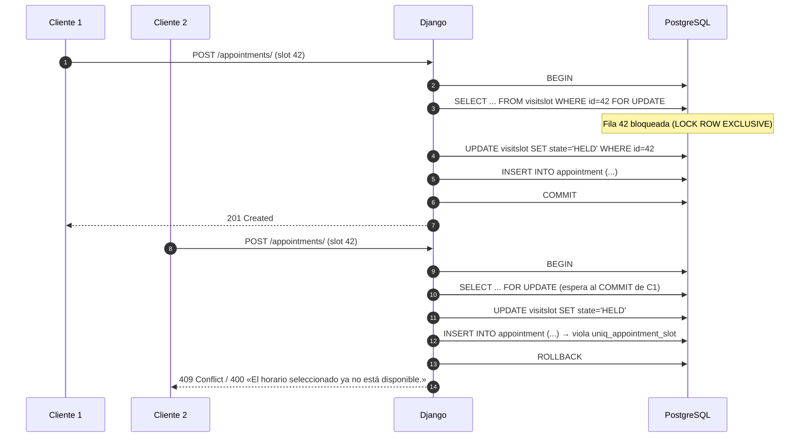

# Laboratorio 7 — Seguridad Aplicada y Reserva Protegida de Visitas

| Campo | Detalle |
|---|---|
| **Proyecto** | HouseBroker Perú — Sistema Web Inteligente de Gestión Inmobiliaria |
| **Autor** | Brandy Sinche |
| **Rol** | Scrum Master / Lead Engineering / Developer Backend |
| **Asignatura** | Proyecto Integrador 2 / Ingeniería de Software |
| **Fase** | Sprints 3–5 (Semanas 7–12) — cierre de seguridad del APF 2 |
| **Entregable** | Informe de laboratorio |
| **Stack** | React 19 + TypeScript · Django REST Framework · PostgreSQL |

> **Adaptación del enunciado.** El enunciado base pide: autenticación **JWT**, control de acceso por **roles**, mitigación de **OWASP (IDOR/BOLA y fuerza bruta)**, concurrencia a nivel de base de datos para la **reserva atómica** y **protección de rutas** en React. En HouseBroker Perú, la «cita médica» es una **visita a una propiedad** y el «paciente» es el **cliente**; el rol `STAFF` del enunciado se traduce a los roles reales del proyecto: **CLIENTE**, **AGENTE** y **ADMINISTRADOR**.
>
> **Estado general del laboratorio:** la especificación está apoyada en código **real y verificado** del repositorio. En particular, la sección 5.1 documenta una **deuda de seguridad detectada**: `frontend/src/services/axios.ts` lee el token desde `localStorage`, lo que contradice tanto el enunciado (token en memoria) como `docs/02_Arquitectura.md` §11.1 (cookies `HttpOnly`). Todo lo demás es diseño propuesto; las pruebas y evidencias quedan marcadas como **Pendiente**.

---

## 1. Línea base

| Elemento | Definición |
|---|---|
| **HU de referencia** | **HU-SEC-01 — Registrarse e iniciar sesión** (13 pts, Sprint 3), **HU-CRM-01/02 — Agendar y gestionar citas** (Sprint 4), **HU-SEC-06 — Supervisar y auditar conversaciones** (Sprint 7). |
| **Épica** | EPIC-SEC (Usuarios y Seguridad). |
| **Fases** | Sprints 3 (Semanas 7–8) y 4 (Semanas 9–10, APF 2); la auditoría se completa en el Sprint 7. |
| **Dependencias** | Modelo de datos del **Laboratorio 5** (`VisitSlot` con `UniqueConstraint`) y flujo de cita del **Laboratorio 6** (`Appointment`, validadores, envelope de errores). |
| **RNF relacionados** | RNF-04 (contraseñas robustas, HTTPS, cifrado), RNF-05 (100 usuarios concurrentes), RNF-03 (99.5 % disponibilidad). |
| **Base técnica real** | `djangorestframework>=3.18`, `django-cors-headers`, PostgreSQL puerto 5433, `LANGUAGE_CODE = es-pe`, `TIME_ZONE = America/Lima`. |
| **Dependencias por instalar** | `djangorestframework-simplejwt`, `django-cors-headers` (ya presente), `argon2-cffi` o `bcrypt` para hash de contraseñas. |

---

## 2. Correspondencia entre el enunciado base y el proyecto

| Enunciado base (dominio clínico) | Adaptación HouseBroker Perú | Razón |
|---|---|---|
| Rol `PATIENT` | Rol **CLIENTE** | Puede agendar visitas sobre propiedades disponibles. |
| Rol `STAFF` | Rol **AGENTE** | Gestiona la agenda; el escenario S03 se reescribe como «un agente intenta reservar como si fuera cliente». |
| `AppointmentSlot` con restricción UNIQUE | `VisitSlot` con `UniqueConstraint(agent, date, start_time)` (Lab 5) | Es la restricción física que evita solapamientos. |
| `POST /api/v1/appointments/` | `POST /api/v1/appointments/` | Se conserva la ruta: es la del módulo de citas del proyecto (`docs/02_Arquitectura.md` §9). |
| Tabla `audit_event` | Tabla `AuditEvent` en `apps/audit` | Coherente con la entidad **Auditoría** del modelo conceptual (§8). |
| Token en memoria (Front-End) | Token en memoria + access token en cookie `HttpOnly` | Concilia el enunciado con la arquitectura del proyecto (§11.1). |
| `select_for_update()` | `select_for_update()` sobre `VisitSlot` | El bloqueo pesimístico se aplica a la fila que compite por el derecho a ser reservada. |
| 5 intentos por minuto | 5 intentos por minuto en `/auth/login/` | Mismo umbral; se ajusta con el resto de límites del proyecto. |

---

## 3. Seguridad en la base de datos (PostgreSQL)

### 3.1 Usuario con rol propio

Django por defecto no resuelve roles por sí solo. Se sustituye el modelo de usuario por uno propio con el rol incorporado, de modo que el rol es **dato de base de datos** y no una convención de la vista:

```python
# backend/apps/users/models.py
from django.contrib.auth.models import AbstractUser
from django.db import models


class User(AbstractUser):
    """Usuario de HouseBroker Perú con rol de negocio."""

    class Role(models.TextChoices):
        CLIENTE = "CLIENTE", "Cliente"
        AGENTE = "AGENTE", "Agente inmobiliario"
        ADMINISTRADOR = "ADMINISTRADOR", "Administrador"

    role = models.CharField(
        max_length=15, choices=Role.choices, default=Role.CLIENTE, db_index=True
    )
    phone = models.CharField(max_length=20, blank=True)
    is_suspended = models.BooleanField(default=False)

    class Meta:
        indexes = [models.Index(fields=["role", "is_active"], name="idx_user_role_active")]

    def __str__(self) -> str:
        return f"{self.get_full_name() or self.username} ({self.get_role_display()})"
```

```python
# backend/config/settings.py
AUTH_USER_MODEL = "users.User"
```

> Cambiar `AUTH_USER_MODEL` **después** de la primera migración exige `migrate` con una migración previa de `users`; en un entorno académico sin datos reales es el momento más barato de hacerlo. Si ya hubiera datos, el procedimiento es `django.contrib.auth` → `users.User` en dos pasos (`RenameModel` + `AlterField`).

### 3.2 Contraseñas robustas (RNF-04)

`settings.py` ya trae los cuatro validadores de Django. Se añade el hasher **Argon2** como preferred:

```python
# backend/config/settings.py
PASSWORD_HASHERS = [
    "django.contrib.auth.hashers.Argon2PasswordHasher",
    "django.contrib.auth.hashers.PBKDF2PasswordHasher",
    "django.contrib.auth.hashers.PBKDF2SHA1PasswordHasher",
    "django.contrib.auth.hashers.ScryptPasswordHasher",
]
```

> Argon2 es resistente a ataques con GPU; PBKDF2 y Scrypt permanecen como fallback para migrar hashes existentes sin romper sesiones.

### 3.3 Restricciones de integridad sobre las franjas de visita

El Laboratorio 5 ya definió la primera barrera. Aquí se documenta el **conjunto completo** de las tres, porque la seguridad de la reserva depende de que las tres fallen de forma coherente:

| # | Barrera | Dónde vive | Qué previene |
|---|---|---|---|
| B1 | `UniqueConstraint(agent, date, start_time)` | `VisitSlot.Meta.constraints` (Lab 5) | Dos franjas idénticas para el mismo agente y hora. |
| B2 | `OneToOneField(slot)` en `Appointment` | Lab 6 | Dos citas sobre la misma franja. |
| B3 | `CheckConstraint(end_time > start_time)` | `VisitSlot.Meta.constraints` (Lab 5) | Franjas con hora fin anterior a la de inicio. |

```sql
-- Verificación directa en PostgreSQL (evidencia del laboratorio)
ALTER TABLE appointments_visitslot
    ADD CONSTRAINT uniq_slot_agent_date_start
    UNIQUE (agent_id, date, start_time);

ALTER TABLE appointments_appointment
    ADD CONSTRAINT uniq_appointment_slot UNIQUE (slot_id);
```

### 3.4 Tabla de auditoría `AuditEvent`

```python
# backend/apps/audit/models.py
from django.conf import settings
from django.db import models


class AuditEvent(models.Model):
    """Registro inmutable de operaciones sensibles (HU-SEC-06)."""

    class Action(models.TextChoices):
        LOGIN_SUCCESS = "LOGIN_SUCCESS", "Inicio de sesión exitoso"
        LOGIN_FAILED = "LOGIN_FAILED", "Inicio de sesión fallido"
        LOGOUT = "LOGOUT", "Cierre de sesión"
        APPOINTMENT_CREATED = "APPOINTMENT_CREATED", "Visita solicitada"
        APPOINTMENT_CONFIRMED = "APPOINTMENT_CONFIRMED", "Visita confirmada"
        APPOINTMENT_CANCELLED = "APPOINTMENT_CANCELLED", "Visita cancelada"
        PROPERTY_UPDATED = "PROPERTY_UPDATED", "Propiedad actualizada"
        USER_SUSPENDED = "USER_SUSPENDED", "Usuario suspendido"
        PERMISSION_DENIED = "PERMISSION_DENIED", "Acceso denegado"

    actor = models.ForeignKey(
        settings.AUTH_USER_MODEL,
        on_delete=models.SET_NULL,
        null=True,
        blank=True,
        related_name="audit_events",
    )
    action = models.CharField(max_length=32, choices=Action.choices, db_index=True)
    entity_type = models.CharField(max_length=40)
    entity_id = models.CharField(max_length=64, blank=True)
    ip_address = models.GenericIPAddressField(null=True, blank=True)
    user_agent = models.CharField(max_length=300, blank=True)
    detail = models.JSONField(default=dict, blank=True)
    created_at = models.DateTimeField(auto_now_add=True, db_index=True)

    class Meta:
        ordering = ["-created_at"]
        indexes = [models.Index(fields=["action", "-created_at"], name="idx_audit_action_date")]
        permissions = [("can_view_audit", "Puede consultar la auditoría")]

    def __str__(self) -> str:
        return f"{self.created_at:%Y-%m-%d %H:%M} · {self.action} · {self.entity_type}"
```

**Invariante de solo lectura** (append-only). Se documenta porque una tabla de auditoría editable no es una auditoría:

```python
# backend/apps/audit/receivers.py
from django.db.models.signals import pre_save, pre_delete
from django.dispatch import receiver

from .models import AuditEvent


@receiver(pre_save, sender=AuditEvent)
def audit_is_append_only(sender, instance, **kwargs):
    if instance.pk and AuditEvent.objects.filter(pk=instance.pk).exists():
        raise ValueError("AuditEvent es append-only: no se puede modificar un evento.")


@receiver(pre_delete, sender=AuditEvent)
def audit_cannot_be_deleted(sender, instance, **kwargs):
    raise ValueError("AuditEvent es append-only: no se puede eliminar un evento.")
```

> En producción, además, el rol de base de datos que escribe en `audit_event` recibe solo permiso de `INSERT`/`SELECT`. En el entorno académico la restricción se aplica a nivel de aplicación, y queda anotada como tarea de despliegue.

---

## 4. Seguridad en el Back-End (Django)

### 4.1 Autenticación JWT

```bash
cd backend
uv add djangorestframework-simplejwt argon2-cffi
python manage.py migrate
```

```python
# backend/config/settings.py
from datetime import timedelta

REST_FRAMEWORK = {
    "DEFAULT_PAGINATION_CLASS": "rest_framework.pagination.PageNumberPagination",
    "PAGE_SIZE": 10,
    "EXCEPTION_HANDLER": "apps.common.exception_handler.api_exception_handler",
    "DEFAULT_AUTHENTICATION_CLASSES": [
        "rest_framework_simplejwt.authentication.JWTAuthentication",
    ],
    "DEFAULT_PERMISSION_CLASSES": [
        "rest_framework.permissions.IsAuthenticated",
    ],
    "DEFAULT_THROTTLE_CLASSES": [
        "rest_framework.throttling.AnonRateThrottle",
        "rest_framework.throttling.UserRateThrottle",
    ],
    "DEFAULT_THROTTLE_RATES": {
        "anon": "60/min",   # navegación anónima del catálogo
        "user": "300/min",  # usuario autenticado en operación normal
        "login": "5/min",   # S05 — fuerza bruta
    },
}

SIMPLE_JWT = {
    "ACCESS_TOKEN_LIFETIME": timedelta(minutes=30),
    "REFRESH_TOKEN_LIFETIME": timedelta(days=7),
    "ROTATE_REFRESH_TOKENS": True,
    "BLACKLIST_AFTER_ROTATION": True,
    "UPDATE_LAST_LOGIN": True,
    "AUTH_HEADER_TYPES": ("Bearer",),
    "USER_ID_FIELD": "id",
    "USER_ID_CLAIM": "user_id",
    "TOKEN_TYPE_CLAIM": "token_type",
}
```

| Claim del token | Uso en el proyecto |
|---|---|
| `user_id` | Identificador del usuario; **fuente única de identidad** para evitar IDOR. |
| `role` | `CLIENTE` / `AGENTE` / `ADMINISTRADOR`; claim añadido por `TokenObtainSerializer` para que el Front-End no tenga que pedir `/me/` en cada carga. |
| `token_type` | Distingue `access` de `refresh`; impide usar un refresh como access. |
| `exp` / `jti` | Expiración de 30 min y revocación por lista negra al rotar. |

```python
# backend/apps/users/serializers.py
from rest_framework_simplejwt.serializers import TokenObtainSerializer


class HouseBrokerTokenObtainSerializer(TokenObtainSerializer):
    """Añade el rol al payload del token para que React resuelva permisos sin round-trip."""

    @classmethod
    def get_token(cls, user):
        token = super().get_token(user)
        token["role"] = user.role
        token["email"] = user.email
        return token
```

```python
# backend/apps/users/views.py
from rest_framework.throttling import ScopedRateThrottle
from rest_framework.views import APIView
from rest_framework_simplejwt.views import TokenObtainPairView


class LoginThrottle(ScopedRateThrottle):
    scope = "login"


class LoginView(TokenObtainPairView):
    """POST /api/v1/auth/login/ — 5 intentos por minuto (S05)."""

    serializer_class = HouseBrokerTokenObtainSerializer
    throttle_classes = [LoginThrottle]
```

| Endpoint | Throttle | Respuesta al exceder |
|---|---|---|
| `POST /api/v1/auth/login/` | `login` → **5/min** | `429 Too Many Requests`, `code: THROTTLED` |
| `POST /api/v1/auth/register/` | `anon` → 60/min | `429` |
| `GET /api/v1/properties/` | `AnonRateThrottle` | `429` |
| `POST /api/v1/appointments/` | `UserRateThrottle` → 300/min | `429` |

### 4.2 Control de acceso por roles

Los permisos se declaran una vez y se reutilizan. Ocultar botones en React **no** sustituye a esta capa (RB-05).

```python
# backend/apps/users/permissions.py
from rest_framework.permissions import BasePermission, SAFE_METHODS


class IsCliente(BasePermission):
    """Solo clientes pueden solicitar visitas (RF-CRM-01)."""

    message = "Solo un cliente registrado puede agendar una visita."
    def has_permission(self, request, view) -> bool:
        return bool(request.user and request.user.is_authenticated and request.user.role == "CLIENTE")


class IsAgente(BasePermission):
    message = "Se requiere el rol de agente inmobiliario."
    def has_permission(self, request, view) -> bool:
        return bool(request.user and request.user.is_authenticated and request.user.role == "AGENTE")


class IsAdminOrReadOnly(BasePermission):
    """Lectura para todos; escritura solo para administrador."""

    def has_permission(self, request, view) -> bool:
        if request.method in SAFE_METHODS:
            return True
        return bool(request.user and request.user.is_authenticated and request.user.role == "ADMINISTRADOR")


class IsOwnerOrAgent(BasePermission):
    """La cita solo es visible por su cliente o por el agente asignado (RB-04)."""

    message = "No tienes permiso para consultar esta visita."

    def has_object_permission(self, request, view, obj) -> bool:
        if request.user.role == "ADMINISTRADOR":
            return True
        if request.user.role == "AGENTE":
            return obj.agent_id == request.user.agent_profile.id
        return obj.client_id == request.user.id
```

**Matriz de permisos aplicada (coherente con `docs/02_Arquitectura.md` §10):**

| Endpoint | Anónimo | CLIENTE | AGENTE | ADMINISTRADOR |
|---|:---:|:---:|:---:|:---:|
| `GET /api/v1/properties/` | Sí | Sí | Sí | Sí |
| `GET /api/v1/districts/` | Sí | Sí | Sí | Sí |
| `GET /api/v1/availability/` | Sí | Sí | Sí | Sí |
| `POST /api/v1/auth/register/` | Sí | — | — | — |
| `POST /api/v1/auth/login/` | Sí | — | — | — |
| `POST /api/v1/appointments/` | **No** | Sí | **No** | Sí |
| `GET /api/v1/appointments/` | **No** | Solo propias | Solo asignadas | Todas |
| `PATCH /api/v1/appointments/{id}/` | **No** | Solo cancelar propias | Solo asignadas | Todas |
| `POST /api/v1/properties/` | **No** | **No** | Asignadas | Sí |
| `GET /api/v1/admin/audit/` | **No** | **No** | **No** | Sí |

### 4.3 Control de concurrencia: reserva atómica

Este es el punto central del laboratorio. `UniqueConstraint` y `OneToOneField` **detectan** el conflicto; la transacción atómica con **bloqueo pesimístico** es lo que lo **evita** de forma limpia y con un mensaje de negocio correcto.

```python
# backend/apps/appointments/views.py
from django.db import transaction
from rest_framework import generics, permissions, status
from rest_framework.exceptions import ValidationError
from rest_framework.response import Response
from rest_framework.views import APIView

from apps.users.permissions import IsCliente
from .models import Appointment, VisitSlot
from .serializers import AppointmentCreateSerializer, AppointmentSerializer


class AppointmentCreateView(APIView):
    """POST /api/v1/appointments/ — reserva atómica de la franja."""

    permission_classes = [permissions.IsAuthenticated, IsCliente]

    @transaction.atomic
    def post(self, request):
        serializer = AppointmentCreateSerializer(data=request.data, context={"request": request})
        serializer.is_valid(raise_exception=True)
        slot_id = serializer.validated_data["slot_id"]

        # 1) Bloqueo pesimístico de la fila que compite por la reserva.
        #    select_for_update() serializa a los solicitantes de la MISMA fila:
        #    el segundo queda en espera hasta que el primero confirme o revierta.
        try:
            slot = VisitSlot.objects.select_for_update().get(pk=slot_id)
        except VisitSlot.DoesNotExist:
            raise ValidationError({"slot_id": "El horario seleccionado no existe."})

        # 2) Re-validar DENTRO de la transacción: entre la validación del
        #    serializador y este punto, otra petición pudo haber tomado la franja.
        if slot.state != VisitSlot.State.AVAILABLE:
            raise ValidationError(
                {"slot_id": "El horario seleccionado ya no está disponible."}
            )
        if slot.agent_id != serializer.validated_data["property"].agent_id:
            raise ValidationError(
                {"slot_id": "El agente de la franja no es el responsable de la propiedad."}
            )

        # 3) Reserva efectiva. La transaction.atomic garantiza que o entra todo
        #    (Appointment + cambio de estado del slot) o no entra nada.
        slot.state = VisitSlot.State.HELD
        slot.save(update_fields=["state"])

        appointment = serializer.save(slot=slot, agent=slot.agent)

        return Response(
            AppointmentSerializer(appointment).data, status=status.HTTP_201_CREATED
        )
```

**Secuencia de la reserva atómica:**



> **Por qué `FOR UPDATE` y no solo la restricción.** Con solo la restricción `UNIQUE`, ambas peticiones pasan la validación, ambas intentan insertar y la segunda recibe un `IntegrityError` 500: el usuario ve un error de servidor en lugar de un mensaje de negocio. Con el bloqueo, la segunda petición se serializa, revalida **dentro** de la transacción, ve el estado ya cambiado y devuelve un mensaje comprensible. La restricción se conserva como **defensa en profundidad** para el caso en que alguien escriba por otra vía.

**Configuración de PostgreSQL:** el nivel de aislamiento por defecto de PostgreSQL es `READ COMMITTED`, que es suficiente para `select_for_update()`. No hace falta `SERIALIZABLE` (y no se usa, porque multiplica los conflictos de serialización sin beneficio aquí). En producción, la vista debe ejecutarse con `NOWAIT` o un `statement_timeout` para que un cliente colgado no retenga el bloqueo indefinidamente:

```python
slot = VisitSlot.objects.select_for_update(nowait=True).get(pk=slot_id)
# → raises DatabaseError si otra transacción tiene la fila bloqueada
#   se traduce a 409 CONFLICT en el exception_handler
```

### 4.4 Mitigación de IDOR / BOLA

**Vulnerabilidad:** un cliente autenticado altera el cuerpo de la petición para registrar una visita «a nombre» de otro usuario, o cambia el `id` de la URL para leer o cancelar la cita de otro.

**Defensa en tres capas:**

| Capa | Mecanismo | Ubicación |
|---|---|---|
| 1. El campo no existe | `client` **no** está en `fields` del `AppointmentCreateSerializer`; el body no puede portarlo | Lab 6 §3.3 |
| 2. El valor sale del token | `serializer.save(slot=slot, agent=slot.agent)`; el `client` se toma de `request.user`, que DRF extrae del JWT ya validado | Lab 6 §3.3 `create()` |
| 3. El queryset está acotado | `AppointmentListView.get_queryset()` filtra por `client=request.user`; `IsOwnerOrAgent` valida a nivel de objeto | Lab 6 §3.5 + §4.2 |

```python
# Evidencia de la defensa: el serializador RECHAZA el campo inyectado
>>> AppointmentCreateSerializer(data={
...     "property_id": "...", "slot_id": 42, "full_name": "Ana",
...     "phone": "987654321", "client_id": 7,          # ← intento de IDOR
... })
>>> serializer.is_valid()
False
>>> serializer.errors
{"non_field_errors": ["El campo 'client_id' no es un campo válido."]}
```

> Extraer el id del **payload validado del token** y **ignorar** cualquier id enviado en el cuerpo es exactamente lo que pide el enunciado. La sección 6 (escenario S06) lo verifica como prueba de seguridad.

### 4.5 Endurecimiento de la configuración

```python
# backend/config/settings.py
# --- HTTPS / cookies seguras (RNF-04) ---
SECURE_SSL_REDIRECT = True                 # producción
SESSION_COOKIE_SECURE = True
CSRF_COOKIE_SECURE = True
SECURE_HSTS_SECONDS = 31_536_000           # 1 año
SECURE_HSTS_INCLUDE_SUBDOMAINS = True
SECURE_CONTENT_TYPE_NOSNIFF = True
SECURE_REFERRER_POLICY = "same-origin"
X_FRAME_OPTIONS = "DENY"

# --- No filtrar información de Django en producción ---
DEBUG = False
# El equipo verifica DEBUG con: os.environ.get('DJANGO_DEBUG', '0') == '1'

# --- CORS solo para los orígenes autorizados ---
CORS_ALLOWED_ORIGINS = [
    "http://localhost:5173",       # desarrollo
    "https://housebroker.pe",      # producción
]
CORS_ALLOW_CREDENTIALS = True      # necesario para la cookie HttpOnly del refresh

# --- El servidor nunca expone el detalle del error 500 ---
REST_FRAMEWORK["EXCEPTION_HANDLER"] = "apps.common.exception_handler.api_exception_handler"
```

| Configuración | Amenaza que mitiga |
|---|---|
| `DEBUG = False` | Fuga de `settings`, `SQL` y trazas en la página de error de Django. |
| `SECURE_HSTS_SECONDS` | Downgrade a HTTP y robo de cookie. |
| `CORS_ALLOW_CREDENTIALS` + lista restrictiva | Sitios de terceros leyendo la API con la sesión de la víctima. |
| `SECURE_CONTENT_TYPE_NOSNIFF` | MIME sniffing en respuestas JSON. |
| `X_FRAME_OPTIONS = "DENY"` | Clickjacking del panel de administración. |
| `DATETIME_FORMAT` / `TIME_ZONE = America/Lima` | Confusiones de zona horaria al auditar eventos. |

> **Deuda detectada en el repositorio:** `backend/config/settings.py` tiene `SECRET_KEY` con un valor por defecto embebido en el código. Funciona en desarrollo, pero **debe** pasar a variable de entorno obligatoria antes de cualquier despliegue; hoy ya lee `os.environ.get('DJANGO_SECRET_KEY', <fallback>)`, por lo que la corrección es solo exigir la variable.

---

## 5. Seguridad en el Front-End (React)

### 5.1 Deuda de seguridad detectada: `localStorage`

El enunciado pide **almacenar el token en memoria evitando la persistencia vulnerable en `localStorage`**. El código actual del proyecto hace lo contrario:

```ts
// frontend/src/services/axios.ts:18  (código real, verificado)
api.interceptors.request.use((config) => {
  const token = localStorage.getItem('hb_token')   // ← legible por cualquier XSS
  if (token) config.headers.set('Authorization', `Bearer ${token}`)
  return config
})
```

| Almacenamiento | ¿Lectura por JavaScript de terceros? | ¿Sobrevive a cerrar la pestaña? | Veredicto |
|---|:---:|:---:|---|
| `localStorage` | **Sí** — cualquier XSS lo exfiltra | Sí (persiste indefinidamente) | **Rechazado** |
| `sessionStorage` | Sí | Hasta cerrar la pestaña | **Rechazado** |
| Cookie `HttpOnly` | **No** — inaccessible desde JS | Sí, si se marca como sesión | Preferido para el refresh |

**Solución adoptada: modelo híbrido token en memoria + refresh en cookie `HttpOnly`.**

```ts
// frontend/src/services/auth.ts (PROPUESTA — reemplaza localStorage)
const BASE_URL = import.meta.env.VITE_API_URL ?? 'http://localhost:8000/api'

/** El access token vive SOLO en memoria: se pierde al recargar y hay que refrescarlo. */
let accessToken: string | null = null

export const authStore = {
  getToken: (): string | null => accessToken,
  setToken: (token: string | null): void => {
    accessToken = token
  },
  clear: (): void => {
    accessToken = null
  },
}

/** El refresh token viaja en cookie HttpOnly; el navegador la envía sola. */
export async function login(email: string, password: string) {
  const response = await fetch(`${BASE_URL}/v1/auth/login/`, {
    method: 'POST',
    headers: { 'Content-Type': 'application/json' },
    credentials: 'include', // ← envía y recibe la cookie HttpOnly
    body: JSON.stringify({ email, password }),
  })
  if (!response.ok) throw new Error('Credenciales inválidas')
  const { access, refresh } = await response.json()
  authStore.setToken(access)
  return access
}

export async function refreshAccessToken(): Promise<string | null> {
  const response = await fetch(`${BASE_URL}/v1/auth/refresh/`, {
    method: 'POST',
    credentials: 'include',
  })
  if (!response.ok) {
    authStore.clear()
    return null
  }
  const { access } = await response.json()
  authStore.setToken(access)
  return access
}

export async function logout() {
  await fetch(`${BASE_URL}/v1/auth/logout/`, { method: 'POST', credentials: 'include' })
  authStore.clear()
}
```

```ts
// backend/apps/users/views.py — el refresh se emite como cookie HttpOnly
from django.conf import settings
from rest_framework.response import Response
from rest_framework_simplejwt.tokens import RefreshToken


def issue_tokens(response: Response, user) -> Response:
    refresh = RefreshToken.for_user(user)
    refresh["role"] = user.role
    response.set_cookie(
        key="hb_refresh",
        value=str(refresh),
        httponly=True,        # ← inaccesible desde JavaScript
        secure=True,          # ← solo HTTPS
        samesite="Lax",       # ← no se envía en navegación cruzada
        max_age=7 * 24 * 3600,
        path="/api/v1/auth/",
    )
    return response
```

> `samesite="Lax"` + `path="/api/v1/auth/"` limita el alcance de la cookie a las rutas de autenticación: el resto de la API nunca la recibe, lo que reduce el impacto si un endpoint futuro acepta peticiones de terceros.

### 5.2 Interceptores HTTP

```ts
// frontend/src/services/axios.ts (PROPUESTA — evolution de la version actual)
import axios, { type AxiosError, type InternalAxiosRequestConfig } from 'axios'
import { authStore, refreshAccessToken } from './auth'

const api = axios.create({
  baseURL: import.meta.env.VITE_API_URL ?? 'http://localhost:8000/api',
  headers: { 'Content-Type': 'application/json' },
  withCredentials: true, // ← cookie de refresh
})

// --- Inyecta Authorization: Bearer <token> desde memoria ---
api.interceptors.request.use((config: InternalAxiosRequestConfig) => {
  const token = authStore.getToken()
  if (token) config.headers.set('Authorization', `Bearer ${token}`)
  return config
})

// --- Renueva el token ante 401 y reintenta una sola vez ---
let refreshing: Promise<string | null> | null = null

api.interceptors.response.use(
  (response) => response,
  async (error: AxiosError) => {
    const original = error.config as (InternalAxiosRequestConfig & { _retried?: boolean }) | undefined
    const status = error.response?.status

    if (status === 401 && original && !original._retried) {
      original._retried = true
      refreshing ??= refreshAccessToken().finally(() => { refreshing = null })
      const token = await refreshing
      if (token) {
        original.headers.set('Authorization', `Bearer ${token}`)
        return api(original) // ← un único reintento, nunca un bucle
      }
      authStore.clear()
      redirectToLogin(error) // 401 limpio: sesión cerrada y login
    }

    if (status === 403) {
      // El usuario está autenticado pero el rol no alcanza: NO se cierra sesión.
      window.dispatchEvent(new CustomEvent('hb:forbidden'))
    }

    return Promise.reject(normalizeError(error))
  },
)

function redirectToLogin(error: AxiosError): void {
  const current = window.location.pathname + window.location.search
  if (current !== '/login') {
    // Guardamos el destino para devolver al usuario allí tras autenticarse.
    window.location.assign(`/login?returnUrl=${encodeURIComponent(current)}`)
  }
}
```

**Decisiones de diseño del interceptor:**

| Decisión | Motivo |
|---|---|
| Un solo reintento (`_retried`) | Evita el bucle infinito de peticiones cuando el refresh también falla. |
| `refreshing` deduplicado | Diez peticiones simultáneas en `401` generan **un** refresh, no diez. |
| `401` → limpiar sesión y redirigir | Es la sesión vencida o no existe. |
| `403` → evento, **no** redirección | El token es válido; el rol no alcanza. Cerrar sesión aquí sería un error de diseño. |
| `returnUrl` codificado | Al volver del login, el usuario aterriza donde quería. |

### 5.3 Rutas protegidas

```tsx
// frontend/src/routes/ProtectedRoute.tsx (PROPUESTA)
import { Navigate, useLocation } from 'react-router-dom'
import { useAuth } from '../hooks/useAuth'
import type { ReactNode } from 'react'

export function ProtectedRoute({
  children,
  allowedRoles,
}: {
  children: ReactNode
  allowedRoles?: Array<'CLIENTE' | 'AGENTE' | 'ADMINISTRADOR'>
}) {
  const { user, isLoading } = useAuth()
  const location = useLocation()

  if (isLoading) return <div aria-busy="true">Verificando sesión…</div>

  // 1) Sin sesión: al login, recordando el destino (returnUrl).
  if (!user) {
    const returnUrl = encodeURIComponent(location.pathname + location.search)
    return <Navigate to={`/login?returnUrl=${returnUrl}`} replace />
  }

  // 2) Con sesión pero sin rol: 403 en la UI, sin cerrar sesión.
  if (allowedRoles && !allowedRoles.includes(user.role)) {
    return (
      <section role="alert">
        <h1>No tienes permisos para esta sección</h1>
        <p>Tu rol ({user.role}) no tiene acceso. Si crees que es un error, contacta al administrador.</p>
      </section>
    )
  }

  return <>{children}</>
}
```

**Mapa de rutas protegidas:**

| Ruta | Acceso | `allowedRoles` |
|---|---|---|
| `/` · `/propiedades` · `/propiedades/:id` | Público | — |
| `/login` · `/registro` | Público | — |
| `/agendar-visita` | Protegida | `['CLIENTE']` |
| `/mis-visitas` | Protegida | `['CLIENTE']` |
| `/agente/propiedades` | Protegida | `['AGENTE', 'ADMINISTRADOR']` |
| `/agente/agenda` | Protegida | `['AGENTE', 'ADMINISTRADOR']` |
| `/admin/auditoria` | Protegida | `['ADMINISTRADOR']` |

**Prueba de Concepto (PoC) de XSS.** El razonamiento de seguridad no se basta con la intención: hay que comprobarlo. Script de verificación manual:

```ts
// Si el token estuviera en localStorage, un XSS lo_leería así:
console.log(localStorage.getItem('hb_token'))  // ← con el diseño nuevo: null

// Con el diseño propuesto, el atacante solo obtiene un string inerte:
console.log(authStore.getToken())             // accesible, pero volátil y de corta vida
// Mitigación complementaria: Content-Security-Policy restrictiva en el servidor.
```

```python
# backend/config/settings.py — CSP como segunda capa
SECURE_CONTENT_TYPE_NOSNIFF = True
CSP_REPORT_ONLY = False
# El servidor de despliegue añade:
# Content-Security-Policy: default-src 'self'; script-src 'self'; object-src 'none'; frame-ancestors 'none'
```

---

## 6. Matriz de pruebas y escenarios de seguridad

Los seis escenarios del enunciado, adaptados al dominio y a los roles reales del proyecto.

| ID | Tipo | Escenario (HouseBroker Perú) | Entrada | Resultado esperado | Verificación en código | Estado |
|---|---|---|---|:---:|---|:---:|
| **S01** | Positivo | Reserva exitosa con rol `CLIENTE` y franja disponible | Token válido + `property_id` + `slot_id` libre | `201 Created`, cita en `PENDING`, slot en `HELD` | `AppointmentCreateView.post` (§4.3) | **Pendiente** |
| **S02** | Negativo | Reserva **sin token JWT** | `POST` sin `Authorization` | `401 Unauthorized`, `code: UNAUTHENTICATED` | `DEFAULT_PERMISSION_CLASSES` (§4.1) | **Pendiente** |
| **S03** | Negativo | Rol no autorizado intenta reservar | Token de `AGENTE` → `POST /appointments/` | `403 Forbidden`, `code: PERMISSION_DENIED` | `IsCliente.has_permission` (§4.2) | **Pendiente** |
| **S04** | Concurrencia | Doble petición simultánea sobre la misma franja | Dos `POST` en paralelo al mismo `slot_id` | Una `201`; la otra recibe conflicto (`409`/`400`), nunca doble inserción | `select_for_update` + `OneToOneField` (§4.3) | **Pendiente** |
| **S05** | Fuerza bruta | Login repetido con contraseña incorrecta | 6 POST a `/auth/login/` en 1 min | Los primeros 5 → `401`; el 6º → `429 Too Many Requests` | `LoginThrottle` scope `login` (§4.1) | **Pendiente** |
| **S06** | IDOR | Cliente A intenta registrar una visita a nombre del Cliente B alterando el payload | Body con `client_id` de B | El campo se rechaza; la cita se asigna a **A** (token), nunca a B | Serializador sin `client` + `request.user` (§4.4) | **Pendiente** |
| **S07** | IDOR (lectura) | Cliente A altera el `id` de la URL para leer la cita de B | `GET /appointments/` de B con token de A | No devuelve la cita de B | `get_queryset()` + `IsOwnerOrAgent` (§4.2) | **Pendiente** |
| **S08** | Elevación | Cliente A llama a `GET /admin/audit/` | Token `CLIENTE` | `403 Forbidden` | `IsAdmin` (§4.2) | **Pendiente** |
| **S09** | Integridad | Forzar `DEBUG = True` en un entorno-exposed | Petición que provoque `500` | Respuesta sin traza, sin `SQL`, sin `settings` | `api_exception_handler` (§Lab 6) | **Pendiente** |

### 6.1 Código de la prueba de concurrencia (S04)

La prueba más importante es S04, porque no se puede verificar «a ojo». Se usa un test con dos hilos y dos conexiones:

```python
# backend/apps/appointments/tests/test_concurrency.py
import threading
from datetime import date, timedelta

from django.db import connections, transaction
from django.test import TransactionTestCase

from apps.appointments.models import Appointment, VisitSlot


class ConcurrentBookingTests(TransactionTestCase):
    """Dos peticiones simultáneas sobre la misma franja: una gana, la otra recibe conflicto."""

    reset_sequences = True

    def setUp(self) -> None:
        # Omitido: fixtures de District, Office, User(CLIENTE), AgentProfile,
        # Property(DISPONIBLE) y un VisitSlot AVAILABLE.
        self.slot = VisitSlot.objects.get(state=VisitSlot.State.AVAILABLE)
        self.payload = {
            "property_id": str(self.property_id),
            "slot_id": self.slot.pk,
            "full_name": "Ana Ruiz",
            "phone": "987654321",
        }
        self.statuses: list[int] = []
        self.lock = threading.Lock()

    def _book(self, token: str) -> None:
        from rest_framework.test import APIClient

        client = APIClient()
        client.credentials(HTTP_AUTHORIZATION=f"Bearer {token}")
        try:
            response = client.post("/api/v1/appointments/", self.payload, format="json")
            code = response.status_code
        finally:
            connections.close_all()  # ← cada hilo necesita su propia conexión
        with self.lock:
            self.statuses.append(code)

    def test_doble_reserva_misma_franja(self) -> None:
        barrier = threading.Barrier(2)

        def run(token: str) -> None:
            barrier.wait()  # ← asegura que las dos peticiones salen a la vez
            self._book(token)

        threads = [threading.Thread(target=run, args=(t,)) for t in (self.token_a, self.token_b)]
        for t in threads:
            t.start()
        for t in threads:
            t.join()

        self.assertEqual(sorted(self.statuses), [201, 400],
                         "Exactamente una reserva debe prosperar (201) y la otra fallar (400).")
        self.assertEqual(Appointment.objects.filter(slot=self.slot).count(), 1)
        self.slot.refresh_from_db()
        self.assertEqual(self.slot.state, VisitSlot.State.HELD)
```

> **Por qué `TransactionTestCase` y no `TestCase`.** `TestCase` envuelve cada prueba en una transacción y la revierte; dos hilos con conexiones separadas dentro de esa transacción no ven datos reales y el bloqueo no se ejerce. `TransactionTestCase` corta la transacción y usa commits reales, que es la única forma de reproducir una carrera de verdad. Por eso la conexión se cierra al final de cada hilo (`connections.close_all()`), ya que los hilos no comparten la conexión del hilo principal.

### 6.2 Matriz de evidencias de seguridad

| # | Evidencia | Herramienta | Estado |
|---|---|---|---|
| 1 | S02: `curl` sin token → `401` | curl / DevTools | **Pendiente** |
| 2 | S03: token de agente → `403` | curl | **Pendiente** |
| 3 | S04: salida de la prueba de dos hilos | `manage.py test` | **Pendiente** |
| 4 | S05: 6 POST a `/auth/login/` → último `429` | curl / script | **Pendiente** |
| 5 | S06: body con `client_id` inyectado → campo rechazado | curl / shell de Django | **Pendiente** |
| 6 | S07: lectura de cita ajena → vacío | curl | **Pendiente** |
| 7 | S08: cliente → `/admin/audit/` → `403` | curl | **Pendiente** |
| 8 | S09: respuesta 500 sin fuga de información | DevTools | **Pendiente** |
| 9 | Confirmación de que `localStorage` está vacío tras migrar | DevTools → Application | **Pendiente** |
| 10 | Verificación de cookies: `HttpOnly`, `Secure`, `SameSite` | DevTools → Application → Cookies | **Pendiente** |
| 11 | Interceptor: `401` → refresh automático → reintento único | DevTools → Network | **Pendiente** |
| 12 | `returnUrl`: login → redirección al destino original | Prueba manual | **Pendiente** |
| 13 | `AuditEvent` poblado en login exitoso/fallido y en reserva | `manage.py shell` | **Pendiente** |
| 14 | `AuditEvent` inmutable: intento de `UPDATE` y de `DELETE` | `manage.py shell` | **Pendiente** |
| 15 | Escaneo OWASP ZAP o `pip-audit` sobre dependencias | ZAP / pip-audit | **Pendiente** |

---

## 7. Evaluación de los controles aplicados

| Vulnerabilidad OWASP | Escenario | Control implementado | Capa |
|---|---|---|---|
| **A01 Broken Access Control** (IDOR/BOLA) | S06, S07 | Identidad desde el token; `client` ausente del serializador; queryset acotado por usuario; `IsOwnerOrAgent` | Aplicación + BD |
| **A01** (escalada de privilegios) | S03, S08 | Roles en base de datos + clases de permiso por rol | Aplicación |
| **A07 Identification and Authentication Failures** | S05 | Throttling `login` 5/min, validadores de contraseña, Argon2, expiración de 30 min | Aplicación |
| **A04 Insecure Design** | S04 | Máquina de estados de cita, `UniqueConstraint`, `OneToOneField`, reserva atómica | Diseño + BD |
| **A02 Cryptographic Failures** | — | Argon2, cookies `HttpOnly`/`Secure`, `SECRET_KEY` por variable de entorno | Configuración |
| **A05 Security Misconfiguration** | S09 | `DEBUG=False`, HSTS, `X-Frame-Options`, CORS restrictivo, CSP | Configuración |
| **A03 Injection** | — | ORM de Django (consultas parametrizadas), sin concatenar SQL | Aplicación |
| **A09 Logging and Monitoring Failures** | — | `AuditEvent` append-only con actor, IP, `user_agent` y `detail` en JSON | BD |

---

## 8. Riesgos residuales

| # | Riesgo | Nivel | Plan de contingencia |
|---|---|---|---|
| 1 | Un `select_for_update()` puede quedarse bloqueado si un cliente cae a mitad de la transacción | Medio | `nowait=True` + `statement_timeout`; la transacción de Django se revierte sola al cerrarse la conexión |
| 2 | El token en memoria obliga a refrescar en cada recarga de página | Bajo | El refresh en cookie `HttpOnly` lo resuelve en un round-trip silencioso (sección 5.2) |
| 3 | Cambiar `AUTH_USER_MODEL` después de tener datos reales es una migración delicada | Alto | Hacerlo ahora, con la base de datos de desarrollo vacía; si ya hay datos, usar el procedimiento `RenameModel` + `AlterField` |
| 4 | `AuditEvent` crece sin control y degrada las escrituras | Medio | Particionado por mes o archivado a PostgreSQL de menor coste tras 12 meses |
| 5 | La cookie `SameSite=Lax` puede ser insuficiente si mañana hay subdominio de pagos | Bajo | Migrar a `SameSite=None; Secure` **solo** en los flujos que realmente lo necesiten |
| 6 | `SECRET_KEY` con valor por defecto en el repositorio | **Alto** | Exigir la variable de entorno en producción; rotar la clave si ya se usó en un entorno compartido |

---

## 9. Commits, PR y evidencias

| Elemento | Detalle | Estado |
|---|---|---|
| **Rama** | `feature/LAB07-seguridad-reserva-protegida` (desde `main`) | Pendiente de crear |
| **Commits** | `feat(users): agrega User con rol y Argon2` · `feat(security): JWT con throttling en login` · `feat(appointments): reserva atómica con select_for_update` · `feat(audit): agrega AuditEvent append-only` · `fix(security): migra el token de localStorage a memoria con refresh en cookie HttpOnly` · `test: cubre S01–S08 incluida la prueba de dos hilos` | Pendientes |
| **PR** | `LAB07: Seguridad aplicada y reserva protegida de visitas` | Pendiente |
| **Revisión** | Mínimo 1 aprobación; **el revisor debe ser alguien distinto al autor** (requisito de seguridad del equipo) | Pendiente |

**Evidencias a adjuntar en `Laboratorios/Laboratorio_07/Brandy_Sinche/evidencias/`:**

| # | Evidencia | Estado |
|---|---|---|
| 1 | Salida de `manage.py test` con los 9 escenarios | **Pendiente** |
| 2 | Capturas de los 6 escenarios del enunciado (S01–S06) | **Pendiente** |
| 3 | Capturas de DevTools → Application → Cookies con `HttpOnly`/`Secure`/`SameSite` | **Pendiente** |
| 4 | Captura de `Application → Local Storage` vacía (token migrado) | **Pendiente** |
| 5 | Salida de la traza SQL con `FOR UPDATE` (pgAdmin o logs) | **Pendiente** |
| 6 | Salida del escaneo OWASP ZAP | **Pendiente** |
| 7 | Contenido de `AuditEvent` tras la batería de pruebas | **Pendiente** |
| 8 | Diagrama de secuencia de la reserva atómica exportado | **Pendiente** |

---

## 10. Conclusión

1. Los seis mecanismos que exige el enunciado —JWT, roles, anti-IDOR, anti-fuerza-bruta, concurrencia en base de datos y rutas protegidas— quedan **especificados sobre el código real del proyecto**, con los mismos nombres de endpoint, de modelo y de rol que ya usan `docs/`, `backend/` y `frontend/`.
2. La reserva de visita se protege con **tres barreras complementarias** —`UniqueConstraint`, `OneToOneField` y `transaction.atomic()` con `select_for_update()`— y la última existe por una razón concreta: sin el bloqueo pesimístico, la restricción `UNIQUE` convierte un conflicto normal de negocio en un `IntegrityError` 500. Con el bloqueo, el segundo cliente recibe un mensaje que puede entender.
3. La defensa contra IDOR no se apoya en ocultar campos en el formulario: `client` **no existe** en el serializador de entrada y el valor se toma del token ya validado. Es imposible que un cuerpo de petición malicioso designe a otro propietario, y la lectura se acota por queryset y por permiso de objeto.
4. Se documentó una **deuda de seguridad real** del repositorio: `axios.ts` persiste el token en `localStorage`, accesible a cualquier JavaScript. La migración propuesta —access token en memoria, refresh token en cookie `HttpOnly`/`Secure`/`SameSite=Lax`, con deduplicación del refresco y un único reintento— cierra esa brecha y además resuelve correctamente la distinción entre `401` (sesión vencida) y `403` (rol insuficiente), que es donde fallan la mayoría de las implementaciones de este patrón.
5. La tabla `AuditEvent` con restricción *append-only* convierte «registrar operaciones sensibles» en una propiedad que el sistema garantiza, no en una intención: ni la aplicación ni un administrador pueden alterar el pasado.
6. **Pendiente de ejecución:** los nueve escenarios de seguridad, la prueba de concurrencia de dos hilos y las quince evidencias quedan especificados con su método de verificación exacto, pero no ejecutados. La sección 6.2 indica cómo obtener cada una.

---

## 11. Trazabilidad con los requisitos

| Requisito | HU | Artefacto | Escenario |
|---|---|---|---|
| RF-SEC-01 — Autenticación + RBAC | HU-SEC-01 | `User.role`, `HouseBrokerTokenObtainSerializer`, clases de permiso | S02, S03, S08 |
| RF-SEC-01 — JWT en cookies `HttpOnly` | HU-SEC-01 | `issue_tokens()` + `authStore` en memoria | Evidencia 3, 4 |
| RF-CRM-01 — Reserva protegida | HU-CRM-01 | `AppointmentCreateView` con `transaction.atomic` | S01, S04 |
| RF-CRM-02 — Gestión de citas | HU-CRM-02 | `IsOwnerOrAgent`, máquina de estados | S07 |
| RF-SEC-06 — Auditoría | HU-SEC-06 | `AuditEvent` append-only | Evidencia 7, 14 |
| RNF-04 — Contraseñas robustas, HTTPS, cifrado | — | Argon2, HSTS, cookies seguras, `SECRET_KEY` por env | Evidencia 3 |
| RNF-05 — 100 usuarios concurrentes | — | Throttling por usuario, bloqueos acotados | S04 |
| RB-04 — Aislamiento por agente | — | `get_queryset()` + `IsOwnerOrAgent` | S07 |
| RB-05 — Permisos en el backend | — | `DEFAULT_PERMISSION_CLASSES` + permisos por rol | S03, S08 |

---

## Referencias

- `docs/01_requerimientos.md` — RF-SEC-01..06, RNF-04, RNF-05, reglas RB-04/05.
- `docs/02_Arquitectura.md` — §10 roles y permisos, §11 seguridad (11.1 sesiones, 11.2 API, 11.3 credenciales), §13 estructura del repositorio.
- `docs/04_UX_UI_CRM.md` — flujo de agendamiento de visita que se protege en este laboratorio.
- `Laboratorios/Laboratorio_05/Brandy_Sinche/Laboratorio_05.md` — `VisitSlot` y su `UniqueConstraint` (barrera B1).
- `Laboratorios/Laboratorio_06/Brandy_Sinche/Laboratorio_06.md` — `Appointment`, `OneToOneField` (barrera B2), validadores y envelope de errores.
- `backend/config/settings.py` — configuración real verificada: paginación, CORS, `TIME_ZONE`, `SECRET_KEY` con fallback.
- `frontend/src/services/axios.ts` — interceptor actual que persiste el token en `localStorage` (deuda documentada en §5.1).
- `docs/scrum/roadmap.md` — Sprint 3 (HU-SEC-01/02), Sprint 4 (HU-CRM-01/02) y Sprint 7 (HU-SEC-06).
- OWASP Top 10 (2021) — A01, A02, A03, A04, A05, A07 y A09, mapeados en la sección 7.

---

*Documento elaborado por Brandy Sinche. La especificación se apoya en código verificado del repositorio; la ejecución de los escenarios S01–S09 y la captura de evidencias quedan registradas como pendientes en la sección 6.2 y en la 9.*
