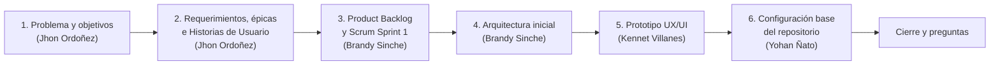

# Sesión 5 — Mapa de Organización del Primer Entregable (APF 1)

**Curso:** Proyecto Integrador 2
**Proyecto:** HouseBroker Perú
**Autor:** Jhon Ordoñez
**Rol:** Product Owner Simulado / Backend Developer
**Fecha de elaboración:** 09/09/2026
**Fecha de presentación (sustentación):** Viernes 11/09/2026
**Hito académico de referencia:** APF 1 — Semana 5 (según `docs/00_Acta_Planificacion_y_Negocio.md`, sección 19)
**Objetivo del documento:** Organizar visualmente los productos que conforman el primer entregable (APF 1), indicando dónde se encuentra la evidencia de cada uno dentro del repositorio y quién es responsable de sustentarlo.

---

## 1. Alcance del APF 1

Según el Acta de Planificación (sección 19), el **APF 1** debe evidenciar principalmente:

- Problema y oportunidad.
- Objetivos.
- Requerimientos.
- Épicas.
- Historias de usuario.
- Product Backlog.
- Arquitectura inicial.
- Prototipo o diseño inicial.
- Configuración base del proyecto.

Este mapa agrupa esos 9 productos en 4 bloques temáticos para facilitar la presentación del viernes.

---

## 2. Mapa general (mind map)

```mermaid
flowchart TD
    ROOT["APF 1 — Primer Entregable<br/>HouseBroker Perú<br/>(Presentación: Viernes 11/09/2026)"]

    ROOT --> B1["Bloque 1<br/>Negocio y Planificación"]
    ROOT --> B2["Bloque 2<br/>Requerimientos y Backlog"]
    ROOT --> B3["Bloque 3<br/>Arquitectura y Diseño"]
    ROOT --> B4["Bloque 4<br/>Configuración Base del Proyecto"]

    B1 --> P1["Problema y oportunidad"]
    B1 --> P2["Objetivos general y específicos"]
    B1 --> P3["Canvas de oportunidad e indicadores (KPI)"]

    B2 --> P4["Épicas (EPIC-PROP, EPIC-CRM, EPIC-SEC, EPIC-AI)"]
    B2 --> P5["Historias de usuario (HU-*)"]
    B2 --> P6["Product Backlog priorizado"]
    B2 --> P7["Sprint 1: Planning / Review / Retro"]

    B3 --> P8["Arquitectura inicial<br/>(React + Django + PostgreSQL)"]
    B3 --> P9["Prototipo / diseño UX-UI inicial"]

    B4 --> P10["Estructura del repositorio<br/>(backend / frontend / infra)"]
    B4 --> P11["Flujo de trabajo Git<br/>(ramas y Pull Requests)"]

    P1 -.-> D1[["docs/00_Acta_Planificacion_y_Negocio.md<br/>secc. 2-4, 6"]]
    P2 -.-> D2[["docs/00_Acta_Planificacion_y_Negocio.md<br/>secc. 5, 7"]]
    P3 -.-> D3[["docs/00_Acta_Planificacion_y_Negocio.md<br/>secc. 6-7"]]
    P4 -.-> D4[["docs/00_Acta...md secc. 8<br/>docs/01_requerimientos.md"]]
    P5 -.-> D5[["docs/00_Acta...md secc. 14<br/>docs/01_requerimientos.md"]]
    P6 -.-> D6[["docs/scrum/backlog.md"]]
    P7 -.-> D7[["docs/scrum/sprint-1/*"]]
    P8 -.-> D8[["docs/02_Arquitectura.md"]]
    P9 -.-> D9[["docs/03_UX_UI_Autenticacion.md<br/>docs/04_UX_UI_CRM.md<br/>docs/05_UX_UI_CHATBOT_REC.md<br/>docs/06_UX_UI_PROP.md"]]
    P10 -.-> D10[["backend/, frontend/, infra/"]]
    P11 -.-> D11[["docs/git_workflow_guide.md"]]
```

---

## 3. Matriz de trazabilidad (producto → evidencia → responsable)

| # | Producto del APF 1 | Evidencia / Ubicación en el repo | Responsable (según Acta, sección 1.1) | Estado |
|---|---------------------|-----------------------------------|-----------------------------------------|--------|
| 1 | Problema y oportunidad | `docs/00_Acta_Planificacion_y_Negocio.md` (secc. 2-4, 6) | Jhon Ordoñez (PO simulado) | Elaborado |
| 2 | Objetivos del proyecto | `docs/00_Acta_Planificacion_y_Negocio.md` (secc. 5) | Jhon Ordoñez (PO simulado) | Elaborado |
| 3 | Indicadores de éxito (KPI) | `docs/00_Acta_Planificacion_y_Negocio.md` (secc. 7) | Jhon Ordoñez (PO simulado) | Elaborado |
| 4 | Épicas del MVP | `docs/00_Acta_Planificacion_y_Negocio.md` (secc. 8), `docs/01_requerimientos.md` | Jhon Ordoñez / Brandy Sinche | Elaborado |
| 5 | Historias de usuario (HU-*) | `docs/00_Acta_Planificacion_y_Negocio.md` (secc. 14), `docs/01_requerimientos.md` | Jhon Ordoñez (PO simulado) | Elaborado |
| 6 | Product Backlog priorizado | `docs/scrum/backlog.md` | Jhon Ordoñez / Brandy Sinche (Scrum Master) | Verificar actualización |
| 7 | Evidencia Scrum (Sprint 1) | `docs/scrum/sprint-1/planning.md`, `review.md`, `retrospective.md`, `dailies.md` | Brandy Sinche (Scrum Master) | Verificar cierre |
| 8 | Arquitectura inicial | `docs/02_Arquitectura.md` | Brandy Sinche (Lead Engineer) | Elaborado |
| 9 | Prototipo / diseño UX-UI | `docs/03_UX_UI_Autenticacion.md`, `04_UX_UI_CRM.md`, `05_UX_UI_CHATBOT_REC.md`, `06_UX_UI_PROP.md` | Kennet Villanes (Frontend/QA) | Verificar completitud |
| 10 | Configuración base del repo | `backend/`, `frontend/`, `infra/`, `README.md` | Yohan Ñato (Backend/DB) | Elaborado |
| 11 | Flujo de trabajo Git (ramas/PR) | `docs/git_workflow_guide.md` | Brandy Sinche (Scrum Master) | Elaborado |

> **Nota:** Los estados "Verificar" deben confirmarse antes del viernes con el responsable indicado; este mapa no reemplaza la revisión directa del contenido de cada documento.

---

## 4. Checklist previo a la sustentación (viernes 11/09/2026)

- [ ] Confirmar que `docs/scrum/backlog.md` refleja el estado real del Product Backlog.
- [ ] Confirmar que `docs/scrum/sprint-1/review.md` y `retrospective.md` estén cerrados con conclusiones.
- [ ] Verificar que los 4 documentos de UX/UI (`03`–`06`) tengan al menos wireframes o mockups del prototipo inicial.
- [ ] Validar que `backend/` y `frontend/` levanten correctamente (configuración base funcional).
- [ ] Preparar un recorrido de presentación siguiendo el orden de los 4 bloques de este mapa (Negocio → Requerimientos → Arquitectura/Diseño → Configuración Base).
- [ ] Asignar quién presenta cada bloque (ver columna "Responsable" de la matriz, sección 3).
- [ ] Revisar que no queden Pull Requests pendientes de fusionar antes de la demo.

---

## 5. Orden sugerido de exposición (Sprint Review / APF 1)

---

## 6. Referencias

- `docs/00_Acta_Planificacion_y_Negocio.md` — Acta de Planificación Ágil (fuente principal del alcance del APF 1, sección 19).
- `docs/01_requerimientos.md` — Especificación de Requerimientos (SRS).
- `docs/02_Arquitectura.md` — Arquitectura del sistema.
- `docs/03_UX_UI_Autenticacion.md`, `04_UX_UI_CRM.md`, `05_UX_UI_CHATBOT_REC.md`, `06_UX_UI_PROP.md` — Prototipos UX/UI por módulo.
- `docs/scrum/backlog.md`, `docs/scrum/sprint-1/*` — Evidencia Scrum del Sprint 1.
- `docs/git_workflow_guide.md` — Flujo de trabajo Git del equipo.
- Formato base tomado de las guías de laboratorio (`Laboratorios/Laboratorio_04/Jhon_Ordonez/Laboratorio_04.md`) para mantener consistencia documental.
