# Acta de Planificación Ágil, Análisis de Negocio y Alineamiento Metodológico

> **Proyecto:** Sistema Web Inteligente de Gestión Inmobiliaria, Recomendación Personalizada de Propiedades y Agendamiento de Citas  
> **Organización / Cliente:** HouseBroker Perú  
> **Documento:** Acta de Planificación Ágil y Alineamiento Metodológico  
> **Versión:** 1.0  
> **Fecha:** Septiembre 2026  
---

## 0. Propósito del Acta

El presente documento establece la planificación ágil del proyecto **HouseBroker Perú**, definiendo el contexto del problema, los objetivos, el alcance del MVP, la organización del equipo, las épicas, el backlog inicial, la estrategia Scrum, los criterios de terminado y el cronograma de desarrollo durante las **18 semanas del curso Integrador**.

El proyecto se desarrollará de manera incremental. Los **APF 1, APF 2 y APF 3** representan hitos de avance del producto y no constituyen proyectos independientes. Cada avance deberá construir sobre el trabajo realizado anteriormente hasta llegar al producto final de la semana 18.

---

# 1. Acuerdo de Equipo y Roles

## 1.1. Organización del equipo

| Integrante | Rol | Responsabilidad principal |
|---|---|---|
| **Brandy Sinche** | **Scrum Master / Lead Engineer** | Facilitar Scrum, coordinar la planificación, supervisar la arquitectura, GitHub Flow e integración Backend/IA. |
| **Jhon Ordoñez** | **Product Owner Simulado / Backend Developer** | Definir y priorizar el valor del producto, gestionar el Product Backlog y validar los criterios de aceptación. |
| **Yohan Ñato** | **Analista / Frontend Developer** | Modelamiento de PostgreSQL, desarrollo de Django REST Framework, lógica de negocio y servicios de integración. |
| **Anderson Villanes** | **Frontend / QA Engineer** | Desarrollo React + TypeScript, prototipado UX/UI, pruebas funcionales y criterios básicos de accesibilidad. |

> **Nota:** Los nombres de los integrantes pendientes deberán reemplazarse cuando el equipo los confirme.

## 1.2. Compromisos del equipo

### Comunicación
- Realizar seguimiento periódico de avances y bloqueos.
- Mantener comunicación mediante el canal definido por el equipo.
- Realizar reuniones de planificación, revisión y retrospectiva según corresponda.

### Gestión del código
- Utilizar GitHub como repositorio central.
- Evitar commits directos a `main`.
- Trabajar mediante ramas y Pull Requests.
- Revisar los cambios antes de integrarlos.

### Gestión de decisiones
Las decisiones técnicas importantes deberán considerar:
1. Requerimientos del sistema.
2. Valor para el usuario.
3. Complejidad de implementación.
4. Seguridad y mantenibilidad.
5. Impacto sobre la arquitectura.

Cuando sea necesario, las decisiones arquitectónicas relevantes se documentarán mediante ADR.

---

# 2. Contexto Organizacional y Problema

## 2.1. Organización

**HouseBroker Perú** es una organización inmobiliaria orientada a la gestión de propiedades para operaciones de compra y alquiler.

El sistema propuesto busca centralizar la gestión de propiedades, clientes, citas y conversaciones, incorporando un asistente virtual y un mecanismo de recomendación personalizada mediante Inteligencia Artificial.

## 2.2. Problema identificado

Actualmente, actividades como la búsqueda de propiedades, cualificación inicial del cliente y coordinación de visitas pueden depender de procesos manuales. Esto dificulta brindar atención continua y realizar un seguimiento centralizado de las oportunidades comerciales.

### Relación causa → problema → consecuencia

| Causa | Problema observable | Consecuencia |
|---|---|---|
| Atención comercial dependiente del horario de los agentes. | Consultas realizadas fuera del horario pueden esperar respuesta. | Pérdida de oportunidades de atención y captación. |
| Búsqueda manual de propiedades. | El agente debe revisar diferentes opciones para encontrar inmuebles adecuados. | Mayor tiempo de respuesta y menor personalización. |
| Coordinación manual de visitas. | Fechas y horarios se coordinan mediante comunicación directa. | Riesgo de cruces de agenda y menor trazabilidad. |
| Información comercial distribuida. | Datos de clientes, conversaciones y citas no están necesariamente centralizados. | Dificultad para realizar seguimiento y obtener métricas. |

## 2.3. Problema central

> **La gestión de atención, búsqueda personalizada de propiedades y coordinación de visitas presenta una dependencia significativa de procesos manuales, dificultando la atención continua, la personalización de las recomendaciones y el seguimiento centralizado de los clientes.**

---

# 3. Análisis del Proceso Actual — AS-IS

El proceso actual puede representarse de la siguiente manera:

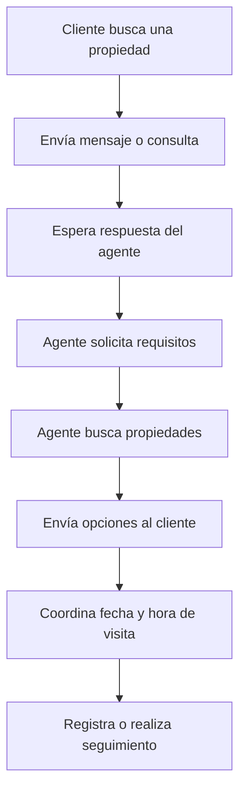

### Principales puntos de mejora

- Atención no necesariamente disponible de manera continua.
- Dependencia de la intervención del agente para la búsqueda.
- Menor personalización de las opciones.
- Coordinación manual de visitas.
- Dificultad para mantener un historial centralizado.
- Falta de automatización en la primera etapa de atención.

---

# 4. Proceso Propuesto — TO-BE

La solución propone una plataforma web que combine catálogo, CRM, chat, agendamiento e Inteligencia Artificial.

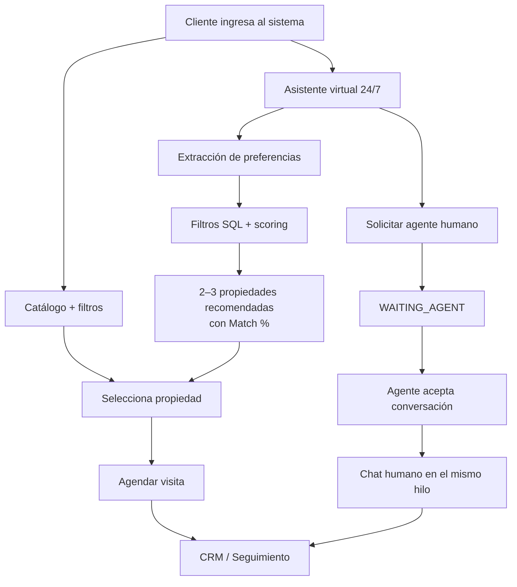

---

# 5. Objetivos del Proyecto

## 5.1. Objetivo general

Desarrollar un **sistema web inteligente para HouseBroker Perú** que centralice la gestión de propiedades, clientes y citas, incorporando un asistente virtual disponible 24/7 y un mecanismo de recomendación personalizada basado en Inteligencia Artificial.

## 5.2. Objetivos específicos

1. Implementar un catálogo web de propiedades con búsqueda y filtros.
2. Gestionar usuarios y permisos según los roles Cliente, Agente y Administrador.
3. Implementar el agendamiento y seguimiento de visitas.
4. Centralizar conversaciones entre clientes y agentes.
5. Incorporar un asistente virtual para la atención inicial.
6. Implementar recomendaciones de 2 a 3 propiedades basadas en las preferencias del cliente.
7. Permitir la transferencia de una conversación del asistente virtual a un agente humano sin perder el contexto.
8. Proporcionar herramientas administrativas para supervisión y consulta de métricas.
9. Mantener una arquitectura modular que permita sustituir el proveedor de IA.

---

# 6. Canvas de Oportunidad

| Elemento | Definición |
|---|---|
| **Stakeholders beneficiados** | Clientes, agentes inmobiliarios y administración de HouseBroker Perú. |
| **Situación actual** | Atención, búsqueda y coordinación de visitas con alta participación manual. |
| **Oportunidad** | Automatizar la atención inicial, personalizar la búsqueda y centralizar la gestión comercial. |
| **Solución propuesta** | Plataforma web con catálogo, CRM, agendamiento, chat y asistente IA. |
| **Valor para el cliente** | Encontrar propiedades adecuadas y recibir atención continua. |
| **Valor para el agente** | Reducir tareas repetitivas y mejorar el seguimiento. |
| **Valor para la administración** | Centralizar información y disponer de métricas. |

---

# 7. Indicadores de Éxito

| KPI | Meta inicial |
|---|---:|
| Disponibilidad del portal y asistente | **99.5 %** |
| Tiempo de respuesta del chatbot IA | **< 3 segundos** |
| Recomendaciones por interacción | **2–3 propiedades** |
| Incremento esperado de citas | **25 %** como objetivo inicial |
| Disponibilidad de atención virtual | **24/7** |

> Estos valores corresponden a objetivos iniciales del proyecto y deberán validarse mediante pruebas durante las etapas de desarrollo y evaluación.

---

# 8. Alcance del MVP

El MVP estará organizado en las cuatro épicas definidas en el documento de requerimientos.

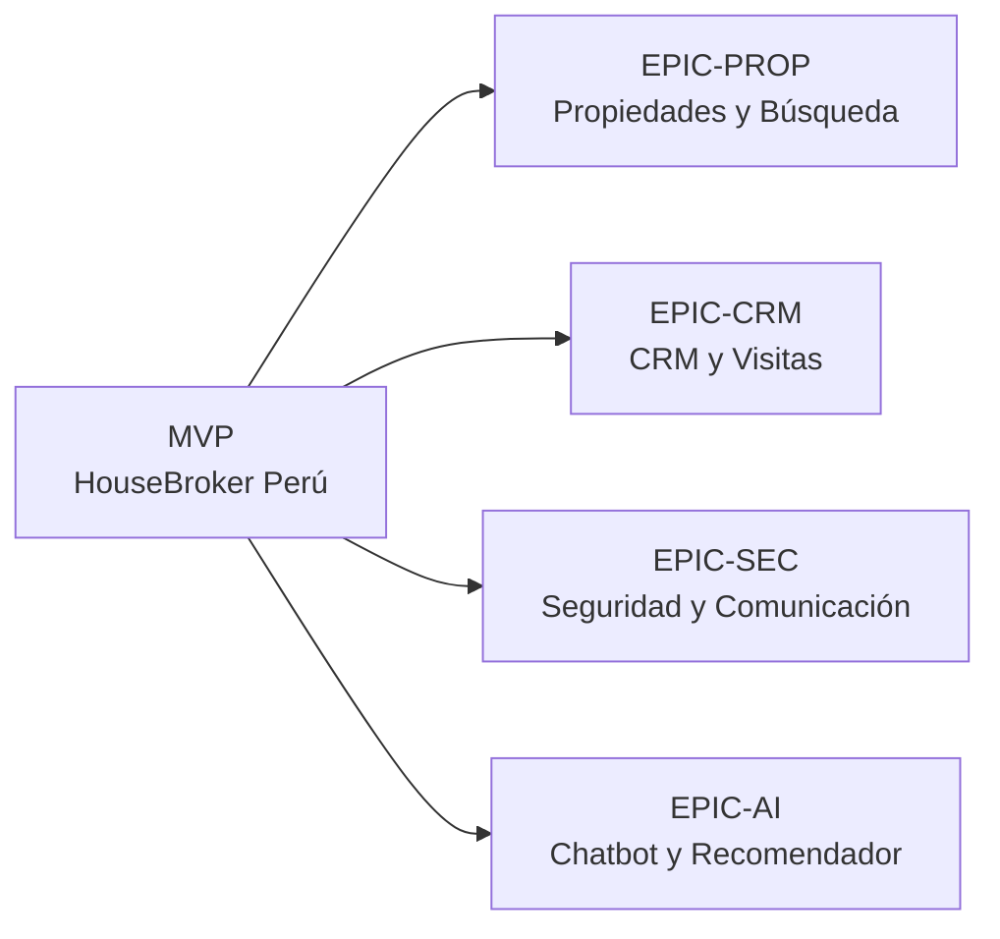

## 8.1. EPIC-PROP — Gestión de Propiedades y Búsqueda

Incluye:

- Registro y edición de propiedades.
- Catálogo interactivo.
- Búsqueda y filtros avanzados.
- Control de disponibilidad.
- Propiedades favoritas.

## 8.2. EPIC-CRM — CRM y Gestión de Visitas

Incluye:

- Agendamiento de visitas.
- Gestión de citas.
- Calendario del agente.
- Historial y ficha del cliente.
- Registro de observaciones.
- Dashboard y reportes administrativos.

## 8.3. EPIC-SEC — Seguridad y Comunicación

Incluye:

- Registro e inicio de sesión.
- Autenticación y autorización.
- Roles Cliente, Agente y Administrador.
- Chat interno en tiempo real.
- Supervisión de conversaciones.
- Estados de conexión.
- Notificaciones.

## 8.4. EPIC-AI — Chatbot y Recomendador

Incluye:

- Asistente virtual 24/7.
- Extracción de preferencias.
- Motor de recomendación.
- Presentación de 2–3 recomendaciones.
- Match %.
- Agendamiento desde las recomendaciones.
- Transferencia a agente humano.
- Auditoría del asistente.

---

# 9. Fuera del Alcance

Las siguientes funcionalidades quedan explícitamente fuera del MVP:

| Funcionalidad | Alcance |
|---|---|
| Pasarela de pagos | ❌ Fuera del MVP |
| Cobro de comisiones online | ❌ Fuera del MVP |
| Aplicaciones nativas iOS/Android | ❌ Fuera del MVP |
| Firma digital de contratos | ❌ Fuera del MVP |
| Gestión contractual completa | ❌ Fuera del MVP |

La solución será una **Web App Responsive / PWA**.

---

# 10. Supuestos y Restricciones

## 10.1. Supuestos

- Se contará con acceso a un proveedor de IA para las pruebas.
- Se utilizará `AIService` como abstracción para la integración de IA.
- Existirá información de propiedades disponible para realizar pruebas.
- El equipo tendrá acceso al repositorio y herramientas necesarias para el desarrollo.

## 10.2. Restricciones

- El alcance inicial de propiedades estará centrado en **Lima Metropolitana, Perú**.
- El sistema se desarrollará inicialmente como aplicación web.
- Las operaciones contractuales y pagos no forman parte del MVP.
- La IA no será considerada una fuente de verdad de propiedades, precios o disponibilidad.

---

# 11. Arquitectura Tecnológica

La arquitectura definida en `02_Arquitectura.md` utiliza una separación por capas y servicios.

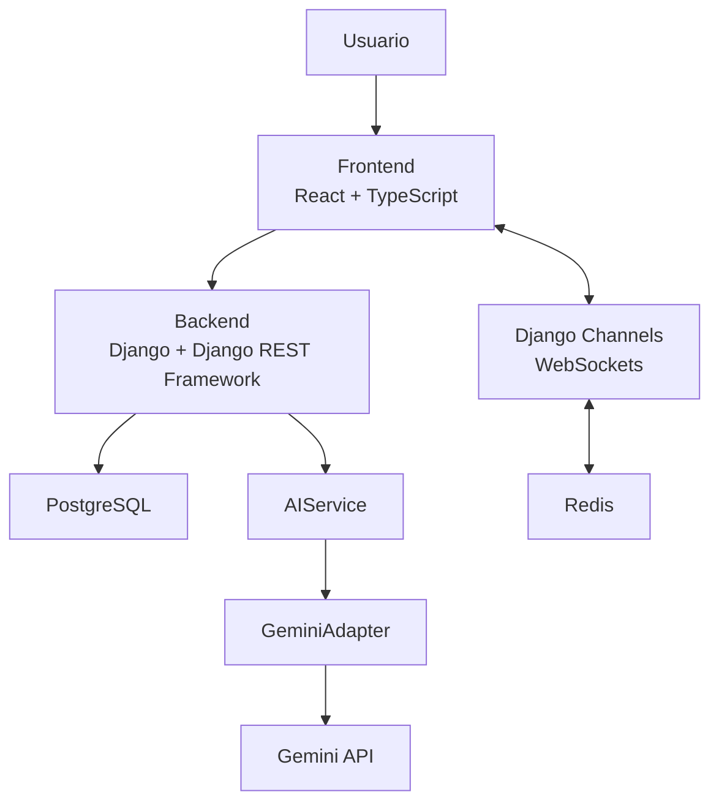

## 11.1. Tecnologías

| Capa | Tecnología | Función |
|---|---|---|
| Frontend | React + TypeScript | Interfaces del sistema |
| Backend | Django + Django REST Framework | API y reglas de negocio |
| Base de datos | PostgreSQL | Persistencia |
| Tiempo real | Django Channels + WebSockets | Chat y eventos |
| Mensajería temporal | Redis | Soporte para tiempo real y presencia |
| IA | `AIService` + `GeminiAdapter` | Abstracción e integración con IA |
| Modelo inicial | `gemini-3.1-flash-lite` | Chatbot y scoring |
| Autenticación | JWT + cookies HttpOnly | Sesiones y seguridad |
| ASGI | Uvicorn o Daphne | Ejecución del backend |
| Contenedores | Docker | Entornos consistentes |
| Control de versiones | Git + GitHub | Colaboración y control de cambios |

---

# 12. Estrategia de Inteligencia Artificial

La IA no tendrá acceso directo a PostgreSQL.

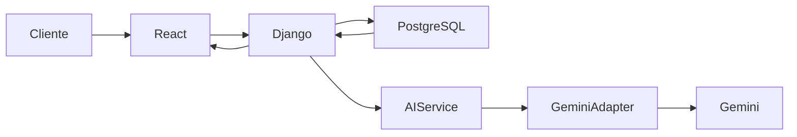

## 12.1. Pipeline de recomendación

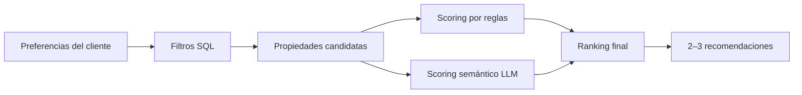

El proceso será:

1. Extraer las preferencias del cliente.
2. Aplicar filtros obligatorios mediante PostgreSQL.
3. Obtener propiedades candidatas reales y disponibles.
4. Calcular coincidencia mediante reglas.
5. Utilizar el LLM para interpretar preferencias semánticas.
6. Combinar los resultados.
7. Ordenar las propiedades.
8. Mostrar las 2–3 mejores coincidencias.

## 12.2. Principio de fuente de verdad

> **PostgreSQL es la fuente de verdad del sistema. Gemini no podrá inventar propiedades, precios, disponibilidad ni identificadores.**

Si el proveedor de IA no está disponible, el sistema podrá utilizar el **ranking basado en reglas** como mecanismo de contingencia.

---

# 13. Chat y Transferencia a Agente Humano

El sistema utilizará un **chat unificado**.

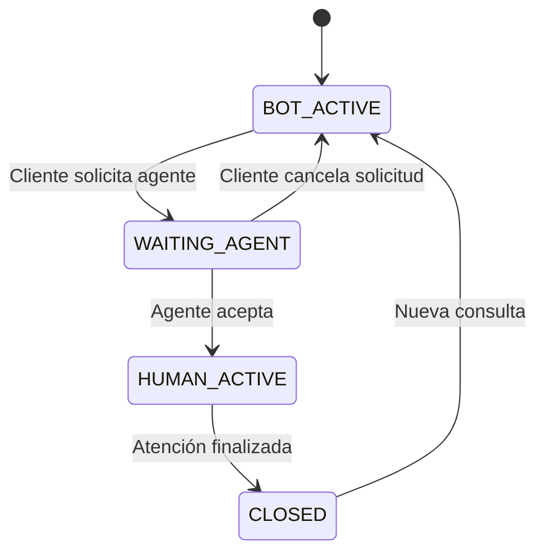

### Estados

| Estado | Descripción |
|---|---|
| `BOT_ACTIVE` | El asistente virtual responde |
| `WAITING_AGENT` | El cliente espera la atención humana |
| `HUMAN_ACTIVE` | Un agente continúa la conversación |
| `CLOSED` | La atención fue finalizada |

La transferencia deberá conservar:

- Historial de mensajes.
- Preferencias extraídas.
- Propiedades recomendadas.
- Contexto de la conversación.

El cliente no deberá iniciar una segunda conversación para comunicarse con el agente.

---

# 14. Backlog Inicial

Los requerimientos completos se encuentran en `01_requerimientos.md`.

## 14.1. Historias representativas

| ID | Épica | Historia | Estimación |
|---|---|---|:---:|
| **HU-PROP-01** | EPIC-PROP | Como cliente, quiero filtrar propiedades por distrito, precio y mascotas para encontrar opciones adecuadas. | M |
| **HU-CRM-01** | EPIC-CRM | Como cliente, quiero agendar una visita en un horario disponible para conocer la propiedad. | L |
| **HU-SEC-01** | EPIC-SEC | Como usuario, quiero iniciar sesión de forma segura para acceder según mi rol. | S |
| **HU-AI-01** | EPIC-AI | Como cliente, quiero conversar con una asistente virtual 24/7 para recibir recomendaciones personalizadas. | XL |
| **HU-AI-02** | EPIC-AI | Como cliente, quiero solicitar un agente humano sin perder la conversación. | M |

---

# 15. Estrategia de Desarrollo con Scrum

El proyecto será desarrollado mediante iteraciones cortas y entregas incrementales.

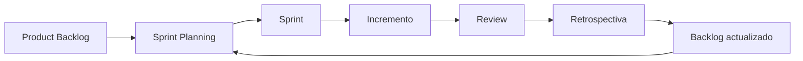

## 15.1. Actividades Scrum

| Actividad | Propósito |
|---|---|
| Product Backlog | Mantener el trabajo pendiente priorizado |
| Sprint Planning | Seleccionar y planificar el trabajo |
| Daily Scrum | Revisar progreso y bloqueos |
| Sprint Review | Validar el incremento |
| Retrospective | Identificar mejoras para el siguiente ciclo |

---

# 16. Definition of Done

Una historia de usuario será considerada **Done** cuando:

### Código
- La funcionalidad esté implementada.
- El código siga la estructura definida.
- No existan errores críticos conocidos.

### Revisión
- El cambio se encuentre en un Pull Request.
- Haya sido revisado por al menos un integrante.
- Se encuentre integrado correctamente.

### Pruebas
- Las pruebas correspondientes hayan sido ejecutadas.
- Los criterios de aceptación se cumplan.

### Calidad
- La interfaz sea responsive.
- Se consideren criterios básicos de accesibilidad.
- No existan errores críticos de consola.

### Documentación
- La documentación relacionada esté actualizada.
- Se mantenga la trazabilidad entre requerimiento, historia y funcionalidad.

---

# 17. Cronograma General — 18 Semanas

## 17.1. Distribución de trabajo

El proyecto se ejecutará durante **18 semanas**, organizando el trabajo en etapas progresivas. Los APF representan **hitos académicos de evaluación**, mientras que el desarrollo continúa entre un hito y otro.

| Semana | Etapa | Actividades principales | Resultado esperado |
|:---:|---|---|---|
| **1** | Inicio | Problema, contexto, objetivos y organización del equipo | Problema definido |
| **2** | Requisitos | Levantamiento y análisis de requerimientos | Requerimientos iniciales |
| **3** | Backlog | Épicas, historias, criterios y priorización | Product Backlog |
| **4** | Diseño | Arquitectura, modelo de datos y UX/UI | Diseño base |
| **5** | **APF 1** | Presentación del primer incremento | **Avance Proyecto 1** |
| **6** | Desarrollo | Backend, base de datos y autenticación | Base funcional |
| **7** | Desarrollo | Catálogo, propiedades y filtros | Módulo de propiedades |
| **8** | Desarrollo | Citas, calendario y CRM | Módulo CRM inicial |
| **9** | **APF 2** | Presentación del segundo incremento | **Avance Proyecto 2** |
| **10** | Desarrollo | Chat y comunicación en tiempo real | Chat funcional |
| **11** | IA | `AIService`, `GeminiAdapter` y extracción de preferencias | IA integrada |
| **12** | IA | Filtros SQL + scoring + recomendaciones | Recomendador funcional |
| **13** | **APF 3** | Presentación del tercer incremento | **Avance Proyecto 3** |
| **14** | Integración | Transferencia IA → agente y notificaciones | Flujo integrado |
| **15** | Administración | Dashboard, reportes y auditoría | Administración funcional |
| **16** | Calidad | Pruebas funcionales, seguridad y rendimiento | Sistema validado |
| **17** | Cierre | Correcciones, documentación y preparación de presentación | Versión candidata final |
| **18** | **ENTREGA FINAL** | Presentación y entrega del producto | **Proyecto Final** |

---

# 18. Diagrama de Gantt — 18 Semanas

> **Leyenda:** `█` trabajo principal · `◆` hito académico · `★` entrega final

| Actividad / Semana | 01 | 02 | 03 | 04 | 05 | 06 | 07 | 08 | 09 | 10 | 11 | 12 | 13 | 14 | 15 | 16 | 17 | 18 |
|---|:---:|:---:|:---:|:---:|:---:|:---:|:---:|:---:|:---:|:---:|:---:|:---:|:---:|:---:|:---:|:---:|:---:|:---:|
| **Planificación y problema** | █ | █ | | | | | | | | | | | | | | | | |
| **Requerimientos y backlog** | | █ | █ | | | | | | | | | | | | | | | |
| **Arquitectura y UX/UI** | | | | █ | | | | | | | | | | | | | | |
| **APF 1** | | | | | ◆ | | | | | | | | | | | | | |
| **Backend + BD + autenticación** | | | | | | █ | █ | | | | | | | | | | | |
| **Propiedades + catálogo + filtros** | | | | | | | █ | █ | | | | | | | | | | |
| **CRM + citas + calendario** | | | | | | | | █ | █ | | | | | | | | | |
| **APF 2** | | | | | | | | | ◆ | | | | | | | | | |
| **Chat + WebSockets** | | | | | | | | | | █ | █ | | | | | | | |
| **Integración de IA** | | | | | | | | | | | █ | █ | | | | | | |
| **Recomendador híbrido** | | | | | | | | | | | | █ | | | | | | |
| **APF 3** | | | | | | | | | | | | | ◆ | | | | | |
| **Integración completa** | | | | | | | | | | | | | | █ | █ | | |
| **Dashboard + auditoría** | | | | | | | | | | | | | | | █ | | | |
| **Testing + seguridad + rendimiento** | | | | | | | | | | | | | | | | █ | █ | |
| **Documentación + presentación** | | | | | | | | | | | | | | | | | █ | █ |
| **ENTREGA FINAL** | | | | | | | | | | | | | | | | | | ★ |

### Hitos académicos

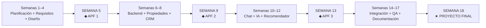

---

# 19. Relación entre Avances y Producto

Los avances no representan entregables aislados. Cada APF debe demostrar un incremento progresivo del mismo producto.

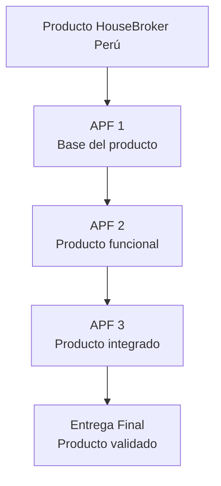

## APF 1 — Semana 5

**Enfoque:** definición y base del producto.

Debe evidenciar principalmente:

- Problema y oportunidad.
- Objetivos.
- Requerimientos.
- Épicas.
- Historias de usuario.
- Product Backlog.
- Arquitectura inicial.
- Prototipo o diseño inicial.
- Configuración base del proyecto.

## APF 2 — Semana 9

**Enfoque:** incremento funcional.

Debe evidenciar principalmente:

- Backend operativo.
- Base de datos.
- Autenticación y roles.
- Catálogo de propiedades.
- Filtros.
- Gestión inicial de citas/CRM.
- Frontend conectado al backend.

## APF 3 — Semana 13

**Enfoque:** integración de funcionalidades inteligentes y comunicación.

Debe evidenciar principalmente:

- Chat en tiempo real.
- Integración de `AIService`.
- `GeminiAdapter`.
- Extracción de preferencias.
- Recomendaciones.
- Scoring y ranking.
- Flujo de transferencia hacia agente humano.

## Entrega Final — Semana 18

**Enfoque:** producto completo y validado.

Debe contemplar:

- Integración de los módulos.
- Dashboard administrativo.
- Chat y transferencia.
- IA y recomendador.
- Citas y CRM.
- Seguridad.
- Pruebas.
- Correcciones.
- Documentación.
- Preparación de la presentación final.

---

# 20. Matriz de Evolución del Producto

| Funcionalidad | APF 1 | APF 2 | APF 3 | Final |
|---|:---:|:---:|:---:|:---:|
| Requerimientos | ✓ | ✓ | ✓ | ✓ |
| Arquitectura | ✓ | ✓ | ✓ | ✓ |
| Autenticación / RBAC | Base | ✓ | ✓ | ✓ |
| Propiedades | Diseño | ✓ | ✓ | ✓ |
| Filtros | Diseño | ✓ | ✓ | ✓ |
| CRM / Citas | Diseño | Base | ✓ | ✓ |
| Chat | Diseño | — | ✓ | ✓ |
| Asistente IA | Diseño | — | ✓ | ✓ |
| Recomendador | Diseño | — | ✓ | ✓ |
| Transferencia a agente | — | — | ✓ | ✓ |
| Dashboard | Diseño | Base | Base | ✓ |
| Auditoría | Diseño | — | Base | ✓ |
| Testing | Plan | Parcial | Parcial | ✓ |
| Documentación | ✓ | Actualización | Actualización | Final |

---

# 21. Riesgos Principales

| Riesgo | Probabilidad | Impacto | Respuesta |
|---|:---:|:---:|---|
| Retraso en la integración Frontend/Backend | Media | Alto | Integrar progresivamente desde las primeras etapas. |
| Problemas con API de IA o límites de uso | Media | Alto | Implementar `AIService`, manejo de errores y fallback por reglas. |
| Complejidad del chat WebSocket | Media | Alto | Implementarlo antes de la integración final y realizar pruebas aisladas. |
| Cambios frecuentes de requerimientos | Media | Medio | Gestionar cambios mediante Product Backlog y priorización. |
| Falta de coordinación del equipo | Media | Alto | Daily Scrum y seguimiento de tareas. |
| Errores de seguridad | Baja/Media | Alto | Revisiones de código y pruebas de autenticación/autorización. |

---

# 22. Trazabilidad del Proyecto

La trazabilidad deberá mantenerse entre los diferentes niveles del proyecto:

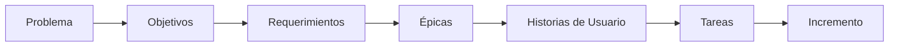

Cada historia implementada deberá poder relacionarse con:

- Una épica.
- Uno o más requerimientos.
- Sus criterios de aceptación.
- Las tareas técnicas correspondientes.
- Un Pull Request.
- El incremento presentado en un Sprint/APF.

---

# 23. Criterios de Éxito del Proyecto

El proyecto será considerado exitoso cuando:

1. El cliente pueda consultar propiedades mediante catálogo y filtros.
2. Los usuarios puedan autenticarse según su rol.
3. El cliente pueda agendar una visita.
4. Los agentes puedan gestionar citas y clientes.
5. El chat permita comunicación en tiempo real.
6. El asistente virtual pueda recopilar preferencias.
7. El sistema pueda recomendar propiedades reales disponibles.
8. Las recomendaciones incluyan un nivel de coincidencia.
9. El cliente pueda solicitar atención humana sin perder el contexto.
10. El administrador pueda supervisar la operación.
11. El sistema cuente con pruebas y documentación.
12. El producto pueda presentarse como un MVP funcional al finalizar la semana 18.

---

# 24. Conclusión

El proyecto **Sistema Web Inteligente de Gestión Inmobiliaria de HouseBroker Perú** se desarrollará durante 18 semanas mediante una estrategia incremental basada en Scrum.

El trabajo comenzará con la definición del problema, requerimientos, backlog y arquitectura; posteriormente se implementarán progresivamente las funcionalidades de propiedades, autenticación, CRM, citas, chat e Inteligencia Artificial.

Los **APF 1 (semana 5), APF 2 (semana 9) y APF 3 (semana 13)** representan hitos de evaluación del mismo producto. Cada avance deberá incorporar nuevas funcionalidades sobre el incremento anterior.

Finalmente, durante la **semana 18**, se realizará la entrega del producto completo, integrando las funcionalidades desarrolladas, pruebas, documentación y validación final.

La arquitectura propuesta mantiene separadas las responsabilidades entre React, Django, PostgreSQL, Redis y los servicios de IA. Además, el uso de `AIService` y `GeminiAdapter` permite mantener desacoplada la integración con el proveedor de inteligencia artificial y facilita futuras modificaciones.

---

## Referencias del Proyecto

- `01_requerimientos.md` — Especificación de Requerimientos del Sistema (SRS v2.0)
- `02_Arquitectura.md` — Arquitectura del Sistema (v1.1)
- GitHub Projects — Product Backlog y seguimiento del proyecto
- Repositorio del proyecto — Código fuente y Pull Requests
