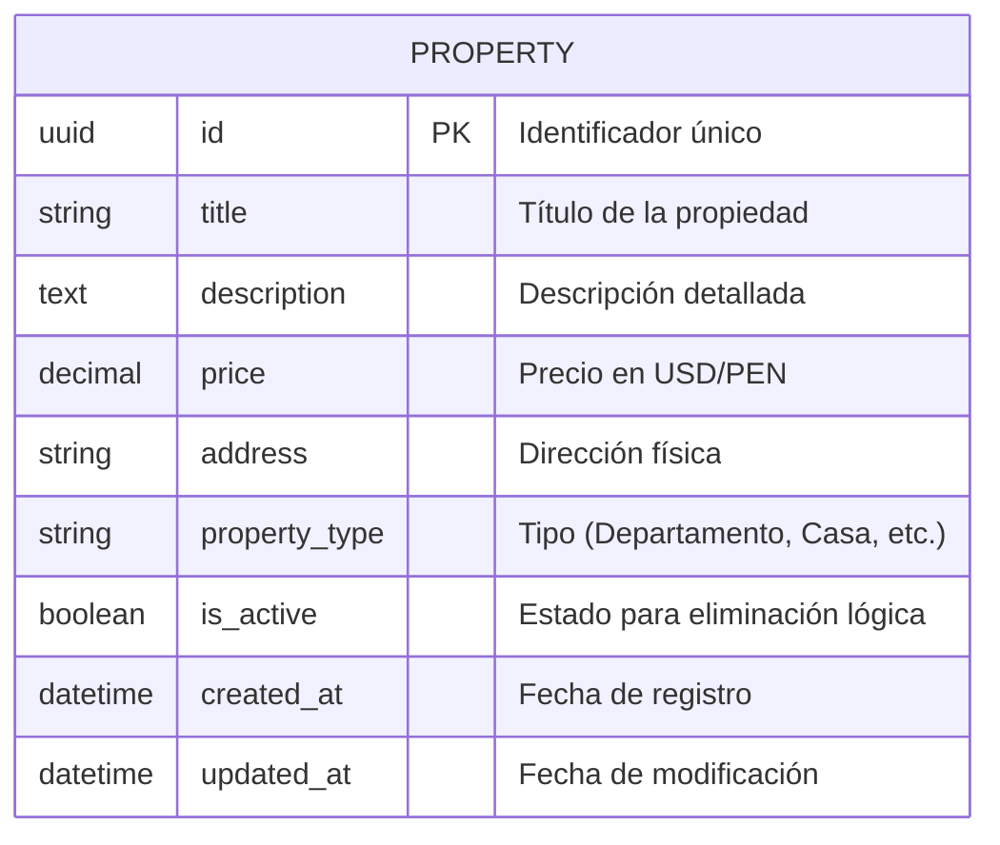

# Arquitectura de Datos — HouseBroker Perú

## Modelo Entidad-Relación (ERD v1.0)

Este esquema representa la entidad inicial `Property` para el módulo de gestión de propiedades correspondiente al Sprint 1 (APF1).

