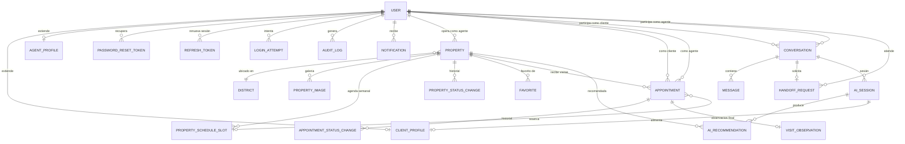
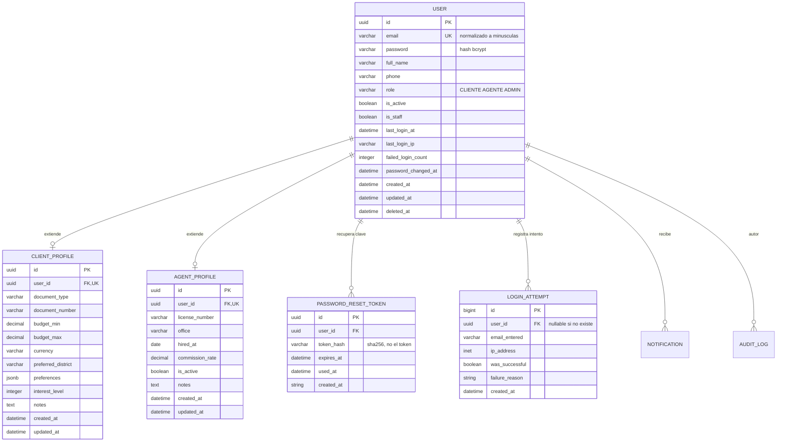
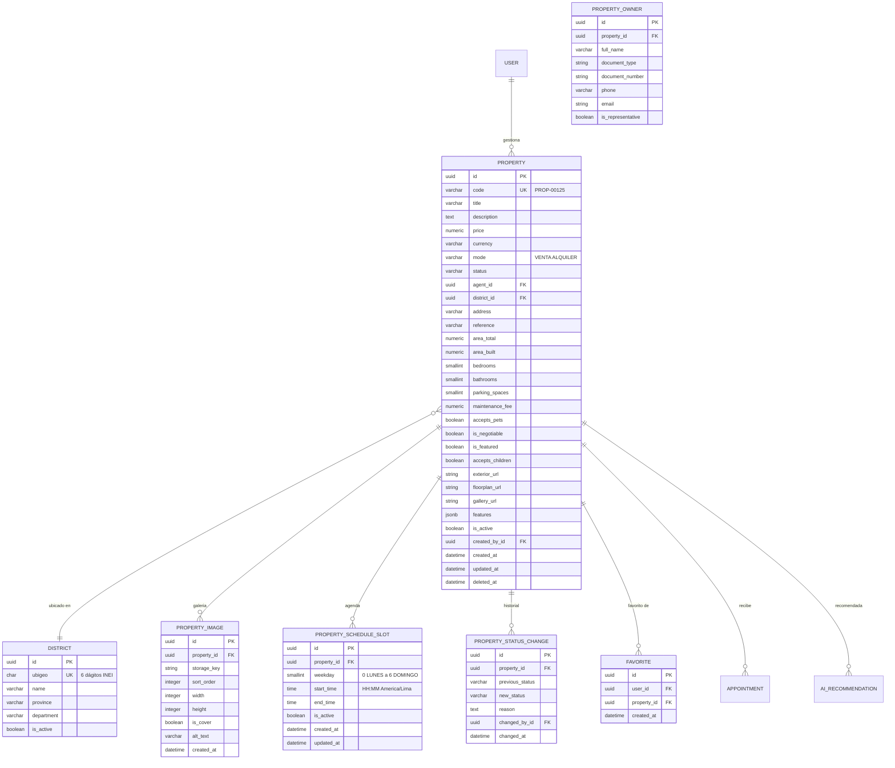
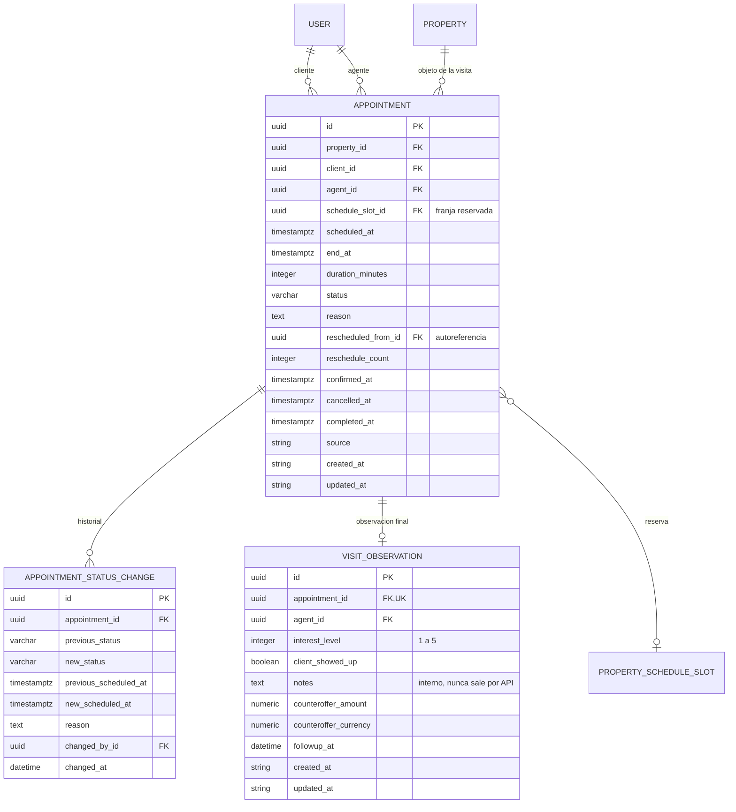
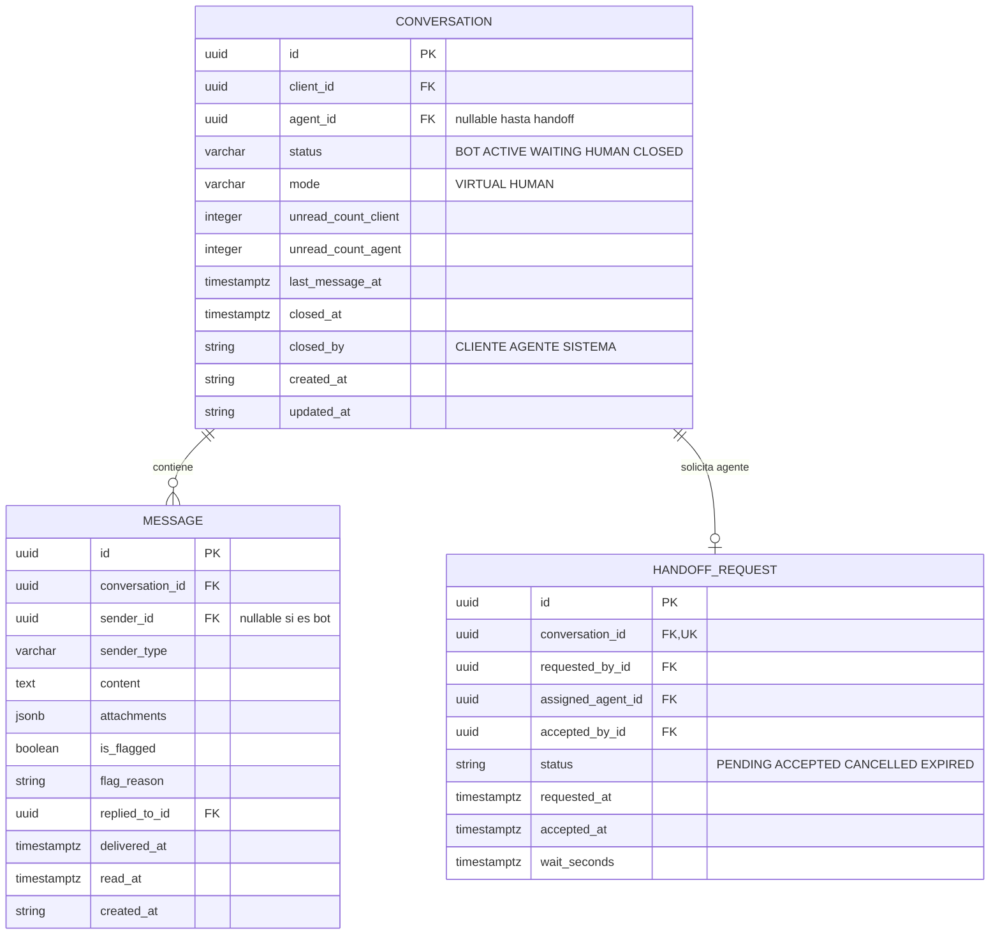
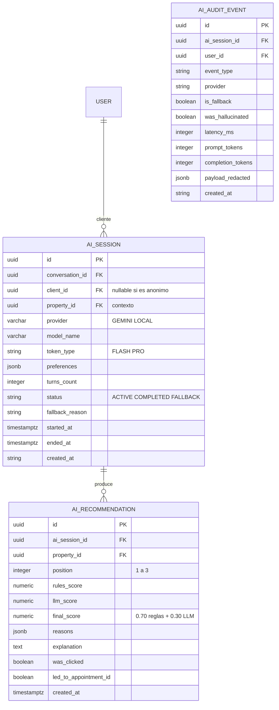
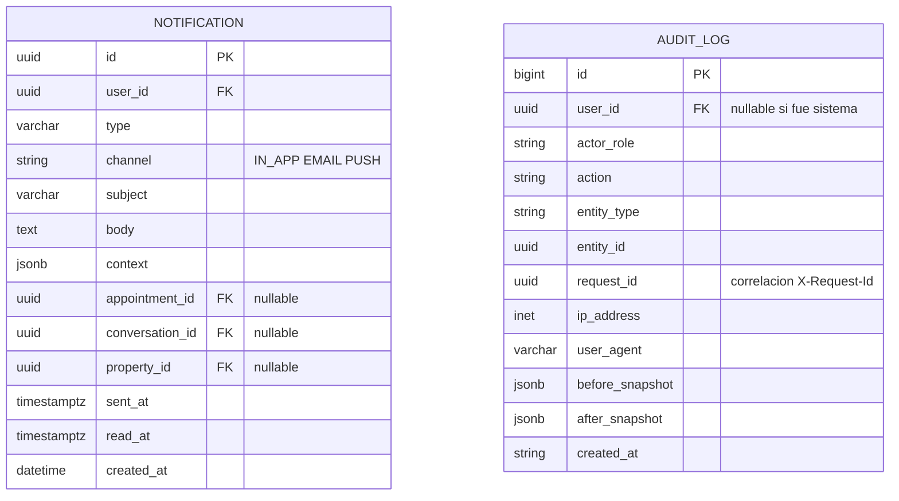
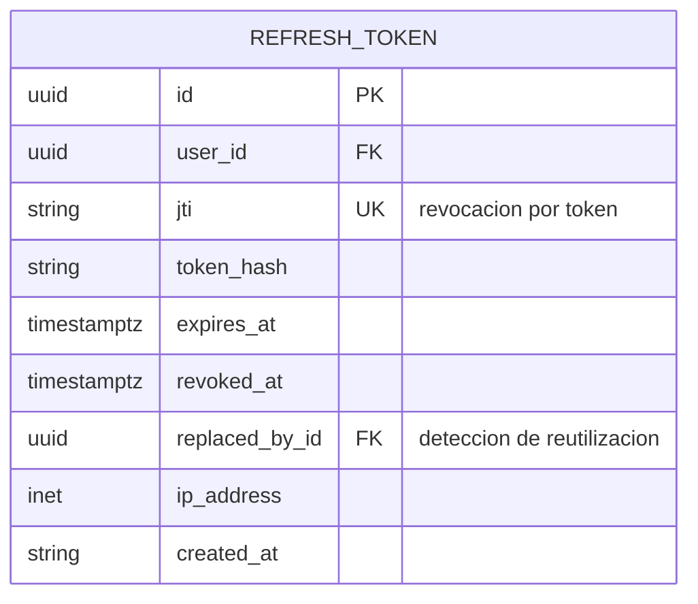

# Arquitectura de Datos — HouseBroker Perú

Modelo Entidad-Relacional del sistema. Este documento muestra **las entidades y
sus relaciones**; la definición columna por columna está en
[`data-model.md`](data-model.md).

**Versión del modelo:** 1.0
**Alcance:** 24 tablas agrupadas en 6 dominios + 5 tablas de `django.contrib`

---

## 1. ERS global

```mermaid
erDiagram
    %% --- Identidad ---
    USER ||--o| CLIENT_PROFILE : "extiende"
    USER ||--o| AGENT_PROFILE : "extiende"
    USER ||--o{ PASSWORD_RESET_TOKEN : "recupera"
    USER ||--o{ REFRESH_TOKEN : "renueva sesián"
    USER ||--o{ LOGIN_ATTEMPT : "intenta"
    USER ||--o{ AUDIT_LOG : "genera"
    USER ||--o{ NOTIFICATION : "recibe"

    %% --- Propiedades ---
    USER ||--o{ PROPERTY : "opera como agente"
    PROPERTY }o--|| DISTRICT : "ubicado en"
    PROPERTY ||--o{ PROPERTY_IMAGE : "galeria"
    PROPERTY ||--o{ PROPERTY_SCHEDULE_SLOT : "agenda semanal"
    PROPERTY ||--o{ PROPERTY_STATUS_CHANGE : "historial"
    PROPERTY ||--o{ FAVORITE : "favorito de"
    PROPERTY ||--o{ APPOINTMENT : "recibe visitas"
    PROPERTY ||--o{ AI_RECOMMENDATION : "recomendada"

    %% --- CRM ---
    USER ||--o{ APPOINTMENT : "como cliente"
    USER ||--o{ APPOINTMENT : "como agente"
    APPOINTMENT ||--o{ APPOINTMENT_STATUS_CHANGE : "historial"
    APPOINTMENT ||--o| VISIT_OBSERVATION : "observacion final"
    APPOINTMENT }o--o| PROPERTY_SCHEDULE_SLOT : "reserva"

    %% --- Conversaciones ---
    USER ||--o{ CONVERSATION : "participa como cliente"
    USER ||--o{ CONVERSATION : "participa como agente"
    CONVERSATION ||--o{ MESSAGE : "contiene"
    CONVERSATION ||--o| HANDOFF_REQUEST : "solicita"
    USER ||--o{ HANDOFF_REQUEST : "atiende"

    %% --- IA ---
    CONVERSATION ||--o{ AI_SESSION : "sesián"
    AI_SESSION ||--o{ AI_RECOMMENDATION : "produce"
    AI_SESSION ||--o| CLIENT_PROFILE : "alimenta"
```

Dos entidades quedan fuera de este diagrama a propósito, y §5 explica por qué:
`property_owner` (contiene PII de terceros, se documenta en
`security-and-privacy.md`) y `refresh_token` (aparece en §5.3).

---

## 2. ERS por dominio

Los mismos datos, separados para que cada diagrama sea legible. Un diagrama
único con 21 entidades no se lee en una revisión.

### 2.1 Identidad y acceso (HU-SEC-01, HU-SEC-02)

```mermaid
erDiagram
    USER {
        uuid id PK
        varchar email UK "normalizado a minusculas"
        varchar password "hash bcrypt"
        varchar full_name
        varchar phone
        varchar role "CLIENTE AGENTE ADMIN"
        boolean is_active
        boolean is_staff
        datetime last_login_at
        varchar last_login_ip
        integer failed_login_count
        datetime password_changed_at
        datetime created_at
        datetime updated_at
        datetime deleted_at
    }

    USER ||--o| CLIENT_PROFILE : "extiende"
    USER ||--o| AGENT_PROFILE : "extiende"
    USER ||--o{ PASSWORD_RESET_TOKEN : "recupera clave"
    USER ||--o{ LOGIN_ATTEMPT : "registra intento"
    USER ||--o{ NOTIFICATION : "recibe"
    USER ||--o{ AUDIT_LOG : "autor"

    CLIENT_PROFILE {
        uuid id PK
        uuid user_id FK,UK
        varchar document_type
        varchar document_number
        decimal budget_min
        decimal budget_max
        varchar currency
        varchar preferred_district
        jsonb preferences
        integer interest_level
        text notes
        datetime created_at
        datetime updated_at
    }

    AGENT_PROFILE {
        uuid id PK
        uuid user_id FK,UK
        varchar license_number
        varchar office
        date hired_at
        decimal commission_rate
        boolean is_active
        text notes
        datetime created_at
        datetime updated_at
    }

    PASSWORD_RESET_TOKEN {
        uuid id PK
        uuid user_id FK
        varchar token_hash "sha256, no el token"
        datetime expires_at
        datetime used_at
        string created_at
    }

    LOGIN_ATTEMPT {
        bigint id PK
        uuid user_id FK "nullable si no existe"
        varchar email_entered
        inet ip_address
        boolean was_successful
        string failure_reason
        datetime created_at
    }
```

### 2.2 Propiedades y catálogo (HU-PROP-01 … HU-PROP-05)

```mermaid
erDiagram
    PROPERTY {
        uuid id PK
        varchar code UK "PROP-00125"
        varchar title
        text description
        numeric price
        varchar currency
        varchar mode "VENTA ALQUILER"
        varchar status
        uuid agent_id FK
        uuid district_id FK
        varchar address
        varchar reference
        numeric area_total
        numeric area_built
        smallint bedrooms
        smallint bathrooms
        smallint parking_spaces
        numeric maintenance_fee
        boolean accepts_pets
        boolean is_negotiable
        boolean is_featured
        boolean accepts_children
        string exterior_url
        string floorplan_url
        string gallery_url
        jsonb features
        boolean is_active
        uuid created_by_id FK
        datetime created_at
        datetime updated_at
        datetime deleted_at
    }

    DISTRICT {
        uuid id PK
        char ubigeo UK "6 dágitos INEI"
        varchar name
        varchar province
        varchar department
        boolean is_active
    }

    PROPERTY }o--|| DISTRICT : "ubicado en"
    USER ||--o{ PROPERTY : "gestiona"
    PROPERTY ||--o{ PROPERTY_IMAGE : "galeria"
    PROPERTY ||--o{ PROPERTY_SCHEDULE_SLOT : "agenda"
    PROPERTY ||--o{ PROPERTY_STATUS_CHANGE : "historial"
    PROPERTY ||--o{ FAVORITE : "favorito de"
    PROPERTY ||--o{ APPOINTMENT : "recibe"
    PROPERTY ||--o{ AI_RECOMMENDATION : "recomendada"

    PROPERTY_IMAGE {
        uuid id PK
        uuid property_id FK
        string storage_key
        integer sort_order
        integer width
        integer height
        boolean is_cover
        varchar alt_text
        datetime created_at
    }

    PROPERTY_SCHEDULE_SLOT {
        uuid id PK
        uuid property_id FK
        smallint weekday "0 LUNES a 6 DOMINGO"
        time start_time "HH:MM America/Lima"
        time end_time
        boolean is_active
        datetime created_at
        datetime updated_at
    }

    PROPERTY_STATUS_CHANGE {
        uuid id PK
        uuid property_id FK
        varchar previous_status
        varchar new_status
        text reason
        uuid changed_by_id FK
        datetime changed_at
    }

    FAVORITE {
        uuid id PK
        uuid user_id FK
        uuid property_id FK
        datetime created_at
    }

    PROPERTY_OWNER {
        uuid id PK
        uuid property_id FK
        varchar full_name
        string document_type
        string document_number
        varchar phone
        string email
        boolean is_representative
    }
```

### 2.3 CRM: citas y observaciones (HU-CRM-01 … HU-CRM-05)

```mermaid
erDiagram
    APPOINTMENT {
        uuid id PK
        uuid property_id FK
        uuid client_id FK
        uuid agent_id FK
        uuid schedule_slot_id FK "franja reservada"
        timestamptz scheduled_at
        timestamptz end_at
        integer duration_minutes
        varchar status
        text reason
        uuid rescheduled_from_id FK "autoreferencia"
        integer reschedule_count
        timestamptz confirmed_at
        timestamptz cancelled_at
        timestamptz completed_at
        string source
        string created_at
        string updated_at
    }

    APPOINTMENT ||--o{ APPOINTMENT_STATUS_CHANGE : "historial"
    APPOINTMENT ||--o| VISIT_OBSERVATION : "observacion final"
    APPOINTMENT }o--o| PROPERTY_SCHEDULE_SLOT : "reserva"
    USER ||--o{ APPOINTMENT : "cliente"
    USER ||--o{ APPOINTMENT : "agente"
    PROPERTY ||--o{ APPOINTMENT : "objeto de la visita"

    APPOINTMENT_STATUS_CHANGE {
        uuid id PK
        uuid appointment_id FK
        varchar previous_status
        varchar new_status
        timestamptz previous_scheduled_at
        timestamptz new_scheduled_at
        text reason
        uuid changed_by_id FK
        datetime changed_at
    }

    VISIT_OBSERVATION {
        uuid id PK
        uuid appointment_id FK,UK
        uuid agent_id FK
        integer interest_level "1 a 5"
        boolean client_showed_up
        text notes "interno, nunca sale por API"
        numeric counteroffer_amount
        numeric counteroffer_currency
        datetime followup_at
        string created_at
        string updated_at
    }
```

### 2.4 Conversaciones y comunicación (HU-SEC-03 … HU-SEC-06)

```mermaid
erDiagram
    CONVERSATION {
        uuid id PK
        uuid client_id FK
        uuid agent_id FK "nullable hasta handoff"
        varchar status "BOT ACTIVE WAITING HUMAN CLOSED"
        varchar mode "VIRTUAL HUMAN"
        integer unread_count_client
        integer unread_count_agent
        timestamptz last_message_at
        timestamptz closed_at
        string closed_by "CLIENTE AGENTE SISTEMA"
        string created_at
        string updated_at
    }

    CONVERSATION ||--o{ MESSAGE : "contiene"
    CONVERSATION ||--o| HANDOFF_REQUEST : "solicita agente"

    MESSAGE {
        uuid id PK
        uuid conversation_id FK
        uuid sender_id FK "nullable si es bot"
        varchar sender_type
        text content
        jsonb attachments
        boolean is_flagged
        string flag_reason
        uuid replied_to_id FK
        timestamptz delivered_at
        timestamptz read_at
        string created_at
    }

    HANDOFF_REQUEST {
        uuid id PK
        uuid conversation_id FK,UK
        uuid requested_by_id FK
        uuid assigned_agent_id FK
        uuid accepted_by_id FK
        string status "PENDING ACCEPTED CANCELLED EXPIRED"
        timestamptz requested_at
        timestamptz accepted_at
        timestamptz wait_seconds
    }
```

### 2.5 Inteligencia artificial (HU-AI-01 … HU-AI-05)

```mermaid
erDiagram
    AI_SESSION {
        uuid id PK
        uuid conversation_id FK
        uuid client_id FK "nullable si es anonimo"
        uuid property_id FK "contexto"
        varchar provider "GEMINI LOCAL"
        varchar model_name
        string token_type "FLASH PRO"
        jsonb preferences
        integer turns_count
        string status "ACTIVE COMPLETED FALLBACK"
        string fallback_reason
        timestamptz started_at
        timestamptz ended_at
        string created_at
    }

    AI_SESSION ||--o{ AI_RECOMMENDATION : "produce"
    USER ||--o{ AI_SESSION : "cliente"

    AI_RECOMMENDATION {
        uuid id PK
        uuid ai_session_id FK
        uuid property_id FK
        integer position "1 a 3"
        numeric rules_score
        numeric llm_score
        numeric final_score "0.70 reglas + 0.30 LLM"
        jsonb reasons
        text explanation
        boolean was_clicked
        boolean led_to_appointment_id
        timestamptz created_at
    }

    AI_AUDIT_EVENT {
        uuid id PK
        uuid ai_session_id FK
        uuid user_id FK
        string event_type
        string provider
        boolean is_fallback
        boolean was_hallucinated
        integer latency_ms
        integer prompt_tokens
        integer completion_tokens
        jsonb payload_redacted
        string created_at
    }
```

### 2.6 Notificaciones y auditoría transversal

```mermaid
erDiagram
    NOTIFICATION {
        uuid id PK
        uuid user_id FK
        varchar type
        string channel "IN_APP EMAIL PUSH"
        varchar subject
        text body
        jsonb context
        uuid appointment_id FK "nullable"
        uuid conversation_id FK "nullable"
        uuid property_id FK "nullable"
        timestamptz sent_at
        timestamptz read_at
        datetime created_at
    }

    AUDIT_LOG {
        bigint id PK
        uuid user_id FK "nullable si fue sistema"
        string actor_role
        string action
        string entity_type
        uuid entity_id
        uuid request_id "correlacion X-Request-Id"
        inet ip_address
        varchar user_agent
        jsonb before_snapshot
        jsonb after_snapshot
        string created_at
    }
```

---

## 3. Inventario de tablas

24 tablas propias: 22 de dominio funcional más 2 transversales. La columna "API"
indica si algún esquema de `openapi_spec.yaml` nombra datos de esa tabla.

| # | Tabla | Dominio | HU | Expone API |
|---:|---|---|---|---|
| 1 | `user` | Identidad | HU-SEC-01 | Parcial |
| 2 | `client_profile` | Identidad | HU-CRM-03, HU-AI-02 | No |
| 3 | `agent_profile` | Identidad | HU-SEC-01, HU-CRM-05 | No |
| 4 | `password_reset_token` | Identidad | HU-SEC-02 | No |
| 5 | `login_attempt` | Identidad | HU-SEC-01 | No |
| 6 | `property` | Propiedades | HU-PROP-01 | Sí |
| 7 | `property_image` | Propiedades | HU-PROP-02 | No |
| 8 | `property_owner` | Propiedades | HU-PROP-01 | No |
| 9 | `property_schedule_slot` | Propiedades | HU-CRM-01 | Sí |
| 10 | `property_status_change` | Propiedades | HU-PROP-04 | No |
| 11 | `favorite` | Propiedades | HU-PROP-05 | Sí |
| 12 | `district` | Propiedades | HU-PROP-03 | Derivado |
| 13 | `appointment` | CRM | HU-CRM-01 | Sí |
| 14 | `appointment_status_change` | CRM | HU-CRM-02 | No |
| 15 | `visit_observation` | CRM | HU-CRM-04 | No |
| 16 | `conversation` | Comunicación | HU-SEC-03 | Sí |
| 17 | `message` | Comunicación | HU-SEC-03 | Sí |
| 18 | `handoff_request` | Comunicación | HU-AI-04 | Sí |
| 19 | `ai_session` | IA | HU-AI-01 | No |
| 20 | `ai_recommendation` | IA | HU-AI-03 | Sí |
| 21 | `ai_audit_event` | IA | HU-AI-05 | No |
| 22 | `notification` | Transversal | HU-SEC-05 | Sí |
| 23 | `audit_log` | Transversal | HU-CRM-05 | No |
| 24 | `refresh_token` | Identidad | HU-SEC-01 | No |

**De las 24, solo 11 exponen algo por API, y 4 de esas 11 lo hacen de forma
derivada, no con una columna directa.** Ese es el material con el que se justifica
que este documento sea más largo que `docs/api/`.

### Tablas de `django.contrib`

Se crean con `migrate` y no se diseñan aquí, pero condicionan el modelo:

| Tabla | Nota |
|---|---|
| `django_migrations` | El único `serial` del sistema. Interna de Django |
| `auth_permission` | Depende de `django.contrib.contenttypes` |
| `auth_group` | El MVP usa rol en `user.role`, no grupos. Queda por si hace falta |
| `django_content_type` | Requerida por las FKs de `django.contrib.admin` |
| `django_admin_log` | Registro de acciones del admin de Django. **Distinto de `audit_log`** |
| `django_session` | Sessions del admin. La API usa JWT, no sesiones |

---

## 4. Límites de módulo

Qué toca qué. Una app Django que consulta tablas de otra sin pasar por su
servicio rompe el aislamiento queexige  la arquitectura.

| App Django | Tablas que posee | Puede leer de otras | Vía |
|---|---|---|---|
| `apps/users` | 1–5, 24 | `agent_profile`, `audit_log` | Servicio `users` |
| `apps/properties` | 6–12 | `district`, `agent_profile` | Servicio `properties` |
| `apps/appointments` | 13–15 | `property`, `property_schedule_slot` | Servicio `appointments` |
| `apps/conversations` | 16–18 | `user`, `property` | Servicio `conversations` |
| `apps/assistant` | 19–21 | `property` (solo lectura, vía `properties`) | Servicio `recommendations` |
| `apps/notifications` | 22 | todas, solo lectura | Servicio `notifications` |
| `apps/audit` | 23 | todas, solo lectura | Servicio `audit` |

Dos reglas que el diagrama no puede expresar:

1. **`apps/assistant` no lee `client_profile` ni `user`.** Recibe candidatos ya
   filtrados de `properties`. Es la diferencia entre "la IA recomienda una
   propiedad real" y "la IA inventa una propiedad". `docs/02_Arquitectura.md` §6
   lo exige y esta tabla lo blinda.
2. **`apps/audit` solo añade.** Nunca actualiza ni borra. Es append-only y su
   permiso es `INSERT`.

---

## 5. Relaciones que no están en el diagrama

Cuatro relaciones que existen en los datos pero que omití de los diagramas para no
cargar el ERS. Están aquí para que no se pierdan.

### 5.1 `appointment.agent_id` frente a `property.agent_id`

No son la misma relación. `property.agent_id` es **el responsable del inmueble**:
quién lo publica, quién responde sus visitas, quién puede editarlo. Es estable y
casi nunca cambia.

`appointment.agent_id` es **quién atiende esa visita concreta**. Puede diferir:
una cita puede ser reasignada a otro agente disponible aunque el inmueble siga
siendo del primero.

Consecuencia: el filtro de agenda de un agente (`GET /api/v1/appointments`) usa
`appointment.agent_id`, no `property.agent_id`. Si se confundieran, un agente vería
las citas de los inmuebles que publica pero no atiende, y viceversa.

### 5.2 `ai_recommendation` sin conversación directa

`ai_recommendation` cuelga de `ai_session`, no de `conversation`. El motivo es que
`HU-CRM-03` pide que el agente vea "las propiedades recomendadas previamente por
la IA" en la ficha del cliente, y a veces esa ficha se consulta fuera de cualquier
conversación. Con la recomendación colgando de la sesión, la consulta es
`ai_session → client_id` y no requiere que exista conversación.

### 5.3 Redención de refresh tokens

El claim `jti` del JWT permite revocación individual, y el spec lo documenta en
`TokenPair.access`. Eso requiere una tabla de revocación, que es la número 24:

```mermaid
erDiagram
    REFRESH_TOKEN {
        uuid id PK
        uuid user_id FK
        string jti UK "revocacion por token"
        string token_hash
        timestamptz expires_at
        timestamptz revoked_at
        uuid replaced_by_id FK "deteccion de reutilizacion"
        inet ip_address
        string created_at
    }
```

La detección de reutilización (`refresh_token_reused` en `ProblemUnauthorized`)
compara el `jti` recibido contra un token ya rotado: si coincide con el
`replaced_by_id` de una fila anterior, se revoca toda la cadena de la cuenta.

### 5.4 Imágenes de mensaje

`message.attachments` es `jsonb`, no una tabla aparte. Decisión deliberada: los
adjuntos del chat son de comenzar-módulo, el MVP los declara "controlados" y no
tiene requisitos de consulta (nadie busca "todos los mensajes con PDF"). Un
`jsonb` con rutas de almacenamiento cumple. Si aparece el requisito de moderar o
escanear adjuntos, se promueve a tabla; mientras tanto, un `jsonb` evita una tabla
que solo se escribiría.

---

## 6. Vistas y recursos calculados

Cosas que la API expone y que **no son tablas**. Implementarlas como `VIEW`
materializada o como consultas del ORM, según el caso.

| Recurso | Origen | Persistido |
|---|---|---|
| `Property.is_favorite` | `favorite` filtrado por el usuario del token | No |
| `AppointmentPropertyRef.district` | `property.ubigeo` → `district.name` | No |
| `AvailableSlots` | `property_schedule_slot` menos `appointment` solapados | No |
| `PaginatedProperties.count` | `COUNT` sobre el filtro activo | No |
| `AuthUser.role` | Columna real, replicada en el claim `role` del JWT | Sí |

`AvailableSlots` merece detalle porque es el único recurso cuyo cálculo es
delicado: es `time slots` de la semana **materializados sobre una fecha**,
menos las citas ya ocupadas. Está definido en `indexes-and-queries.md` §5 con la
consulta exacta y su índice.

---

## 7. Estado de la señalética

Las etiquetas del `erDiagram` de este documento son abreviaturas, no columnas
reales. La tabla de traducción:

| Abreviatura | Significado |
|---|---|
| `PK` | Primary key |
| `FK` | Foreign key |
| `UK` | Unique |
| `string` | `varchar` o `text` |
| `datetime` | `timestamptz` (UTC) |
| `time` | `time` sin zona horaria |
| `uuid` | UUID v4 |
| `char` | `char(n)` de longitud fija |

La definición autoritativa de cada columna está en `data-model.md`. Si un
diagrama y una tabla discrepan, **gana `data-model.md`**.